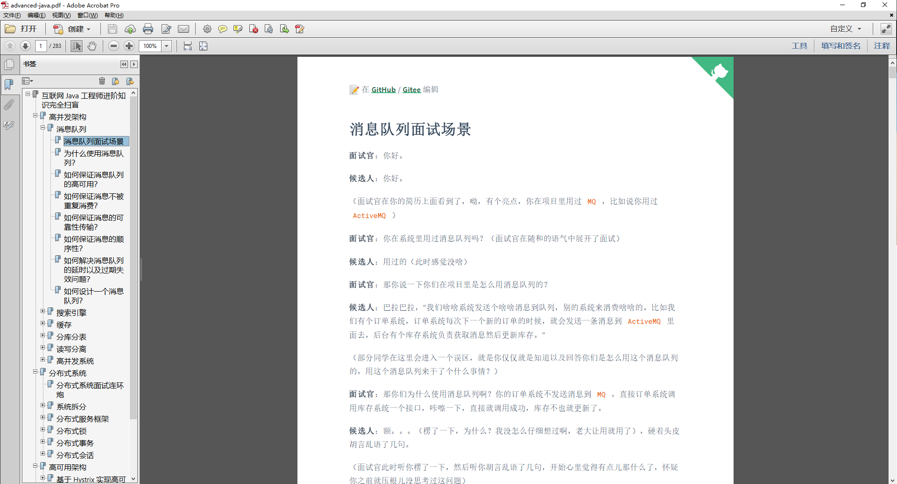

# 互联网 Java 工程师进阶知识完全扫盲

本项目大部分内容来自中华石杉，版权归作者所有，内容涵盖[高并发](#高并发架构)、[分布式](#分布式系统)、[高可用](#高可用架构)、[微服务](#微服务架构)、[海量数据处理](#海量数据处理)等领域知识。我对这部分知识做了一个系统的整理，方便学习查阅。

学习之前，先来看看 [Issues 讨论区](https://github.com/doocs/advanced-java/issues/9#issue-394275038)的技术面试官是怎么说的吧。本项目欢迎各位开发者朋友到 Issues 讨论区分享自己的一些想法和实践经验。也不妨 Star 关注 [doocs/advanced-java](https://github.com/doocs/advanced-java)，随时追踪项目最新动态。

本项目基于 [Docsify](https://docsify.js.org) 进行构建，并同步部署在以下三个站点：

- Netlify: https://adjava.netlify.app
- Gitee Pages: https://doocs.gitee.io/advanced-java
- GitHub Pages: https://doocs.github.io/advanced-java

如果你同时希望在本地查看，请按照以下步骤进行操作：

1. 安装 NodeJS 环境：https://nodejs.org/zh-cn/
2. 安装 Docsify：`npm i docsify-cli -g`
3. 使用 Git 克隆([HTTPS / SSH / GitHub CLI](https://docs.github.com/en/free-pro-team@latest/github/using-git/which-remote-url-should-i-use))本项目到你的本地环境：`git clone git@github.com:doocs/advanced-java.git`
4. 进入 advanced-java 根目录：`cd advanced-java`
5. 执行命令，启动一个本地服务器：`docsify serve`
6. 浏览器访问地址：http://localhost:3000

🔈：Doocs 新推出“[穿山甲链路追踪](https://github.com/doocs/pangolin-tracing)”项目，欢迎开发者朋友关注。

## 高并发架构

### [消息队列](./docs/high-concurrency/mq-interview.md)

- [为什么使用消息队列？消息队列有什么优点和缺点？Kafka、ActiveMQ、RabbitMQ、RocketMQ 都有什么优点和缺点？](./docs/high-concurrency/why-mq.md)
- [如何保证消息队列的高可用？](./docs/high-concurrency/how-to-ensure-high-availability-of-message-queues.md)
- [如何保证消息不被重复消费？（如何保证消息消费的幂等性）](./docs/high-concurrency/how-to-ensure-that-messages-are-not-repeatedly-consumed.md)
- [如何保证消息的可靠性传输？（如何处理消息丢失的问题）](./docs/high-concurrency/how-to-ensure-the-reliable-transmission-of-messages.md)
- [如何保证消息的顺序性？](./docs/high-concurrency/how-to-ensure-the-order-of-messages.md)
- [如何解决消息队列的延时以及过期失效问题？消息队列满了以后该怎么处理？有几百万消息持续积压几小时，说说怎么解决？](./docs/high-concurrency/mq-time-delay-and-expired-failure.md)
- [如果让你写一个消息队列，该如何进行架构设计啊？说一下你的思路。](./docs/high-concurrency/mq-design.md)

### [搜索引擎](./docs/high-concurrency/es-introduction.md)

- [ES 的分布式架构原理能说一下么（ES 是如何实现分布式的啊）？](./docs/high-concurrency/es-architecture.md)
- [ES 写入数据的工作原理是什么啊？ES 查询数据的工作原理是什么啊？底层的 Lucene 介绍一下呗？倒排索引了解吗？](./docs/high-concurrency/es-write-query-search.md)
- [ES 在数据量很大的情况下（数十亿级别）如何提高查询效率啊？](./docs/high-concurrency/es-optimizing-query-performance.md)
- [ES 生产集群的部署架构是什么？每个索引的数据量大概有多少？每个索引大概有多少个分片？](./docs/high-concurrency/es-production-cluster.md)

### 缓存

- [在项目中缓存是如何使用的？缓存如果使用不当会造成什么后果？](./docs/high-concurrency/why-cache.md)
- [Redis 和 Memcached 有什么区别？Redis 的线程模型是什么？为什么单线程的 Redis 比多线程的 Memcached 效率要高得多？](./docs/high-concurrency/redis-single-thread-model.md)
- [Redis 都有哪些数据类型？分别在哪些场景下使用比较合适？](./docs/high-concurrency/redis-data-types.md)
- [Redis 的过期策略都有哪些？手写一下 LRU 代码实现？](./docs/high-concurrency/redis-expiration-policies-and-lru.md)
- [如何保证 Redis 高并发、高可用？Redis 的主从复制原理能介绍一下么？Redis 的哨兵原理能介绍一下么？](./docs/high-concurrency/how-to-ensure-high-concurrency-and-high-availability-of-redis.md)
- [Redis 主从架构是怎样的？](./docs/high-concurrency/redis-master-slave.md)
- [Redis 的持久化有哪几种方式？不同的持久化机制都有什么优缺点？持久化机制具体底层是如何实现的？](./docs/high-concurrency/redis-persistence.md)
- [Redis 集群模式的工作原理能说一下么？在集群模式下，Redis 的 key 是如何寻址的？分布式寻址都有哪些算法？了解一致性 hash 算法吗？如何动态增加和删除一个节点？](./docs/high-concurrency/redis-cluster.md)
- [了解什么是 Redis 的雪崩、穿透和击穿？Redis 崩溃之后会怎么样？系统该如何应对这种情况？如何处理 Redis 的穿透？](./docs/high-concurrency/redis-caching-avalanche-and-caching-penetration.md)
- [如何保证缓存与数据库的双写一致性？](./docs/high-concurrency/redis-consistence.md)
- [Redis 的并发竞争问题是什么？如何解决这个问题？了解 Redis 事务的 CAS 方案吗？](./docs/high-concurrency/redis-cas.md)
- [生产环境中的 Redis 是怎么部署的？](./docs/high-concurrency/redis-production-environment.md)

### 分库分表

- [为什么要分库分表（设计高并发系统的时候，数据库层面该如何设计）？用过哪些分库分表中间件？不同的分库分表中间件都有什么优点和缺点？你们具体是如何对数据库如何进行垂直拆分或水平拆分的？](./docs/high-concurrency/database-shard.md)
- [现在有一个未分库分表的系统，未来要分库分表，如何设计才可以让系统从未分库分表动态切换到分库分表上？](./docs/high-concurrency/database-shard-method.md)
- [如何设计可以动态扩容缩容的分库分表方案？](./docs/high-concurrency/database-shard-dynamic-expand.md)
- [分库分表之后，id 主键如何处理？](./docs/high-concurrency/database-shard-global-id-generate.md)

### 读写分离

- [如何实现 MySQL 的读写分离？MySQL 主从复制原理是啥？如何解决 MySQL 主从同步的延时问题？](./docs/high-concurrency/mysql-read-write-separation.md)

### 高并发系统

- [如何设计一个高并发系统？](./docs/high-concurrency/high-concurrency-design.md)

## 分布式系统

### [面试连环炮](./docs/distributed-system/distributed-system-interview.md)

### 系统拆分

- [为什么要进行系统拆分？如何进行系统拆分？拆分后不用 Dubbo 可以吗？](./docs/distributed-system/why-dubbo.md)

### 分布式服务框架

- [说一下 Dubbo 的工作原理？注册中心挂了可以继续通信吗？](./docs/distributed-system/dubbo-operating-principle.md)
- [Dubbo 支持哪些序列化协议？说一下 Hessian 的数据结构？PB 知道吗？为什么 PB 的效率是最高的？](./docs/distributed-system/dubbo-serialization-protocol.md)
- [Dubbo 负载均衡策略和集群容错策略都有哪些？动态代理策略呢？](./docs/distributed-system/dubbo-load-balancing.md)
- [Dubbo 的 spi 思想是什么？](./docs/distributed-system/dubbo-spi.md)
- [如何基于 Dubbo 进行服务治理、服务降级、失败重试以及超时重试？](./docs/distributed-system/dubbo-service-management.md)
- [分布式服务接口的幂等性如何设计（比如不能重复扣款）？](./docs/distributed-system/distributed-system-idempotency.md)
- [分布式服务接口请求的顺序性如何保证？](./docs/distributed-system/distributed-system-request-sequence.md)
- [如何自己设计一个类似 Dubbo 的 RPC 框架？](./docs/distributed-system/dubbo-rpc-design.md)
- [CAP 定理的 P 是什么？](./docs/distributed-system/distributed-system-cap.md)

### 分布式锁

- [Zookeeper 都有哪些应用场景？](./docs/distributed-system/zookeeper-application-scenarios.md)
- [使用 Redis 如何设计分布式锁？使用 Zookeeper 来设计分布式锁可以吗？以上两种分布式锁的实现方式哪种效率比较高？](./docs/distributed-system/distributed-lock-redis-vs-zookeeper.md)

### 分布式事务

- [分布式事务了解吗？你们如何解决分布式事务问题的？TCC 如果出现网络连不通怎么办？XA 的一致性如何保证？](./docs/distributed-system/distributed-transaction.md)

### 分布式会话

- [集群部署时的分布式 Session 如何实现？](./docs/distributed-system/distributed-session.md)

## 高可用架构

- [Hystrix 介绍](./docs/high-availability/hystrix-introduction.md)
- [电商网站详情页系统架构](./docs/high-availability/e-commerce-website-detail-page-architecture.md)
- [Hystrix 线程池技术实现资源隔离](./docs/high-availability/hystrix-thread-pool-isolation.md)
- [Hystrix 信号量机制实现资源隔离](./docs/high-availability/hystrix-semphore-isolation.md)
- [Hystrix 隔离策略细粒度控制](./docs/high-availability/hystrix-execution-isolation.md)
- [深入 Hystrix 执行时内部原理](./docs/high-availability/hystrix-process.md)
- [基于 request cache 请求缓存技术优化批量商品数据查询接口](./docs/high-availability/hystrix-request-cache.md)
- [基于本地缓存的 fallback 降级机制](./docs/high-availability/hystrix-fallback.md)
- [深入 Hystrix 断路器执行原理](./docs/high-availability/hystrix-circuit-breaker.md)
- [深入 Hystrix 线程池隔离与接口限流](./docs/high-availability/hystrix-thread-pool-current-limiting.md)
- [基于 timeout 机制为服务接口调用超时提供安全保护](./docs/high-availability/hystrix-timeout.md)

### 高可用系统

- 如何设计一个高可用系统？

### 限流

- [如何限流？在工作中是怎么做的？说一下具体的实现？](./docs/high-concurrency/huifer-how-to-limit-current.md)

### 熔断

- 如何进行熔断？
- 熔断框架都有哪些？具体实现原理知道吗？
- [熔断框架如何做技术选型？选用 Sentinel 还是 Hystrix？](./docs/high-availability/sentinel-vs-hystrix.md)

### 降级

- 如何进行降级？

## 微服务架构

- [微服务架构整个章节内容属额外新增，后续抽空更新，也欢迎读者们参与补充完善](https://github.com/doocs/advanced-java)
- [关于微服务架构的描述](./docs/micro-services/microservices-introduction.md)
- [从单体式架构迁移到微服务架构](./docs/micro-services/migrating-from-a-monolithic-architecture-to-a-microservices-architecture.md)
- [微服务的事件驱动数据管理](./docs/micro-services/event-driven-data-management-for-microservices.md)
- [选择微服务部署策略](./docs/micro-services/choose-microservice-deployment-strategy.md)
- [微服务架构的优势与不足](./docs/micro-services/advantages-and-disadvantages-of-microservice.md)

### Spring Cloud 微服务架构

- [什么是微服务？微服务之间是如何独立通讯的？](./docs/micro-services/huifer-what's-microservice-how-to-communicate.md)
- Spring Cloud 和 Dubbo 有哪些区别？
- Spring Boot 和 Spring Cloud，谈谈你对它们的理解？
- 什么是服务熔断？什么是服务降级？
- 微服务的优缺点分别是什么？说一下你在项目开发中碰到的坑？
- [你所知道的微服务技术栈都有哪些？](./docs/micro-services/huifer-micro-services-technology-stack.md)
- [微服务治理策略](./docs/micro-services/huifer-micro-service-governance.md)
- Eureka 和 Zookeeper 都可以提供服务注册与发现的功能，它们有什么区别？
- [谈谈服务发现组件 Eureka 的主要调用过程？](./docs/micro-services/how-eureka-enable-service-discovery-and-service-registration.md)
- ......

## 海量数据处理

- [如何从大量的 URL 中找出相同的 URL？](./docs/big-data/find-common-urls.md)
- [如何从大量数据中找出高频词？](./docs/big-data/find-top-100-words.md)
- [如何找出某一天访问百度网站最多的 IP？](./docs/big-data/find-top-1-ip.md)
- [如何在大量的数据中找出不重复的整数？](./docs/big-data/find-no-repeat-number.md)
- [如何在大量的数据中判断一个数是否存在？](./docs/big-data/find-a-number-if-exists.md)
- [如何查询最热门的查询串？](./docs/big-data/find-hotest-query-string.md)
- [如何统计不同电话号码的个数？](./docs/big-data/count-different-phone-numbers.md)
- [如何从 5 亿个数中找出中位数？](./docs/big-data/find-mid-value-in-500-millions.md)
- [如何按照 query 的频度排序？](./docs/big-data/sort-the-query-strings-by-counts.md)
- [如何找出排名前 500 的数？](./docs/big-data/find-rank-top-500-numbers.md)

---

## Doocs 社区优质项目

Doocs 技术社区，致力于打造一个内容完整、持续成长的互联网开发者学习生态圈！以下是 Doocs 旗下的一些优秀项目，欢迎各位开发者朋友持续保持关注。

| #   | 项目                                                              | 描述                                                                                             | 热度                                                                                                                            |
| --- | ----------------------------------------------------------------- | ------------------------------------------------------------------------------------------------ | ------------------------------------------------------------------------------------------------------------------------------- |
| 1   | [advanced-java](https://github.com/doocs/advanced-java)           | 互联网 Java 工程师进阶知识完全扫盲：涵盖高并发、分布式、高可用、微服务、海量数据处理等领域知识。 |              |
| 2   | [leetcode](https://github.com/doocs/leetcode)                     | 多种编程语言实现 LeetCode、《剑指 Offer（第 2 版）》、《程序员面试金典（第 6 版）》题解。        |                        |
| 3   | [source-code-hunter](https://github.com/doocs/source-code-hunter) | 互联网常用组件框架源码分析。                                                                     |    |
| 4   | [jvm](https://github.com/doocs/jvm)                               | Java 虚拟机底层原理知识总结。                                                                    |                                  |
| 5   | [coding-interview](https://github.com/doocs/coding-interview)     | 代码面试题集，包括《剑指 Offer》、《编程之美》等。                                               |        |
| 6   | [md](https://github.com/doocs/md)                                 | 一款高度简洁的微信 Markdown 编辑器。                                                             |                                    |
| 7   | [technical-books](https://github.com/doocs/technical-books)       | 值得一看的技术书籍列表。                                                                         |          |

## 贡献者

感谢以下所有朋友对 [Doocs 技术社区](https://github.com/doocs) 所做出的贡献，[参与项目维护请戳这儿](https://doocs.github.io/#/?id=how-to-join)。

<!-- ALL-CONTRIBUTORS-LIST: START - Do not remove or modify this section -->

<!-- ALL-CONTRIBUTORS-LIST: END -->

## 公众号

[Doocs](https://github.com/doocs) 技术社区旗下唯一公众号「**Doocs 开源社区**」​，欢迎扫码关注，**专注分享技术领域相关知识及行业最新资讯**。当然，也可以加我个人微信（备注：GitHub），拉你进技术交流群。

<table>
  <tr>
    <td align="center" style="width: 200px;">
      <a href="https://github.com/doocs">
         
        公众平台
      </a> 
    </td>
    <td align="center" style="width: 200px;">
      <a href="https://github.com/yanglbme">
         
        个人微信
      </a> 
    </td>
  </tr>
</table>

关注「**Doocs 开源社区**」公众号，回复 **PDF**，即可获取本项目离线 PDF 文档（283 页精华），学习更加方便！

