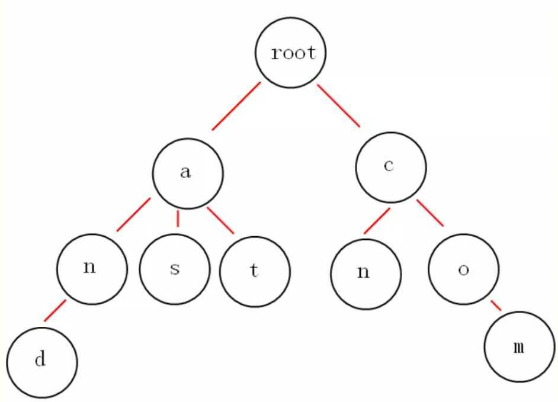

## 大数据中 TopK 问题的常用套路

> **作者 Chunel Feng，编程爱好者，阿里巴巴搜索引擎开发工程师。**<br><br>个人微信：ChunelFeng <br>个人博客：[一面之猿网](http://www.chunel.cn) <br>开源项目：[Caiss 智能相似搜索引擎](https://github.com/ChunelFeng/caiss)

Doocs 社区的朋友们，大家好。我是你们的新朋友 [Chunel Feng](https://github.com/ChunelFeng)。今天想跟大家聊一些**常见的 topK 问题**。

对于海量数据到处理经常会涉及到 topK 问题。在设计数据结构和算法的时候，主要需要考虑的应该是当前算法（包括数据结构）跟给定情境（比如数据量级、数据类型）的适配程度，和当前问题最核心的瓶颈（如降低时间复杂度，还是降低空间复杂度）是什么。

首先，我们来举几个常见的 topK 问题的例子：

1. 给定 100 个 int 数字，在其中找出最大的 10 个；
1. 给定 10 亿个 int 数字，在其中找出最大的 10 个（这 10 个数字可以无序）；
1. 给定 10 亿个 int 数字，在其中找出最大的 10 个（这 10 个数字依次排序）；
1. 给定 10 亿个不重复的 int 数字，在其中找出最大的 10 个；
1. 给定 10 个数组，每个数组中有 1 亿个 int 数字，在其中找出最大的 10 个；
1. 给定 10 亿个 string 类型的数字，在其中找出最大的 10 个（仅需要查 1 次）；
1. 给定 10 亿个 string 类型的数字，在其中找出最大的 k 个（需要反复多次查询，其中 k 是一个随机数字）。

上面这些问题看起来很相似，但是解决的方式却千差万别。稍有不慎，就可能使得 topK 问题成为系统的瓶颈。不过也不用太担心，接下来我会总结几种常见的解决思路，遇到问题的时候，大家把这些基础思路融会贯通并且杂糅组合，即可做到见招拆招。
<br>

### 1. 堆排序法

这里说的是堆排序法，而不是快排或者希尔排序。虽然理论时间复杂度都是 `O(nlogn)`，但是堆排在做 topK 的时候有一个优势，就是可以维护一个仅包含 k 个数字的小顶堆（想清楚，为啥是小顶堆哦），当新加入的数字大于堆顶数字的时候，将堆顶元素剔除，并加入新的数字。

用 C++ 来说明，堆在 stl 中是 priority_queue（不是 set）。

```cpp
int main() {
    const int topK = 3;
    vector<int> vec = {4,1,5,8,7,2,3,0,6,9};
    priority_queue<int, vector<int>, greater<>> pq;    // 小顶堆
    for (const auto& x : vec) {
        pq.push(x);
        if (pq.size() > topK) {
            // 如果超出个数，则弹出堆顶（最小的）数据
            pq.pop();
        }
    }

    while (!pq.empty()) {
        cout << pq.top() << endl;    // 输出依次为7,8,9
        pq.pop();
    }

    return 0;
}
```

> Java 中同样提供了 PriorityQueue 的数据结构。

### 2. 类似快排法

快排大家都知道，针对 topK 问题，可以对快排进行改进。仅对部分数据进行递归计算。比如，在 100 个数字中，找最大的 10 个，第一次循环的时候，povit 被移动到了 80 的位置，则接下来仅需要在后面的 20 个数字中找最大的 10 个即可。

这样做的优势是，理论最优时间复杂度可以达到 `O(n)`，不过平均时间复杂度还是 `O(nlogn)`。需要说明的是，通过这种方式，找出来的最大的 k 个数字之间，是无序的。

```cpp
int partition(vector<int>& arr, int begin, int end) {
    int left = begin;
    int right = end;
    int povit = arr[begin];

    while (left < right) {
        while (left < right && arr[right] >= povit) {right--;}
        while (left < right && arr[left] <= povit) {left++;}
        if (left < right) {swap(arr[left], arr[right]);}
    }

    swap(arr[begin], arr[left]);
    return left;
}

void partSort(vector<int>& arr, int begin, int end, int target) {
    if (begin >= end) {
        return;
    }

    int povit = partition(arr, begin, end);
    if (target < povit) {
        partSort(arr, begin, povit - 1, target);
    } else if (target > povit) {
        partSort(arr, povit + 1, end, target);
    }
}

vector<int> getMaxNumbers(vector<int>& arr, int k) {
    int size = (int)arr.size();
    // 把求最大的k个数，转换成求最小的size-k个数字
    int target = size - k;
    partSort(arr, 0, size - 1, target);
    vector<int> ret(arr.end() - k, arr.end());
    return ret;
}

int main() {
    vector<int> vec = {4,1,5,8,7,2,3,0,6,9};
    auto ret = getMaxNumbers(vec, 3);

    for (auto x : ret) {
        cout << x << endl;    // 输出7，8，9（理论上无序）
    }

    return 0;
}
```

<br>

### 3. 使用 bitmap

有时候 topK 问题会遇到数据量过大，内存无法全部加载。这个时候，可以考虑将数据存放至 bitmap 中，方便查询。

比如，给出 10 个 int 类型的数据，分别是【13，12，11，1，2，3，4，5，6，7】，int 类型的数据每个占据 4 个字节，那这个数组就占据了 40 个字节。现在，把它们放到一个 16 个长度 bool 的 bitmap 中，结果就是【0，1，1，1，1，1，1，1，0，0，0，1，1，1，0，0】，在将空间占用降低至 4 字节的同时，也可以很方便的看出，最大的 3 个数字，分别是 11，12 和 13。

需要说明的是，bitmap 结合跳表一起使用往往有奇效。比如以上数据还可以记录成：从第 1 位开始，有连续 7 个 1；从第 11 位开始，有连续 3 个 1。这样做，空间复杂度又得到了进一步的降低。

这种做法的优势，当然是降低了空间复杂度。不过需要注意一点，bitmap 比较适合不重复且有范围（比如，数据均在 0 ～ 10 亿之间）的数据的查询。至于有重复数据的情况，可以考虑与 hash 等结构的混用。
<br>

### 4. 使用 hash

如果遇到了查询 string 类型数据的大小，可以考虑 hash 方法。

举个例子，10 个 string 数字【"1001"，"23"，"1002"，"3003"，"2001"，"1111"，"65"，"834"，"5"，"987"】找最大的 3 个。我们先通过长度进行 hash，得到长度最大为 4，且有 5 个长度为 4 的 string。接下来再通过最高位值做 hash，发现有 1 个最高位为"3"的，1 个为"2"的，3 个为"1"的。接下来，可以通过再设计 hash 函数，或者是循环的方式，在 3 个最高位为"1"的 string 中找到最大的一个，即可找到 3 个最值大的数据。

这种方法比较适合网址或者电话号码的查询。缺点就是如果需要多次查询的话，需要多次计算 hash，并且需要根据实际情况设计多个 hash 函数。
<br>

### 5. 字典树

字典树（trie）的具体结构和查询方式，不在这里赘述了，自行百度一下就有很多。这里主要说一下优缺点。



字典树的思想，还是通过前期建立索引信息，后期可以反复多次查询，并且后期增删数据也很方便。比较适合于需要反复多次查询的情况。

比如，反复多次查询字符序（例如：z>y>...>b>a）最大的 k 个 url 这种，使用字典树把数据存储一遍，就非常适合。既减少了空间复杂度，也加速了查询效率。
<br>

### 6. 混合查询

以上几种方法，都是比较独立的方法。其实，在实际工作中，遇到更多的问题还是混合问题，这就需要我们对相关的内容，融会贯通并且做到活学活用。

我举个例子：我们的分布式服务跑在 10 台不同机器上，每台机器上部署的服务均被请求 10000 次，并且记录了个这 10000 次请求的耗时（耗时值为 int 数据），找出这 10\*10000 次请求中，从高到低的找出耗时最大的 50 个。看看这个问题，很现实吧。我们试着用上面介绍的方法，组合一下来求解。

#### 方法一

首先，对每台机器上的 10000 个做类似快排，找出每台机器上 top50 的耗时信息。此时，单机上的这 50 条数据是无序的。

然后，再将 10 台机器上的 50 条数据（共 500 条）放到一起，再做一次类似快排，找到最大的 50 个（此时应该这 50 个应该是无序的）。

最后，对这 50 个数据做快排，从而得到最终结果。

#### 方法二

首先通过堆排，分别找出 10 台机器上耗时最高的 50 个数据，此时的这 50 个数据，已经是从大到小有序的了。

然后，我们依次取出 10 台机器中，耗时最高的 5 条放入小顶堆中。

最后，遍历 10 台机器上的数据，每台机器从第 6 个数据开始往下循环，如果这个值比堆顶的数据大，则抛掉堆顶数据并且把它加入，继续用下一个值进行同样比较。如果这个值比堆顶的值小，则结束当前循环，并且在下一台机器上做同样操作。

以上我介绍了两种方法，并不是为了说明哪种方法更好，或者时间复杂度更低。而是想说同样的事情有多种不同的解决方法，而且随着数据量的增加，可能会需要更多组合形式。在这个领域，数据决定了数据结构，数据结构决定了算法。

**没有最好的方法，只有不断找寻更好的方法的程序员。适合的，才会是最好的。**

嗯，加油，你可以找到更好的！！！
