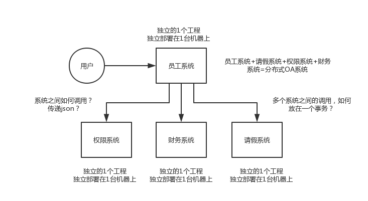

## 分布式系统面试连环炮
有一些同学，之前呢主要是做传统行业，或者外包项目，一直是在那种小的公司，技术一直都搞的比较简单。他们有共同的一个问题，就是都没怎么搞过分布式系统，现在互联网公司，一般都是做分布式的系统，大家都不是做底层的分布式系统、分布式存储系统 Hadoop HDFS、分布式计算系统 Hadoop MapReduce / Spark、分布式流式计算系统 Storm。

分布式业务系统，就是把原来用 Java 开发的一个大块系统，给拆分成**多个子系统**，多个子系统之间互相调用，形成一个大系统的整体。假设原来你做了一个 OA 系统，里面包含了权限模块、员工模块、请假模块、财务模块，一个工程，里面包含了一堆模块，模块与模块之间会互相去调用，1 台机器部署。现在如果你把这个系统给拆开，权限系统、员工系统、请假系统、财务系统 4 个系统，4 个工程，分别在 4 台机器上部署。一个请求过来，完成这个请求，这个员工系统，调用权限系统，调用请假系统，调用财务系统，4 个系统分别完成了一部分的事情，最后 4 个系统都干完了以后，才认为是这个请求已经完成了。

> 近几年开始兴起和流行 Spring Cloud，刚流行，还没开始普及，目前普及的是 Dubbo，因此这里也主要讲 Dubbo。

面试官可能会问你以下问题。

### 为什么要进行系统拆分？

* 为什么要进行系统拆分？如何进行系统拆分？拆分后不用 Dubbo 可以吗？Dubbo 和 thrift 有什么区别呢？

### 分布式服务框架

* 说一下的 Dubbo 的工作原理？注册中心挂了可以继续通信吗？
* Dubbo 支持哪些序列化协议？说一下 Hessian 的数据结构？PB 知道吗？为什么 PB 的效率是最高的？
* Dubbo 负载均衡策略和高可用策略都有哪些？动态代理策略呢？
* Dubbo 的 SPI 思想是什么？
* 如何基于 Dubbo 进行服务治理、服务降级、失败重试以及超时重试？
* 分布式服务接口的幂等性如何设计（比如不能重复扣款）？
* 分布式服务接口请求的顺序性如何保证？
* 如何自己设计一个类似 Dubbo 的 RPC 框架？

### 分布式锁

* 使用 Redis 如何设计分布式锁？使用 zk 来设计分布式锁可以吗？这两种分布式锁的实现方式哪种效率比较高？

### 分布式事务

* 分布式事务了解吗？你们如何解决分布式事务问题的？TCC 如果出现网络连不通怎么办？XA 的一致性如何保证？

### 分布式会话

* 集群部署时的分布式 Session 如何实现？
