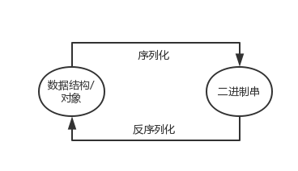
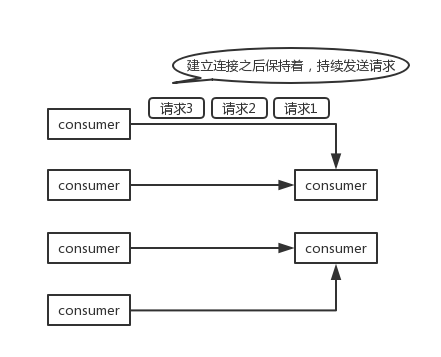
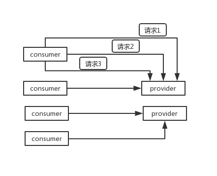

## 面试题

dubbo 支持哪些通信协议？支持哪些序列化协议？说一下 Hessian 的数据结构？PB 知道吗？为什么 PB 的效率是最高的？

## 面试官心理分析

上一个问题，说说 dubbo 的基本工作原理，那是你必须知道的，至少要知道 dubbo 分成哪些层，然后平时怎么发起 rpc 请求的，注册、发现、调用，这些是基本的。

接着就可以针对底层进行深入的问问了，比如第一步就可以先问问序列化协议这块，就是平时 RPC 的时候怎么走的？

## 面试题剖析

**序列化**，就是把数据结构或者是一些对象，转换为二进制串的过程，而**反序列化**是将在序列化过程中所生成的二进制串转换成数据结构或者对象的过程。

### dubbo 支持不同的通信协议

- dubbo 协议 `dubbo://`

**默认**就是走 dubbo 协议，单一长连接，进行的是 NIO 异步通信，基于 hessian 作为序列化协议。使用的场景是：传输数据量小（每次请求在 100kb 以内），但是并发量很高，以及服务消费者机器数远大于服务提供者机器数的情况。

为了要支持高并发场景，一般是服务提供者就几台机器，但是服务消费者有上百台，可能每天调用量达到上亿次！此时用长连接是最合适的，就是跟每个服务消费者维持一个长连接就可以，可能总共就 100 个连接。然后后面直接基于长连接 NIO 异步通信，可以支撑高并发请求。

长连接，通俗点说，就是建立连接过后可以持续发送请求，无须再建立连接。

而短连接，每次要发送请求之前，需要先重新建立一次连接。

- rmi 协议 `rmi://`

RMI 协议采用 JDK 标准的 java.rmi.\* 实现，采用阻塞式短连接和 JDK 标准序列化方式。多个短连接，适合消费者和提供者数量差不多的情况，适用于文件的传输，一般较少用。

- hessian 协议 `hessian://`

Hessian 1 协议用于集成 Hessian 的服务，Hessian 底层采用 Http 通讯，采用 Servlet 暴露服务，Dubbo 缺省内嵌 Jetty 作为服务器实现。走 hessian 序列化协议，多个短连接，适用于提供者数量比消费者数量还多的情况，适用于文件的传输，一般较少用。

- http 协议 `http://`

基于 HTTP 表单的远程调用协议，采用 Spring 的 HttpInvoker 实现。走表单序列化。

- thrift 协议 `thrift://`

当前 dubbo 支持的 thrift 协议是对 thrift 原生协议的扩展，在原生协议的基础上添加了一些额外的头信息，比如 service name，magic number 等。

- webservice `webservice://`

基于 WebService 的远程调用协议，基于 Apache CXF 的 frontend-simple 和 transports-http 实现。走 SOAP 文本序列化。

- memcached 协议 `memcached://`

基于 memcached 实现的 RPC 协议。

- redis 协议 `redis://`

基于 Redis 实现的 RPC 协议。

- rest 协议 `rest://`

基于标准的 Java REST API——JAX-RS 2.0（Java API for RESTful Web Services 的简写）实现的 REST 调用支持。

- gPRC 协议 `grpc://`

Dubbo 自 2.7.5 版本开始支持 gRPC 协议，对于计划使用 HTTP/2 通信，或者想利用 gRPC 带来的 Stream、反压、Reactive 编程等能力的开发者来说， 都可以考虑启用 gRPC 协议。

### dubbo 支持的序列化协议

dubbo 支持 hession、Java 二进制序列化、json、SOAP 文本序列化多种序列化协议。但是 hessian 是其默认的序列化协议。

### 说一下 Hessian 的数据结构

Hessian 的对象序列化机制有 8 种原始类型：

- 原始二进制数据
- boolean
- 64-bit date（64 位毫秒值的日期）
- 64-bit double
- 32-bit int
- 64-bit long
- null
- UTF-8 编码的 string

另外还包括 3 种递归类型：

- list for lists and arrays
- map for maps and dictionaries
- object for objects

还有一种特殊的类型：

- ref：用来表示对共享对象的引用。

### 为什么 PB 的效率是最高的？

其实 PB 之所以性能如此好，主要得益于两个：**第一**，它使用 proto 编译器，自动进行序列化和反序列化，速度非常快，应该比 `XML` 和 `JSON` 快上了 `20~100` 倍；**第二**，它的数据压缩效果好，就是说它序列化后的数据量体积小。因为体积小，传输起来带宽和速度上会有优化。
