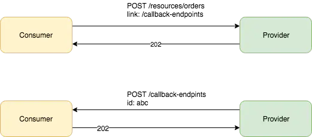
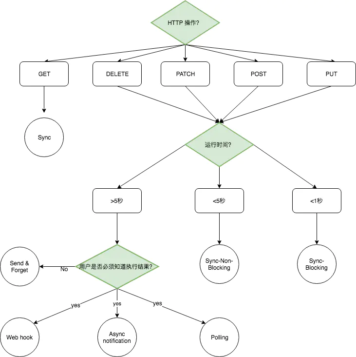

## **API 异步 & 同步的决策树**

### **定义**

> **Synchronous (同步)**: A business transaction done in a single HTTP request/response exchange, which means that **the HTTP response provides all data and associated resources resulting from the transaction**.

> **Asynchronous (异步)**: A business transaction done over multiple HTTP request/response exchanges, which means that the initial HTTP response **does not provide all data and associated resources resulting from the transaction**, such data and resources **can be obtained in subsequent interactions**.

---

### **问题域**

**HTTP 是一个同步协议：**

- 客户端和服务器端通过三次握建立 TCP 连接。
- 客户端发出请求，然后就等待响应。
- 服务器端处理请求，并返回相应的状态码和数据。
- 客户端完成接收，通过四次挥手，断开连接。

一些情况下，这种**同步 - blocking** 的通信方式，并不适合，比如以下的场景：

- **复杂的服务编排**， 比如一个请求需要通过**调用多个 downstream 系统来更新或者创建一个资源**（一个 long running 的 http 连接，可能会影响 web server 的性能或者 API gateway 的性能）。
- **系统的可用性和稳定性**， 比如一个后端系统，响应非常的慢，不稳定，甚至不可用（一个请求响应时间长短，直接影响到用户体验和转化率）。

---

### **方法域**

**异步模式：**

1. **Web hook**

- 作为 Consumer，需要提供成功或者失败的回调接口
- 作为 Provider，需要在一次接收到请求的时候，返回202；需要在 resource 成功或者失败创建后，调用 callback 接口，通知 Consumer； 如果 consumer 提供的 callback 接口，返回失败的 status code，需要设置一定的 retry 机制。

2. **Asynchronous Notification**

---

### **什么时候使用异步呢？**

1. **根据HTTP操作来判断：**

- **HEAD, OPTIONS, CONNECT, TRACE** 等方法不能使用异步。
- **GET 方法通常不使用异步**，如果你的 GET 请求时间太长，可以考虑以下的这些方法改进：e.g： 将你的聚合根拆分为更细粒度的 resource、引入分页、引入缓存、将你的GET操作改为POST（比如 search）。
- 其他的 HTTP 操作，比如 PUT, POST, PATCH 和 DELETE 能够异步就尽量异步。

2. **根据响应时间来判断：**

- 如果你的 API 操作，大于5秒的时间，就选择异步。
- 如果你的 API 操作，大于1秒并小于5秒，应选择异步。
- 如果你的 API 操作，小于1秒，则可以选择同步。  

    P.S: 关于响应时间，根据用户行为调查，发现用户在等待大约5秒左右，就会失去耐心; 关于 HTTP Client 的 timeout 设置，浏览器，客户端 JS 库，服务器端 http client 库，他们的 timeout 设置都不一样，从20s到几分钟都有。

---

### **辅助决策树**

