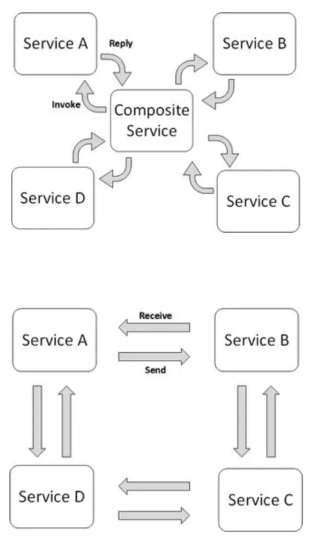
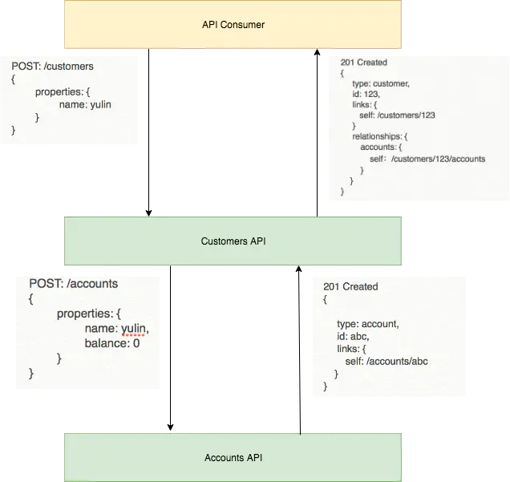
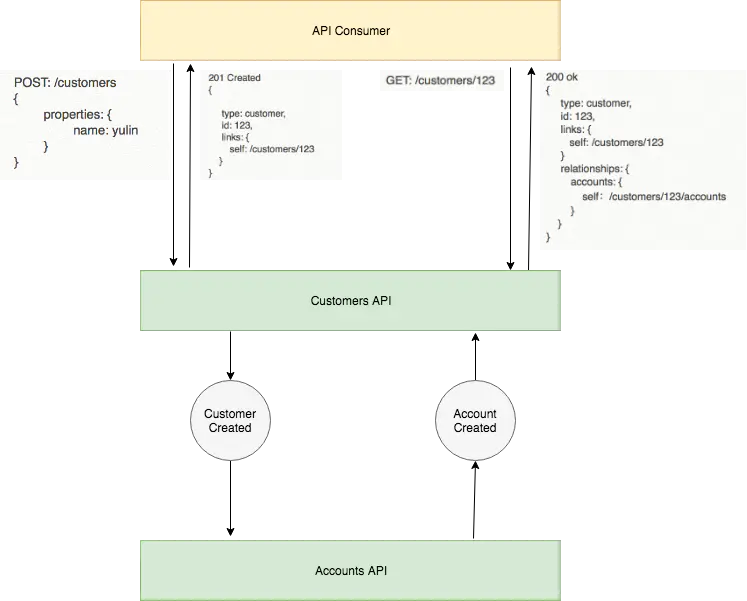

## **事件驱动架构**

简单来说，事件驱动架构就是基于事件进行通信的软件架构，它具有以下的特点：

- **分布式异步架构**，事件生产者和消费者**高度解耦**（生产者不知道有多少消费者要消费对应事件），事件消费者之间也**高度解耦**（消费者之间也互不感知）
- **更好的性能**，由于事件的异步本质，软件不易产生拥堵，能够处理更高的流量。
- 事件处理器可以**独立的开发，测试，部署**，并容易接入到整个生态系统，故**可扩展性好**。

## **Orchestration vs Choreography**

我们在聊事件驱动架构时，先了解下 **Orchestration** 和 **Choreography** 的区别：

- 他们都是服务组合的方式，一种是**中心化**的方式，另外一种是**去中心化**的方式，直接从下图就可以看出他们之间的区别：

由于 [HTTP 的同步特性](./api-synchronous-and-asynchronous.md)，在很多场景下，**Blocking** 式的 http 调用其实并不适用，因此为了提高系统性能，缩短总体响应时间（e.g后端多个服务编排的时间过长），提高系统的整体可用性（e.g： 下游 downstream 服务不稳定，导致的可用性问题），越来越多的系统都采用了 **Event Driven Architecture** 的方式进行服务的集成。

在 Event-Based 的系统里，服务的集成是通过 Choreography 的方式，而不是 Orchestration 的方式来实现的，举个例子如下图：

- **Orchestration**，在图中 Customers API 在创建 Customer 的过程中，**直接调用了Account API 进行了账号的创建**，在返回体中包含了一个 hypermedia link，允许 consumer 通过这个链接获取到 Account 的信息。

- **Choreography**，在图中 Customers API 并没有**试图直接创建账号**，而是抛出一个 "CustomerCreated" 的事件到 queue 或者 stream 里面，然后就将用户的数据反馈给消费者了，之后，相应的事件订阅者，比如 Accounts API 就被通知了，或者主动去拉取 "**CustomerCreated**" 事件，获取到事件后，执行相应的操作，创建了 Account 并抛出了 "**AccountCreated**" 事件，然后 Customer API 作为这个事件的订阅者，被通知，进行了相应的关联操作，因此，当 consumer 获取 customer 的时候，Account 的信息已经被内联到 customer 数据结构了。