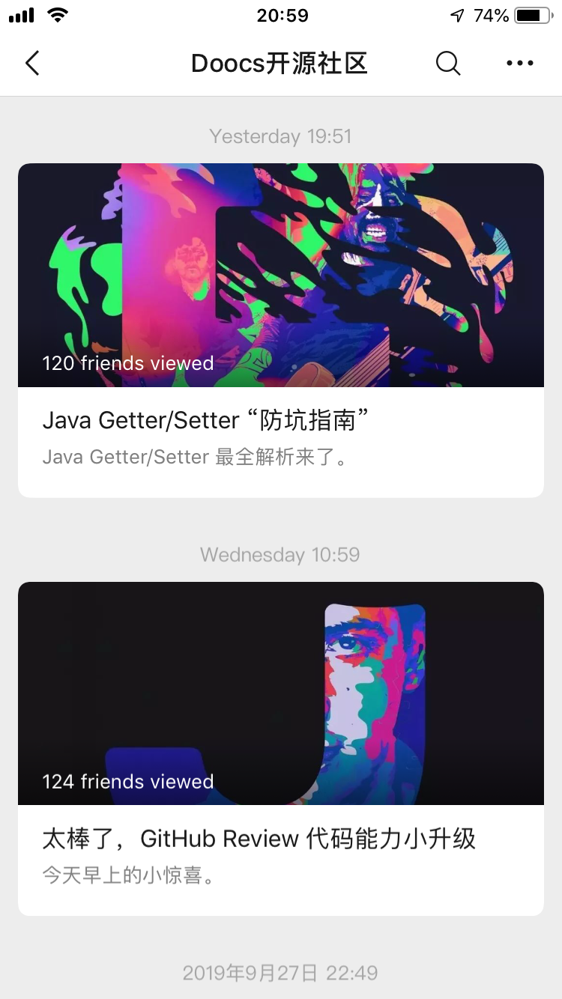
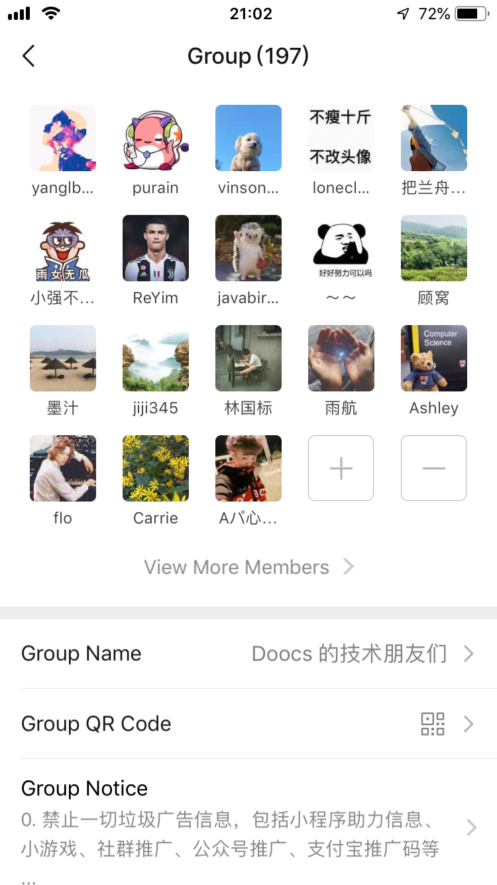

# Doocs 开源社区的公众号来了
GitHub 开源社区 Doocs 旗下唯一公众号“**Doocs开源社区**”，专注于挖掘 IT 技术知识，助力开发者成长。

  

来成为公众号的首批粉丝吗？一定不会辜负你们的期待。

## 为什么选择公众号？

微信公众号的**原创保护功能**做得比较好，内容阅读也比较方便。

后续我的所有原创文章，将第一时间通过微信公众号“Doocs开源社区”发布。如果其他公众号号主希望转载内容，请在公众号聊天窗口处发消息与我说明，或者直接添加我的个人微信(YLB0109)进行交流。

## 公众号的定位是怎样的？

* **内容高质**：不随意从网上复制粘贴一些文章，即便是转载的技术文章，也要确保质量。
* **定期更新**：尽量在每周输出 1-2 篇文章，保证一定的更新频率。

  

## 目前都有哪些文章？

因为刚刚推出公众号，目前有以下几篇文章，来先睹为快吧：

* [硬核！亿级流量秒杀系统设计](https://mp.weixin.qq.com/s/Mo_knIRBQQL2s-D2aieZLg)
* [技术面试是否要看面经？面试官/面试者有话说！](https://mp.weixin.qq.com/s/fNiUmbY395rsPdEC0QDIrw)
* [如何破解极验滑动验证码？成功率 100%！](https://mp.weixin.qq.com/s/Fsl6qYN5Dw4s6Du893MkFQ)
* [免费且好用的图床，就你了，「图壳」！](https://mp.weixin.qq.com/s/0HhgHLo_tTRFZcC-CVjDbw)
* [阿里又一个 20k+ stars 开源项目诞生，恭喜 fastjson！](https://mp.weixin.qq.com/s/RNKDCK2KoyeuMeEs6GUrow)
* [刷掉 90% 候选人的互联网大厂海量数据面试题（附题解 + 方法总结）](https://mp.weixin.qq.com/s/rjGqxUvrEqJNlo09GrT1Dw)
* [好用！期待已久的文本块功能究竟如何在 Java 13 中发挥作用？](https://mp.weixin.qq.com/s/kalGv5T8AZGxTnLHr2wDsA)
* [2019 GitHub 开源贡献排行榜新鲜出炉！微软谷歌领头，阿里跻身前 12！](https://mp.weixin.qq.com/s/_q812aGD1b9QvZ2WFI0Qgw)
* [Google 搜索的即时自动补全功能究竟是如何“工作”的？](https://mp.weixin.qq.com/s/YlMISSc3Sn890BzTLytcLA)
* [厉害了，原来 Redisson 这么好用！](https://mp.weixin.qq.com/s/lpZ7eRdImy0MyTEVH68HYw)
* [一文带你搞懂 “缓存策略”](https://mp.weixin.qq.com/s/47A_iXY_nArURwUTPHr2IQ)
* [Java Getter/Setter “防坑指南”](https://mp.weixin.qq.com/s/TZqcAw7NTlcvU-p930-eHA)
* [太棒了，GitHub Review 代码能力小升级](https://mp.weixin.qq.com/s/Lok0epqn91Q51ygZo_FLkg)
* [巧用 Redis Hyperloglog，轻松统计 UV 数据](https://mp.weixin.qq.com/s/w1r-M6YVvQSfUtzO_xe44Q)
* [如何开启「GitHub+码云」双工作流模式？](https://mp.weixin.qq.com/s/byxAjr3-ifWfDYQcR7YA8Q)

后续将推出一系列原创干货文章，敬请期待。

## 是否有交流群？

有的，目前微信群“**Doocs的技术朋友们**”已经接近 200 号人，如果你希望加入，请通过微信与我联系。

**注意**，群内禁止一切垃圾广告信息，包括小程序助力信息、小游戏、社群推广、公众号推广、支付宝推广码等；交流 GitHub、开发相关，可以自由分享一些开发相关知识，但不提倡整天水群，建议还是多花点时间提升自己。

  

