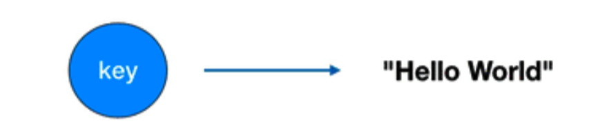

## **Redis 基础数据结构**

Redis 有 5 种基础数据结构，分别为: string (字符串)、list (列表)、set (集合)、hash (哈希) 和 zset (有序集合)

### **字符串**

字符串 string 是 Redis 最简单的数据结构。Redis 所有的数据结构都是以唯一的 key 字符串作为名称，然后通过这个唯一 key 值来获取相应的 value 数据。不同类型的数据结构的差异就在于 value 的结构不一样。

字符串结构使用非常广泛，一个常见的用途就是缓存用户信息。我们将用户信息结构体**使用 JSON 序列化成字符串**，然后将序列化后的字符串塞进 Redis 来缓存。同样，取用户信息会经过一次反序列化的过程。

