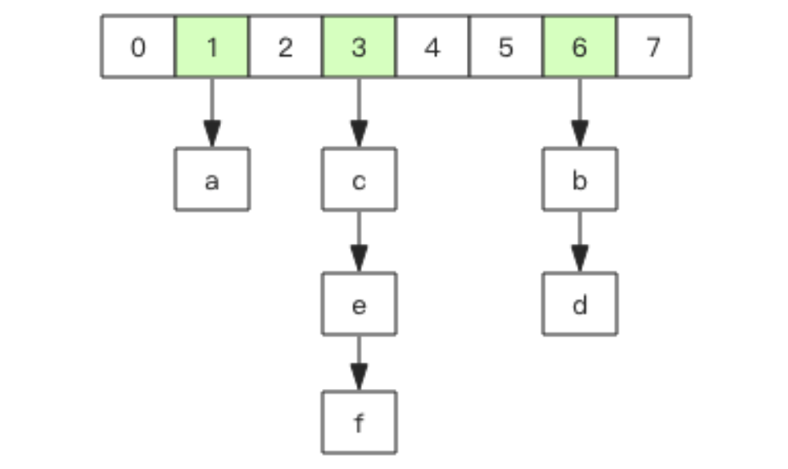
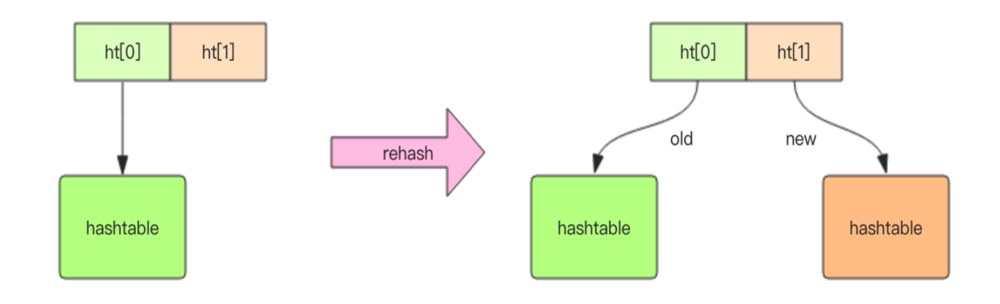

# **Redis 基础数据结构**

## **hash (字典)**
- Redis 的字典相当于 Java 语言里面的 HashMap，它是**无序字典**。
- 内部实现结构上同 Java 的 HashMap 也是一致的，同样的**数组 + 链表**二维结构。第一维 hash 的数组位置碰撞时，就会将碰撞的元素使用链表串接起来。



- Redis 的字典的值只能是字符串。
- 在字典很大时，rehash 是个耗时的操作，Redis 为了高性能采用了**渐进式 rehash** 策略。

> **渐进式 rehash**：[渐进式 rehash](../rehash.md)



- 当 hash 移除最后一个元素之后，该数据结构自动被删除，内存被回收。
- hash 结构也可以用来存储用户信息，不同于字符串一次性需要**全部序列化整个对象**，hash 可以对用户结构中的**每个字段单独存储**。这样当我们需要获取用户信息时可以进行**部分获取**。而以整个字符串的形式保存用户信息的话就只能**一次性全部读取**，比较浪费网络流量。
- hash 也有缺点，hash 结构的存储消耗要高于单个字符串，到底该使用 hash 还是字符串，需要根据实际情况。

```bash
> hset books java "think in java" # 命令行的字符串如果包含空格，要用引号括起来 
(integer) 1
> hset books golang "concurrency in go"
(integer) 1
> hset books python "python cookbook"
(integer) 1
>
> hgetall books # entries()，key 和 value 间隔出现
1) "java"
2) "think in java"
3) "golang"
4) "concurrency in go"
5) "python"
6) "python cookbook"
>
> hlen books
(integer) 3
> hget books java
"think in java"
>
> hset books golang "learning go programming" # 因为是更新操作，所以返回 0 
(integer) 0
> hget books golang "learning go programming"
> hmset books java "effective java" python "learning python" golang "modern golang
programming" # 批量 set 
OK
```

- hash 结构中的单个子 key 也可以进行计数，它对应的指令是 hincrby。

> **字典结构内部实现**：[字典结构](../redis-dict.md)