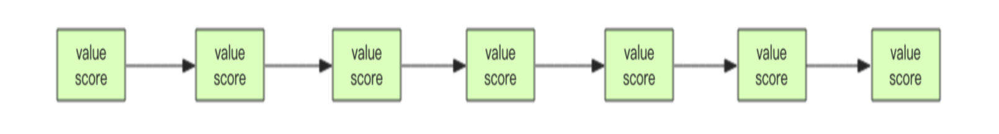

# **Redis 基础数据结构**

## **set (集合)**

- Redis 的集合相当于 Java 语言里面的 HashSet，它内部的键值对是**无序的唯一的**。它的内部实现相当于一个特殊的字典，字典中所有的 value 都是一个值 NULL。
- 当集合中最后一个元素移除之后，数据结构自动删除，内存被回收。
- set 结构可以用来 存储活动中奖的用户 ID，因为有**去重功能**，可以保证同一个用户不会中奖两次。

```bash
> sadd books python
(integer) 1
> sadd books python # 重复
(integer) 0
> sadd books java golang
(integer) 2
>
> smembers books # 注意顺序，和插入的并不一致，因为 set 是无序的
1) "java"
2) "python"
3) "golang"
>
> sismember books java # 查询某个 value 是否存在，相当于 contains(o) 
(integer) 1
> sismember books rust
(integer) 0
>
> scard books # 获取长度相当于 count()
(integer) 3
> spop books # 弹出一个
"java"
```

### **zset (有序列表)**
- 类似于 Java 的 **SortedSet** 和 **HashMap** 的结合体。一方面它是一个 **set**，保证了内部 value 的**唯一性**，另一方面它可以给每个 value 赋予一个 **score**，代表这个 value 的**排序权重**。
- 它的内部实现用的是一种叫着「**跳跃列表**」的数据结构。
- zset 中最后一个 value 被移除后，数据结构自动删除，内存被回收。
- zset 可以用来存粉丝列表，value 值是粉丝的**用户 ID**，score 是**关注时间**。我们可以对粉丝列表**按关注时间进行排序**。
- zset 还可以用来存储学生的成绩，value 值是学生的 ID，score 是他的考试成绩。我们可以对成绩**按分数进行排序**就可以得到他的名次。

```bash
> zadd books 9.0 "think in java"
(integer) 1
> zadd books 8.9 "java concurrency"
(integer) 1
> zadd books 8.6 "java cookbook"
(integer) 1
>
> zrange books 0 -1 # 按 score 排序列出，参数区间为排名范围
1) "java cookbook"
2) "java concurrency"
3) "think in java"
>
> zrevrange books 0 -1 # 按 score 逆序列出，参数区间为排名范围
1) "think in java"
2) "java concurrency"
3) "java cookbook"
>
> zcard books # 相当于 count()
(integer) 3
>
> zscore books "java concurrency" # 获取指定 value 的 score
"8.9000000000000004" # 内部 score 使用 double 类型进行存储，所以存在小数点精度问题
>
> zrank books "java concurrency" # 排名
(integer) 1
>
> zrangebyscore books 0 8.91 # 根据分值区间遍历 zset
1) "java cookbook"
2) "java concurrency"
>
> zrangebyscore books -inf 8.91 withscores # 根据分值区间 (-∞, 8.91] 遍历 zset，同时返回分值。inf 代表 infinite，无穷大的意思。
1) "java cookbook"
2) "8.5999999999999996"
3) "java concurrency"
4) "8.9000000000000004"
>
> zrem books "java concurrency" # 删除 value (integer) 1
> zrange books 0 -1
1) "java cookbook"
2) "think in java"
```

### **跳跃列表**
- zset 内部的排序功能是通过「**跳跃列表**」数据结构来实现的，它的结构非常特殊，也比较复杂。
- 因为 zset 要支持**随机的插入和删除**，所以它不好使用数组来表示。我们先看一个普通的链表结构。


- 我们需要这个链表按照 **score** 值进行排序。这意味着当有新元素需要插入时，要定位到特定位置的**插入点**，这样才可以继续保证链表是有序的。
- 通常我们会通过**二分查找**来找到插入点，但是二分查找的对象必须是**数组**。只有数组才可以支持**快速位置定位**。

- 跳跃列表就是类似于这种层级制，最下面一层**所有的元素都会串起来**。然后每隔几个元素**挑选出一个代表来**，再将这几个代表使用**另外一级指针**串起来。


- 「跳跃列表」之所以「**跳跃**」，是因为内部的元素可能「**身兼数职**」，比如上图中间的这个元素，同时处于 L0、L1 和 L2 层，可以快速在**不同层次之间**进行「跳跃」。

定位插入点时，先在**顶层**进行定位，然后下潜到**下一级**定位，一直下潜到**最底层**找到合适的位置，将新元素插进去。那新插入的元素如何才有机会「**身兼数职**」呢? <br>
> 跳跃列表采取一个**随机策略**来决定新元素可以兼职到第几层。<br>

> **跳表的内部结构实现**：[跳表内部结构](../jump_table.md)
