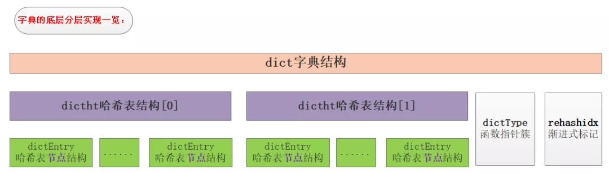

# **「字典」内部**

> 参考1: https://mp.weixin.qq.com/s/f9N13fnyTtnu2D5sKZiu9w  
> 参考2: https://juejin.im/entry/6844903433665773576

当我们在本文中提到 Redis 的 “数据结构”，可能是在两个不同的层面来讨论它。

第一个层面，是从**使用者**的角度。比如：

- **string**

- **list**

- **hash**

- **set**

- **sorted set**

这一层面也是 Redis **暴露给外部的调用接口**。

第二个层面，是从**内部实现**的角度，属于更底层的实现。比如：

- **dict**

- **sds**

- **ziplist**

- **quicklist**

- **skiplist**

第一个层面的 “数据结构”，Redis的官方文档(http://redis.io/topics/data-types-intro)有详细的介绍。本文的重点在于讨论第二个层面，**Redis数据结构的内部实现**，以及**这两个层面的数据结构之间的关系**：Redis如何**通过组合第二个层面的各种基础数据结构来实现第一个层面的更高层的数据结构**。

在讨论任何一个系统的内部实现的时候，我们都要先明确它的**设计原则**，这样我们才能更深刻地理解它为什么会进行如此设计的真正意图。在本文接下来的讨论中，我们主要关注以下几点：

- **存储效率**（memory efficiency）。Redis是专用于存储数据的，它对于计算机资源的主要消耗就在于内存，因此节省内存是它非常非常重要的一个方面。这意味着Redis一定是非常精细地考虑了压缩数据、减少内存碎片等问题。

- **快速响应时间**（fast response time）。与快速响应时间相对的，是高吞吐量（high throughput）。Redis是用于提供在线访问的，对于单个请求的响应时间要求很高，因此，快速响应时间是比高吞吐量更重要的目标。有时候，这两个目标是矛盾的。

- **单线程**（single-threaded）。Redis的性能瓶颈不在于CPU资源，而在于内存访问和网络IO。而采用单线程的设计带来的好处是，极大简化了数据结构和算法的实现。相反，Redis通过异步IO和pipelining等机制来实现高速的并发访问。显然，单线程的设计，对于单个请求的快速响应时间也提出了更高的要求。

dict是一个用于维护key和value映射关系的数据结构，与很多语言中的Map或dictionary类似。Redis的一个database中**所有key到value的映射**，就是使用一个**dict**来维护的。不过，这只是它在Redis中的一个用途而已。

**dict 是 Redis 服务器中出现最为频繁的复合型数据结构**，除了 hash 结构的数据会用到字典外，整个 Redis 数据库的**所有 key 和 value 也组成了一个全局字典**，还有**带过期时间的 key 集合**也是一个字典。zset 集合中存储 **value 和 score 值的映射关系**也是通过 dict 结构实现的。

dict是一个用于维护key和value映射关系的数据结构，与很多语言中的Map或dictionary类似。Redis的一个database中所有key到value的映射，就是使用一个dict来维护的。不过，这只是它在Redis中的一个用途而已，它在Redis中被使用的地方还有很多。比如，一个Redis hash结构，当它的field较多时，便会采用dict来存储。再比如，Redis配合使用dict和skiplist来共同维护一个sorted set。这些细节我们后面再讨论，在本文中，我们集中精力讨论dict本身的实现。

dict本质上是为了解决算法中的**查找问题**（Searching），一般查找问题的解法分为两个大类：一个是基于各种**平衡树**，一个是基于**哈希表**。我们平常使用的各种Map或dictionary，大都是基于哈希表实现的。在不要求数据有序存储，且能保持较低的哈希值冲突概率的前提下，基于哈希表的查找性能能做到非常高效，接近O(1)，而且实现简单。

在Redis中，dict也是一个基于哈希表的算法。和传统的哈希算法类似，它采用某个哈希函数从key计算得到在哈希表中的位置，采用拉链法解决冲突，并在装载因子（load factor）**超过预定值时自动扩展内存**，引发重哈希（rehashing）。Redis的dict实现最显著的一个特点，就在于它的**重哈希**。它采用了一种称为**增量式重哈希**（incremental rehashing）的方法，在需要扩展内存时避免一次性对所有key进行重哈希，而是将重哈希操作分散到对于dict的各个增删改查的操作中去。这种方法能做到每次只对一小部分key进行重哈希，而每次重哈希之间不影响dict的操作。dict之所以这样设计，是为了**避免重哈希期间单个请求的响应时间剧烈增加**，这与前面提到的“快速响应时间”的设计原则是相符的。

## **I. dict 的数据结构定义**

```C
//哈希节点结构
typedef struct dictEntry {
    void *key;
    union {
        void *val;
        uint64_t u64;
        int64_t s64;
        double d;
    } v;
    struct dictEntry *next;
} dictEntry;

//封装的是字典的操作函数指针
typedef struct dictType {
    uint64_t (*hashFunction)(const void *key);
    void *(*keyDup)(void *privdata, const void *key);
    void *(*valDup)(void *privdata, const void *obj);
    int (*keyCompare)(void *privdata, const void *key1, const void *key2);
    void (*keyDestructor)(void *privdata, void *key);
    void (*valDestructor)(void *privdata, void *obj);
} dictType;

/* This is our hash table structure. Every dictionary has two of this as we
 * implement incremental rehashing, for the old to the new table. */
//哈希表结构 该部分是理解字典的关键
typedef struct dictht {
    dictEntry **table;
    unsigned long size;
    unsigned long sizemask;
    unsigned long used;
} dictht;

//字典结构
typedef struct dict {
    dictType *type;
    void *privdata;
    dictht ht[2];
    long rehashidx; /* rehashing not in progress if rehashidx == -1 */
    unsigned long iterators; /* number of iterators currently running */
} dict;
```

字典是个层次非常明显的数据类型，如图：


结合上面的代码和结构图，可以很清楚地看出dict的结构。一个dict由如下若干项组成：

- 一个指向dictType结构的指针（type）。它通过自定义的方式使得dict的key和value能够存储任何类型的数据。

- 一个私有数据指针（privdata）。由调用者在创建dict的时候传进来。

- 两个哈希表（ht[2]）。只有在重哈希的过程中，ht[0]和ht[1]才都有效。而在平常情况下，只有ht[0]有效，ht[1]里面没有任何数据。上图表示的就是重哈希进行到中间某一步时的情况。

- 当前重哈希索引（rehashidx）。如果rehashidx = -1，表示当前没有在重哈希过程中；否则，表示当前正在进行重哈希，且它的值记录了当前重哈希进行到哪一步了。

- 当前正在进行遍历的iterator的个数。这不是我们现在讨论的重点，暂时忽略。

dictType结构包含若干函数指针，用于dict的调用者对涉及key和value的各种操作进行自定义。这些操作包含：

- hashFunction，对key进行哈希值计算的哈希算法。

- keyDup和valDup，分别定义key和value的拷贝函数，用于在需要的时候对key和value进行深拷贝，而不仅仅是传递对象指针。

- keyCompare，定义两个key的比较操作，在根据key进行查找时会用到。

- keyDestructor和valDestructor，分别定义对key和value的析构函数。

私有数据指针（privdata）就是在dictType的某些操作被调用时会传回给调用者。

需要详细察看的是dictht结构。它定义一个哈希表的结构，由如下若干项组成：

- 一个dictEntry指针数组（table）。key的哈希值最终映射到这个数组的某个位置上（对应一个bucket）。如果多个key映射到同一个位置，就发生了冲突，那么就拉出一个dictEntry链表。

- size：标识dictEntry指针数组的长度。它总是2的指数。

- sizemask：用于将哈希值映射到table的位置索引。它的值等于(size-1)，比如7, 15, 31, 63，等等，也就是用二进制表示的各个bit全1的数字。每个key先经过hashFunction计算得到一个哈希值，然后计算(哈希值 & sizemask)得到在table上的位置。相当于计算取余(哈希值 % size)。

- used：记录dict中现有的数据个数。它与size的比值就是装载因子（load factor）。这个比值越大，哈希值冲突概率越高。

dictEntry结构中包含k, v和指向链表下一项的next指针。k是void指针，这意味着它可以指向任何类型。v是个union，当它的值是uint64_t、int64_t或double类型时，就不再需要额外的存储，这有利于减少内存碎片。当然，v也可以是void指针，以便能存储任何类型的数据。

C语言的好处在于定义必须是由最底层向外的，因此我们可以看到一个明显的层次变化，于是笔者又画一图来展现具体的层次概念：

