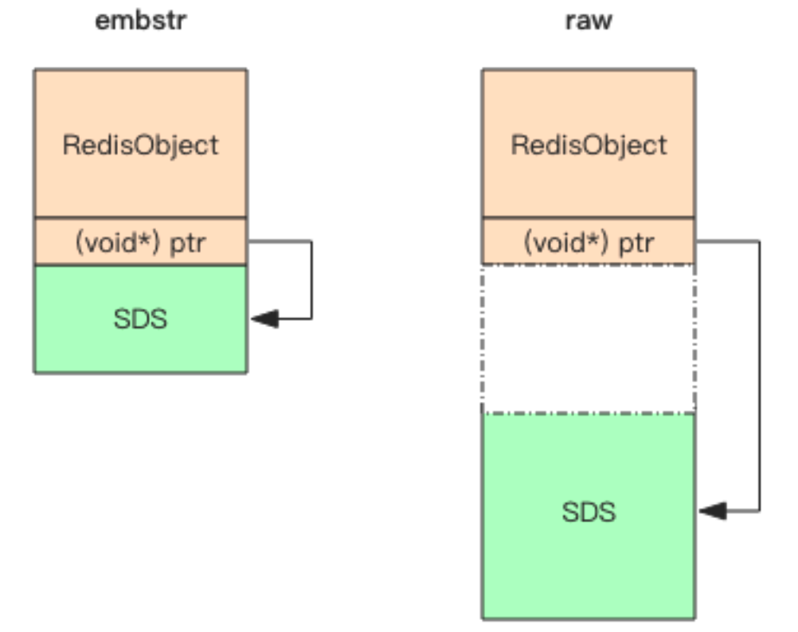

# **「字符串」内部结构**

Redis 的字符串叫着「SDS」，也就是 **Simple Dynamic String**。它的结构是一个**带长度信息的字节数组**。

```C
struct SDS<T> {
    T capacity; // 数组容量
    T len; // 数组长度
    byte flags; // 特殊标识位，不理睬它 
    byte[] content; // 数组内容
}
```

**content** 里面存储了真正的字符串内容，那 capacity 和 len 表示什么意思呢？它有点类似于 Java 语言的 ArrayList 结构，需要比实际的内容长度多分配一些冗余空间。**capacity 表示所分配数组的长度，len 表示字符串的实际长度**。前面我们提到字符串是可以修改的字符串，它要支持 append 操作。如果数组没有冗余空间，那么追加操作必然涉及到分配新数组，然后将旧内容复制过来，再 append 新内容。如果字符串的长度非常长，这样的内存分配和复制开销就会非常大。

```C
/* Append the specified binary-safe string pointed by 't' of 'len' bytes to the * end of the specified sds string 's'.
 *
 * After the call, the passed sds string is no longer valid and all the
 * references must be substituted with the new pointer returned by the call. */ 
 sds sdscatlen(sds s, const void *t, size_t len) {
    size_t curlen = sdslen(s); // 原字符串长度
    // 按需调整空间，如果 capacity 不够容纳追加的内容，就会重新分配字节数组并复制原字符串的内容到新数组中
    s = sdsMakeRoomFor(s,len);
    if (s == NULL) return NULL; // 内存不足
    memcpy(s+curlen, t, len); // 追加目标字符串的内容到字节数组中
    sdssetlen(s, curlen+len); // 设置追加后的长度值
    s[curlen+len] = '\0'; // 让字符串以\0 结尾，便于调试打印，还可以直接使用 glibc 的字符串函数进行操作
    return s; 
}
```

Redis 规定字符串的长度不得超过 512M 字节。创建字符串时 len 和 capacity 一样 长，不会多分配冗余空间，这是因为绝大多数场景下我们不会使用 append 操作来修改字符串。

## **I. embstr vs raw**

Redis 的字符串有两种存储方式，在长度特别短时，使用 emb 形式存储 (embeded)，当长度超过 44 时，使用 raw 形式存储。



如图所示，embstr 存储形式是这样一种存储形式，它**将 RedisObject 对象头和 SDS 对象连续存在一起，使用 malloc 方法一次分配**。而 raw 存储形式不一样，它**需要两次 malloc，两个对象头在内存地址上一般是不连续的**。

## **II. 扩容策略**

字符串在长度小于 1M 之前，扩容空间采用加倍策略，也就是保留 100% 的冗余空间。当长度超过 1M 之后，为了避免加倍后的冗余空间过大而导致浪费，每次扩容只会多分配 1M 大小的冗余空间。

## **III. SDS 与 C 字符串的区别**

- **1. 常数时间内获得字符串长度**

    C 字符串本身不记录长度信息，每次获取长度信息都需要遍历整个字符串，复杂度为 O(n)；C 字符串遍历时遇到 '\0' 时结束。

    SDS 中 len 字段保存着字符串的长度，所以总能在**常数时间内获取字符串长度**，复杂度是 O(1)。

- **2. 避免缓冲区溢出**

    假设在内存中有两个紧挨着的两个字符串，s1 = “xxxxx”和 s2 = “yyyyy”。

    由于在内存上紧紧相连，当我们对 s1 进行扩充的时候，将 s1 = “xxxxxzzzzz”后，由于没有进行相应的内存重新分配，导致 s1 把 s2 覆盖掉，导致 s2 被莫名其妙的修改。

    但 SDS 的 API 对 zfc 修改时首先会检查空间是否足够，若不充足则会分配新空间，避免了缓冲区溢出问题。

- **3. 减少字符串修改时带来的内存重新分配的次数**

    在 C 中，当我们频繁的对一个字符串进行修改（append 或 trim）操作的时候，需要**频繁的进行内存重新分配的操作**，十分影响性能。

    如果不小心忘记，有可能会导致内存溢出或内存泄漏，对于 Redis 来说，本身就会很频繁的修改字符串，所以使用 C 字符串并不合适。而 SDS 实现了**空间预分配**和**惰性空间释放**两种优化策略：  

    - **空间预分配**：当 SDS 的 API 对一个 SDS 修改后，并且对 SDS 空间扩充时，程序不仅会为 SDS 分配所需要的必须空间，还会分配额外的未使用空间。
    分配规则如下：如果对 SDS 修改后，len 的长度小于 1M，那么程序将分配和 len 相同长度的未使用空间。举个例子，如果 len=10，重新分配后，buf 的实际长度会变为 10(已使用空间)+10(额外空间)+1(空字符)=21。如果对 SDS 修改后 len 长度大于 1M，那么程序将分配 1M 的未使用空间。

    - **惰性空间释放**：当对 SDS 进行缩短操作时，程序并不会回收多余的内存空间，而是使用 free 字段将这些字节数量记录下来不释放，后面如果需要 append 操作，则直接使用 free 中未使用的空间，减少了内存的分配。

- **4. 二进制安全**

    在 Redis 中**不仅可以存储 String 类型的数据，也可能存储一些二进制数据**。

    二进制数据并不是规则的字符串格式，其中会包含一些特殊的字符如 '\0'，在 C 中遇到 '\0' 则表示字符串的结束，但在 SDS 中，标志字符串结束的是 len 属性。