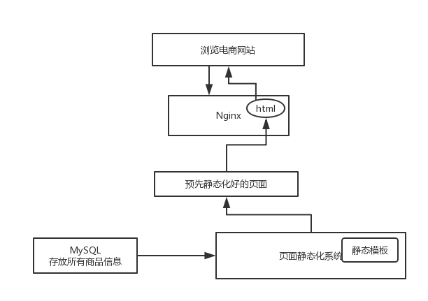
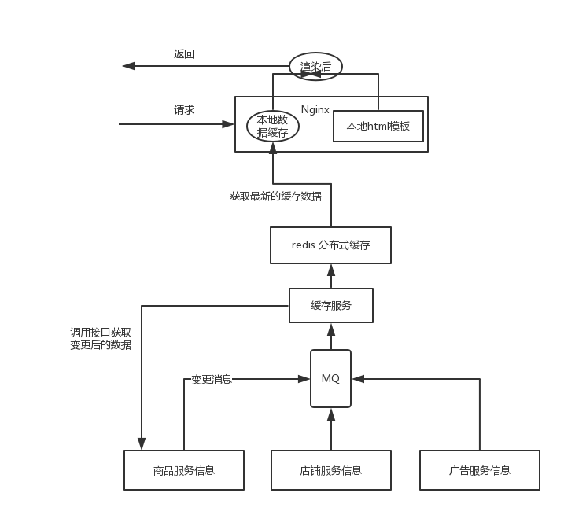

## 电商网站的商品详情页系统架构

### 小型电商网站的商品详情页系统架构

小型电商网站的页面展示采用页面全量静态化的思想。数据库中存放了所有的商品信息，页面静态化系统，将数据填充进静态模板中，形成静态化页面，推入 Nginx 服务器。用户浏览网站页面时，取用一个已经静态化好的 html 页面，直接返回回去，不涉及任何的业务逻辑处理。



下面是页面模板的简单 Demo 。

```html
<html>
  <body>
    商品名称：#{productName}<br />
    商品价格：#{productPrice}<br />
    商品描述：#{productDesc}
  </body>
</html>
```

这样做，**好处**在于，用户每次浏览一个页面，不需要进行任何的跟数据库的交互逻辑，也不需要执行任何的代码，直接返回一个 html 页面就可以了，速度和性能非常高。

对于小网站，页面很少，很实用，非常简单，Java 中可以使用 velocity、freemarker、thymeleaf 等等，然后做个 cms 页面内容管理系统，模板变更的时候，点击按钮或者系统自动化重新进行全量渲染。

**坏处**在于，仅仅适用于一些小型的网站，比如页面的规模在几十到几万不等。对于一些大型的电商网站，亿级数量的页面，你说你每次页面模板修改了，都需要将这么多页面全量静态化，靠谱吗？每次渲染花个好几天时间，那你整个网站就废掉了。

### 大型电商网站的商品详情页系统架构

大型电商网站商品详情页的系统设计中，当商品数据发生变更时，会将变更消息压入 MQ 消息队列中。**缓存服务**从消息队列中消费这条消息时，感知到有数据发生变更，便通过调用数据服务接口，获取变更后的数据，然后将整合好的数据推送至 redis 中。Nginx 本地缓存的数据是有一定的时间期限的，比如说 10 分钟，当数据过期之后，它就会从 redis 获取到最新的缓存数据，并且缓存到自己本地。

用户浏览网页时，动态将 Nginx 本地数据渲染到本地 html 模板并返回给用户。



虽然没有直接返回 html 页面那么快，但是因为数据在本地缓存，所以也很快，其实耗费的也就是动态渲染一个 html 页面的性能。如果 html 模板发生了变更，不需要将所有的页面重新静态化，也不需要发送请求，没有网络请求的开销，直接将数据渲染进最新的 html 页面模板后响应即可。

在这种架构下，我们需要**保证系统的高可用性**。

如果系统访问量很高，Nginx 本地缓存过期失效了，redis 中的缓存也被 LRU 算法给清理掉了，那么会有较高的访问量，从缓存服务调用商品服务。但如果此时商品服务的接口发生故障，调用出现了延时，缓存服务全部的线程都被这个调用商品服务接口给耗尽了，每个线程去调用商品服务接口的时候，都会卡住很长时间，后面大量的请求过来都会卡在那儿，此时缓存服务没有足够的线程去调用其它一些服务的接口，从而导致整个大量的商品详情页无法正常显示。

这其实就是一个商品接口服务故障导致缓存服务资源耗尽的现象。
