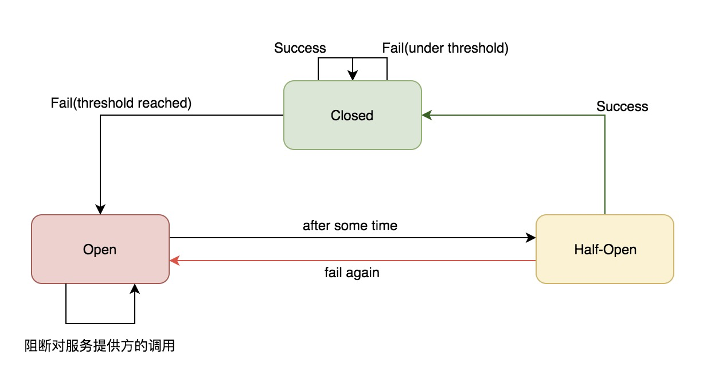

## 深入 Hystrix 断路器执行原理

### 状态机

Hystrix 断路器有三种状态，分别是关闭（Closed）、打开（Open）与半开（Half-Open），三种状态转化关系如下：



1. `Closed` 断路器关闭：调用下游的请求正常通过
2. `Open` 断路器打开：阻断对下游服务的调用，直接走 Fallback 逻辑
3. `Half-Open` 断路器处于半开状态：[SleepWindowInMilliseconds](#circuitBreaker.sleepWindowInMilliseconds)

### [Enabled](https://github.com/Netflix/Hystrix/wiki/Configuration#circuitbreakerenabled)

```java
HystrixCommandProperties.Setter()
    .withCircuitBreakerEnabled(boolean)
```

控制断路器是否工作，包括跟踪依赖服务调用的健康状况，以及对异常情况过多时是否允许触发断路。默认值 `true`。

### [circuitBreaker.requestVolumeThreshold](https://github.com/Netflix/Hystrix/wiki/Configuration#circuitbreakerrequestvolumethreshold)

```java
HystrixCommandProperties.Setter()
    .withCircuitBreakerRequestVolumeThreshold(int)
```

表示在一次统计的**时间滑动窗口中（这个参数也很重要，下面有说到）**，至少经过多少个请求，才可能触发断路，默认值 20。**经过 Hystrix 断路器的流量只有在超过了一定阈值后，才有可能触发断路。**比如说，要求在 10s 内经过断路器的流量必须达到 20 个，而实际经过断路器的请求有 19 个，即使这 19 个请求全都失败，也不会去判断要不要断路。

### [circuitBreaker.errorThresholdPercentage](https://github.com/Netflix/Hystrix/wiki/Configuration#circuitBreaker.errorThresholdPercentage)

```java
HystrixCommandProperties.Setter()
    .withCircuitBreakerErrorThresholdPercentage(int)
```

表示异常比例达到多少，才会触发断路，默认值是 50(%)。

#### [circuitBreaker.sleepWindowInMilliseconds](https://github.com/Netflix/Hystrix/wiki/Configuration#circuitbreakersleepwindowinmilliseconds)

```java
HystrixCommandProperties.Setter()
    .withCircuitBreakerSleepWindowInMilliseconds(int)
```

断路器状态由 Close 转换到 Open，在之后 `SleepWindowInMilliseconds` 时间内，所有经过该断路器的请求会被断路，不调用后端服务，直接走 Fallback 降级机制，默认值 5000(ms)。

而在该参数时间过后，断路器会变为 `Half-Open` 半开闭状态，尝试让一条请求经过断路器，看能不能正常调用。如果调用成功了，那么就自动恢复，断路器转为 Close 状态。

### [ForceOpen](https://github.com/Netflix/Hystrix/wiki/Configuration#circuitbreakerforceopen)

```java
HystrixCommandProperties.Setter()
    .withCircuitBreakerForceOpen(boolean)
```

如果设置为 true 的话，直接强迫打开断路器，相当于是手动断路了，手动降级，默认值是 `false`。

### [ForceClosed](https://github.com/Netflix/Hystrix/wiki/Configuration#circuitbreakerforceclosed)

```java
HystrixCommandProperties.Setter()
    .withCircuitBreakerForceClosed(boolean)
```

如果设置为 true，直接强迫关闭断路器，相当于手动停止断路了，手动升级，默认值是 `false`。

### Metrics 统计器

与 Hystrix 断路器紧密协作的，还有另一个重要组件 —— **统计器（Metrics）**。统计器中最重要的参数要数滑动窗口（[metrics.rollingStats.timeInMilliseconds](https://github.com/Netflix/Hystrix/wiki/Configuration#metricsrollingstatstimeinmilliseconds)）以及桶（[metrics.rollingStats.numBuckets](https://github.com/Netflix/Hystrix/wiki/Configuration#metricsrollingstatsnumbuckets)）了，这里引用[一段博文](https://zhenbianshu.github.io/2018/09/hystrix_configuration_analysis.html)来解释滑动窗口（默认值是 10000 ms）：

> 一位乘客坐在正在行驶的列车的靠窗座位上，列车行驶的公路两侧种着一排挺拔的白杨树，随着列车的前进，路边的白杨树迅速从窗口滑过。我们用每棵树来代表一个请求，用列车的行驶代表时间的流逝，那么，列车上的这个窗口就是一个典型的滑动窗口，这个乘客能通过窗口看到的白杨树就是 Hystrix 要统计的数据。

Hystrix 并不是只要有一条请求经过就去统计，而是将整个滑动窗口均分为 numBuckets 份，时间每经过一份就去统计一次。**在经过一个时间窗口后，才会判断断路器状态要不要开启，请看下面的例子。**

## 实例 Demo

### HystrixCommand 配置参数
在 GetProductInfoCommand 中配置 Setter 断路器相关参数。

- 滑动窗口中，最少 20 个请求，才可能触发断路。
- 异常比例达到 40% 时，才触发断路。
- 断路后 3000ms 内，所有请求都被 reject，直接走 fallback 降级，不会调用 run() 方法。3000ms 过后，变为 half-open 状态。

run() 方法中，我们判断一下 productId 是否为 -1，是的话，直接抛出异常。这么写，我们之后测试的时候就可以传入 productId=-1，**模拟服务执行异常**了。

在降级逻辑中，我们直接给它返回降级商品就好了。

```java
public class GetProductInfoCommand extends HystrixCommand<ProductInfo> {

    private Long productId;

    private static final HystrixCommandKey KEY = HystrixCommandKey.Factory.asKey("GetProductInfoCommand");

    public GetProductInfoCommand(Long productId) {
        super(Setter.withGroupKey(HystrixCommandGroupKey.Factory.asKey("ProductInfoService"))
                .andCommandKey(KEY)
                .andCommandPropertiesDefaults(HystrixCommandProperties.Setter()
                        // 是否允许断路器工作
                        .withCircuitBreakerEnabled(true)
                        // 滑动窗口中，最少有多少个请求，才可能触发断路
                        .withCircuitBreakerRequestVolumeThreshold(20)
                        // 异常比例达到多少，才触发断路，默认50%
                        .withCircuitBreakerErrorThresholdPercentage(40)
                        // 断路后多少时间内直接reject请求，之后进入half-open状态，默认5000ms
                        .withCircuitBreakerSleepWindowInMilliseconds(3000)));
        this.productId = productId;
    }

    @Override
    protected ProductInfo run() throws Exception {
        System.out.println("调用接口查询商品数据，productId=" + productId);

        if (productId == -1L) {
            throw new Exception();
        }

        String url = "http://localhost:8081/getProductInfo?productId=" + productId;
        String response = HttpClientUtils.sendGetRequest(url);
        return JSONObject.parseObject(response, ProductInfo.class);
    }

    @Override
    protected ProductInfo getFallback() {
        ProductInfo productInfo = new ProductInfo();
        productInfo.setName("降级商品");
        return productInfo;
    }
}
```

### 断路测试类
我们在测试类中，前 30 次请求，传入 productId=-1，然后休眠 3s，之后 70 次请求，传入 productId=1。

```java
@SpringBootTest
@RunWith(SpringRunner.class)
public class CircuitBreakerTest {

    @Test
    public void testCircuitBreaker() {
        String baseURL = "http://localhost:8080/getProductInfo?productId=";

        for (int i = 0; i < 30; ++i) {
            // 传入-1，会抛出异常，然后走降级逻辑
            HttpClientUtils.sendGetRequest(baseURL + "-1");
        }

        TimeUtils.sleep(3);
        System.out.println("After sleeping...");

        for (int i = 31; i < 100; ++i) {
            // 传入1，走服务正常调用
            HttpClientUtils.sendGetRequest(baseURL + "1");
        }
    }
}
```

### 测试结果

测试结果，我们可以明显看出系统断路与恢复的整个过程。

```c
调用接口查询商品数据，productId=-1
ProductInfo(id=null, name=降级商品, price=null, pictureList=null, specification=null, service=null, color=null, size=null, shopId=null, modifiedTime=null, cityId=null, cityName=null, brandId=null, brandName=null)
// ...
// 这里重复打印了 20 次上面的结果


ProductInfo(id=null, name=降级商品, price=null, pictureList=null, specification=null, service=null, color=null, size=null, shopId=null, modifiedTime=null, cityId=null, cityName=null, brandId=null, brandName=null)
// ...
// 这里重复打印了 8 次上面的结果


// 休眠 3s 后
调用接口查询商品数据，productId=1
ProductInfo(id=1, name=iphone7手机, price=5599.0, pictureList=a.jpg,b.jpg, specification=iphone7的规格, service=iphone7的售后服务, color=红色,白色,黑色, size=5.5, shopId=1, modifiedTime=2017-01-01 12:00:00, cityId=1, cityName=null, brandId=1, brandName=null)
// ...
// 这里重复打印了 69 次上面的结果
```

前 30 次请求，我们传入的 productId 为 -1，所以服务执行过程中会抛出异常。我们设置了最少 20 次请求通过断路器并且异常比例超出 40% 就触发断路。因此执行了 21 次接口调用，每次都抛异常并且走降级，21 次过后，断路器就被打开了。

之后的 9 次请求，都不会执行 run() 方法，也就不会打印以下信息。

```c
调用接口查询商品数据，productId=-1
```

而是直接走降级逻辑，调用 getFallback() 执行。

休眠了 3s 后，我们在之后的 70 次请求中，都传入 productId 为 1。由于我们前面设置了 3000ms 过后断路器变为 `half-open` 状态。因此 Hystrix 会尝试执行请求，发现成功了，那么断路器关闭，之后的所有请求也都能正常调用了。

### 参考内容

1. [Hystrix issue 1459](https://github.com/Netflix/Hystrix/issues/1459)
2. [Hystrix Metrics](https://github.com/Netflix/Hystrix/wiki/Configuration#metrics)