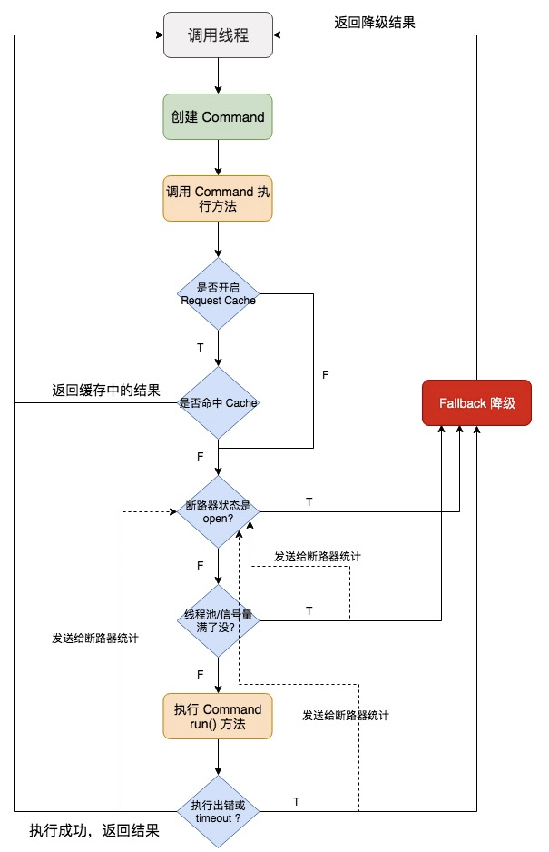

## 深入 Hystrix 执行时内部原理
前面我们了解了 Hystrix 最基本的支持高可用的技术：**资源隔离** + **限流**。

- 创建 command；
- 执行这个 command；
- 配置这个 command 对应的 group 和线程池。

这里，我们要讲一下，你开始执行这个 command，调用了这个 command 的 execute() 方法之后，Hystrix 底层的执行流程和步骤以及原理是什么。

在讲解这个流程的过程中，我会带出来 Hystrix 其他的一些核心以及重要的功能。

这里是整个 8 大步骤的流程图，我会对每个步骤进行细致的讲解。学习的过程中，对照着这个流程图，相信思路会比较清晰。



### 步骤一：创建 command
一个 HystrixCommand 或 HystrixObservableCommand 对象，代表了对某个依赖服务发起的一次请求或者调用。创建的时候，可以在构造函数中传入任何需要的参数。

- HystrixCommand 主要用于仅仅会返回一个结果的调用。
- HystrixObservableCommand 主要用于可能会返回多条结果的调用。

```java
// 创建 HystrixCommand
HystrixCommand hystrixCommand = new HystrixCommand(arg1, arg2);

// 创建 HystrixObservableCommand
HystrixObservableCommand hystrixObservableCommand = new HystrixObservableCommand(arg1, arg2);
```

### 步骤二：调用 command 执行方法
执行 command，就可以发起一次对依赖服务的调用。

要执行 command，可以在 4 个方法中选择其中的一个：execute()、queue()、observe()、toObservable()。

其中 execute() 和 queue() 方法仅仅对 HystrixCommand 适用。

- execute()：调用后直接 block 住，属于同步调用，直到依赖服务返回单条结果，或者抛出异常。
- queue()：返回一个 Future，属于异步调用，后面可以通过 Future 获取单条结果。
- observe()：订阅一个 Observable 对象，Observable 代表的是依赖服务返回的结果，获取到一个那个代表结果的 Observable 对象的拷贝对象。
- toObservable()：返回一个 Observable 对象，如果我们订阅这个对象，就会执行 command 并且获取返回结果。

```java
K             value    = hystrixCommand.execute();
Future<K>     fValue   = hystrixCommand.queue();
Observable<K> oValue   = hystrixObservableCommand.observe();
Observable<K> toOValue = hystrixObservableCommand.toObservable();
```

execute() 实际上会调用 queue().get() 方法，可以看一下 Hystrix 源码。
```java
public R execute() {
    try {
        return queue().get();
    } catch (Exception e) {
        throw Exceptions.sneakyThrow(decomposeException(e));
    }
}
```

而在 queue() 方法中，会调用 toObservable().toBlocking().toFuture()。
```java
final Future<R> delegate = toObservable().toBlocking().toFuture();
```

也就是说，先通过 toObservable() 获得 Future 对象，然后调用 Future 的 get() 方法。那么，其实无论是哪种方式执行 command，最终都是依赖于 toObservable() 去执行的。

### 步骤三：检查是否开启缓存（不太常用）
从这一步开始，就进入到 Hystrix 底层运行原理啦，看一下 Hystrix 一些更高级的功能和特性。

如果这个 command 开启了请求缓存 Request Cache，而且这个调用的结果在缓存中存在，那么直接从缓存中返回结果。否则，继续往后的步骤。

### 步骤四：检查是否开启了断路器
检查这个 command 对应的依赖服务是否开启了断路器。如果断路器被打开了，那么 Hystrix 就不会执行这个 command，而是直接去执行 fallback 降级机制，返回降级结果。

### 步骤五：检查线程池/队列/信号量是否已满
如果这个 command 线程池和队列已满，或者 semaphore 信号量已满，那么也不会执行 command，而是直接去调用 fallback 降级机制，同时发送 reject 信息给断路器统计。

### 步骤六：执行 command
调用 HystrixObservableCommand 对象的 construct() 方法，或者 HystrixCommand 的 run() 方法来实际执行这个 command。

- HystrixCommand.run() 返回单条结果，或者抛出异常。

```java
// 通过command执行，获取最新一条商品数据
ProductInfo productInfo = getProductInfoCommand.execute();
```

- HystrixObservableCommand.construct() 返回一个 Observable 对象，可以获取多条结果。

```java
Observable<ProductInfo> observable = getProductInfosCommand.observe();

// 订阅获取多条结果
observable.subscribe(new Observer<ProductInfo>() {
    @Override
    public void onCompleted() {
        System.out.println("获取完了所有的商品数据");
    }

    @Override
    public void onError(Throwable e) {
        e.printStackTrace();
    }

    /**
     * 获取完一条数据，就回调一次这个方法
     * 
     * @param productInfo 商品信息
     */
    @Override
    public void onNext(ProductInfo productInfo) {
        System.out.println(productInfo);
    }
});
```

如果是采用线程池方式，并且 HystrixCommand.run() 或者 HystrixObservableCommand.construct() 的执行时间超过了 timeout 时长的话，那么 command 所在的线程会抛出一个 TimeoutException，这时会执行 fallback 降级机制，不会去管 run() 或 construct() 返回的值了。另一种情况，如果 command 执行出错抛出了其它异常，那么也会走 fallback 降级。这两种情况下，Hystrix 都会发送异常事件给断路器统计。

**注意**，我们是不可能终止掉一个调用严重延迟的依赖服务的线程的，只能说给你抛出来一个 TimeoutException。

如果没有 timeout，也正常执行的话，那么调用线程就会拿到一些调用依赖服务获取到的结果，然后 Hystrix 也会做一些 logging 记录和 metric 度量统计。

### 步骤七：断路健康检查
Hystrix 会把每一个依赖服务的调用成功、失败、Reject、Timeout 等事件发送给 circuit breaker 断路器。断路器就会对这些事件的次数进行统计，根据异常事件发生的比例来决定是否要进行断路（熔断）。如果打开了断路器，那么在接下来一段时间内，会直接断路，返回降级结果。

如果在之后，断路器尝试执行 command，调用没有出错，返回了正常结果，那么 Hystrix 就会把断路器关闭。

### 步骤八：调用 fallback 降级机制
在以下几种情况中，Hystrix 会调用 fallback 降级机制。

- 断路器处于打开状态；
- 线程池/队列/semaphore满了；
- command 执行超时；
- run() 或者 construct() 抛出异常。

一般在降级机制中，都建议给出一些默认的返回值，比如静态的一些代码逻辑，或者从内存中的缓存中提取一些数据，在这里尽量不要再进行网络请求了。

在降级中，如果一定要进行网络调用的话，也应该将那个调用放在一个 HystrixCommand 中进行隔离。

- HystrixCommand 中，实现 getFallback() 方法，可以提供降级机制。
- HystrixObservableCommand 中，实现 resumeWithFallback() 方法，返回一个 Observable 对象，可以提供降级结果。

如果没有实现 fallback，或者 fallback 抛出了异常，Hystrix 会返回一个 Observable，但是不会返回任何数据。

不同的 command 执行方式，其 fallback 为空或者异常时的返回结果不同。

- 对于 execute()，直接抛出异常。
- 对于 queue()，返回一个 Future，调用 get() 时抛出异常。
- 对于 observe()，返回一个 Observable 对象，但是调用 subscribe() 方法订阅它时，立即抛出调用者的 onError() 方法。
- 对于 toObservable()，返回一个 Observable 对象，但是调用 subscribe() 方法订阅它时，立即抛出调用者的 onError() 方法。

### 不同的执行方式
- execute()，获取一个 Future.get()，然后拿到单个结果。
- queue()，返回一个 Future。
- observe()，立即订阅 Observable，然后启动 8 大执行步骤，返回一个拷贝的 Observable，订阅时立即回调给你结果。
- toObservable()，返回一个原始的 Observable，必须手动订阅才会去执行 8 大步骤。