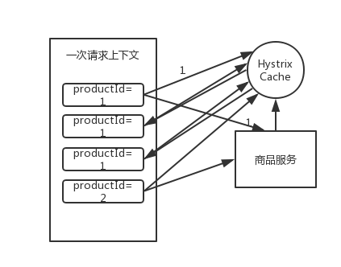

## 基于 request cache 请求缓存技术优化批量商品数据查询接口
Hystrix command 执行时 8 大步骤第三步，就是检查 Request cache 是否有缓存。

首先，有一个概念，叫做 Request Context 请求上下文，一般来说，在一个 web 应用中，如果我们用到了 Hystrix，我们会在一个 filter 里面，对每一个请求都施加一个请求上下文。就是说，每一次请求，就是一次请求上下文。然后在这次请求上下文中，我们会去执行 N 多代码，调用 N 多依赖服务，有的依赖服务可能还会调用好几次。

在一次请求上下文中，如果有多个 command，参数都是一样的，调用的接口也是一样的，而结果可以认为也是一样的。那么这个时候，我们可以让第一个 command 执行返回的结果缓存在内存中，然后这个请求上下文后续的其它对这个依赖的调用全部从内存中取出缓存结果就可以了。

这样的话，好处在于不用在一次请求上下文中反复多次执行一样的 command，**避免重复执行网络请求，提升整个请求的性能**。

举个栗子。比如说我们在一次请求上下文中，请求获取 productId 为 1 的数据，第一次缓存中没有，那么会从商品服务中获取数据，返回最新数据结果，同时将数据缓存在内存中。后续同一次请求上下文中，如果还有获取 productId 为 1 的数据的请求，直接从缓存中取就好了。



HystrixCommand 和 HystrixObservableCommand 都可以指定一个缓存 key，然后 Hystrix 会自动进行缓存，接着在同一个 request context 内，再次访问的话，就会直接取用缓存。

下面，我们结合一个具体的**业务场景**，来看一下如何使用 request cache 请求缓存技术。当然，以下代码只作为一个基本的 Demo 而已。

现在，假设我们要做一个**批量查询商品数据**的接口，在这个里面，我们是用 HystrixCommand 一次性批量查询多个商品 id 的数据。但是这里有个问题，如果说 Nginx 在本地缓存失效了，重新获取一批缓存，传递过来的 productIds 都没有进行去重，比如 `productIds=1,1,1,2,2`，那么可能说，商品 id 出现了重复，如果按照我们之前的业务逻辑，可能就会重复对 productId=1 的商品查询三次，productId=2 的商品查询两次。

我们对批量查询商品数据的接口，可以用 request cache 做一个优化，就是说一次请求，就是一次 request context，对相同的商品查询只执行一次，其余重复的都走 request cache。

### 实现 Hystrix 请求上下文过滤器并注册
定义 HystrixRequestContextFilter 类，实现 Filter 接口。

```java
/**
 * Hystrix 请求上下文过滤器
 */
public class HystrixRequestContextFilter implements Filter {

    @Override
    public void init(FilterConfig filterConfig) throws ServletException {

    }

    @Override
    public void doFilter(ServletRequest servletRequest, ServletResponse servletResponse, FilterChain filterChain) {
        HystrixRequestContext context = HystrixRequestContext.initializeContext();
        try {
            filterChain.doFilter(servletRequest, servletResponse);
        } catch (IOException | ServletException e) {
            e.printStackTrace();
        } finally {
            context.shutdown();
        }
    }

    @Override
    public void destroy() {

    }
}
```

然后将该 filter 对象注册到 SpringBoot Application 中。

```java
@SpringBootApplication
public class EshopApplication {

    public static void main(String[] args) {
        SpringApplication.run(EshopApplication.class, args);
    }

    @Bean
    public FilterRegistrationBean filterRegistrationBean() {
        FilterRegistrationBean filterRegistrationBean = new FilterRegistrationBean(new HystrixRequestContextFilter());
        filterRegistrationBean.addUrlPatterns("/*");
        return filterRegistrationBean;
    }
}
```

### command 重写 getCacheKey() 方法
在 GetProductInfoCommand 中，重写 getCacheKey() 方法，这样的话，每一次请求的结果，都会放在 Hystrix 请求上下文中。下一次同一个 productId 的数据请求，直接取缓存，无须再调用 run() 方法。

```java
public class GetProductInfoCommand extends HystrixCommand<ProductInfo> {

    private Long productId;

    private static final HystrixCommandKey KEY = HystrixCommandKey.Factory.asKey("GetProductInfoCommand");

    public GetProductInfoCommand(Long productId) {
        super(Setter.withGroupKey(HystrixCommandGroupKey.Factory.asKey("ProductInfoService"))
                .andCommandKey(KEY));
        this.productId = productId;
    }

    @Override
    protected ProductInfo run() {
        String url = "http://localhost:8081/getProductInfo?productId=" + productId;
        String response = HttpClientUtils.sendGetRequest(url);
        System.out.println("调用接口查询商品数据，productId=" + productId);
        return JSONObject.parseObject(response, ProductInfo.class);
    }

    /**
     * 每次请求的结果，都会放在Hystrix绑定的请求上下文上
     *
     * @return cacheKey 缓存key
     */
    @Override
    public String getCacheKey() {
        return "product_info_" + productId;
    }

    /**
     * 将某个商品id的缓存清空
     *
     * @param productId 商品id
     */
    public static void flushCache(Long productId) {
        HystrixRequestCache.getInstance(KEY,
                HystrixConcurrencyStrategyDefault.getInstance()).clear("product_info_" + productId);
    }
}
```

这里写了一个 flushCache() 方法，用于我们开发手动删除缓存。

### controller 调用 command 查询商品信息
在一次 web 请求上下文中，传入商品 id 列表，查询多条商品数据信息。对于每个 productId，都创建一个 command。

如果 id 列表没有去重，那么重复的 id，第二次查询的时候就会直接走缓存。

```java
@Controller
public class CacheController {

    /**
     * 一次性批量查询多条商品数据的请求
     *
     * @param productIds 以,分隔的商品id列表
     * @return 响应状态
     */
    @RequestMapping("/getProductInfos")
    @ResponseBody
    public String getProductInfos(String productIds) {
        for (String productId : productIds.split(",")) {
            // 对每个productId，都创建一个command
            GetProductInfoCommand getProductInfoCommand = new GetProductInfoCommand(Long.valueOf(productId));
            ProductInfo productInfo = getProductInfoCommand.execute();
            System.out.println("是否是从缓存中取的结果：" + getProductInfoCommand.isResponseFromCache());
        }

        return "success";
    }
}
```

### 发起请求
调用接口，查询多个商品的信息。

```
http://localhost:8080/getProductInfos?productIds=1,1,1,2,2,5
```

在控制台，我们可以看到以下结果。

```
调用接口查询商品数据，productId=1
是否是从缓存中取的结果：false
是否是从缓存中取的结果：true
是否是从缓存中取的结果：true
调用接口查询商品数据，productId=2
是否是从缓存中取的结果：false
是否是从缓存中取的结果：true
调用接口查询商品数据，productId=5
是否是从缓存中取的结果：false
```

第一次查询 productId=1 的数据，会调用接口进行查询，不是从缓存中取结果。而随后再出现查询 productId=1 的请求，就直接取缓存了，这样的话，效率明显高很多。

### 删除缓存
我们写一个 UpdateProductInfoCommand，在更新商品信息之后，手动调用之前写的 flushCache()，手动将缓存删除。

```java
public class UpdateProductInfoCommand extends HystrixCommand<Boolean> {

    private Long productId;

    public UpdateProductInfoCommand(Long productId) {
        super(HystrixCommandGroupKey.Factory.asKey("UpdateProductInfoGroup"));
        this.productId = productId;
    }

    @Override
    protected Boolean run() throws Exception {
        // 这里执行一次商品信息的更新
        // ...

        // 然后清空缓存
        GetProductInfoCommand.flushCache(productId);
        return true;
    }
}
```

这样，以后查询该商品的请求，第一次就会走接口调用去查询最新的商品信息。