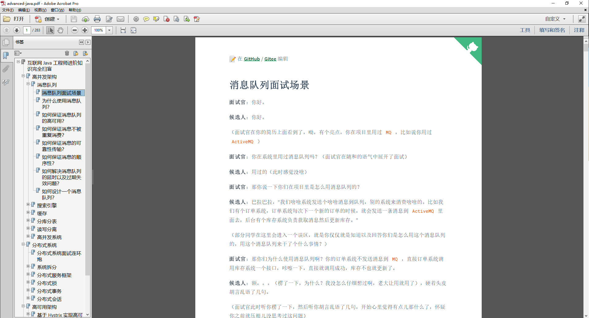

# 高并发架构

## [消息队列](/docs/high-concurrency/mq-interview.md)

- [为什么使用消息队列？消息队列有什么优点和缺点？Kafka、ActiveMQ、RabbitMQ、RocketMQ 都有什么优点和缺点？](/docs/high-concurrency/why-mq.md)
- [如何保证消息队列的高可用？](/docs/high-concurrency/how-to-ensure-high-availability-of-message-queues.md)
- [如何保证消息不被重复消费？（如何保证消息消费的幂等性）](/docs/high-concurrency/how-to-ensure-that-messages-are-not-repeatedly-consumed.md)
- [如何保证消息的可靠性传输？（如何处理消息丢失的问题）](/docs/high-concurrency/how-to-ensure-the-reliable-transmission-of-messages.md)
- [如何保证消息的顺序性？](/docs/high-concurrency/how-to-ensure-the-order-of-messages.md)
- [如何解决消息队列的延时以及过期失效问题？消息队列满了以后该怎么处理？有几百万消息持续积压几小时，说说怎么解决？](/docs/high-concurrency/mq-time-delay-and-expired-failure.md)
- [如果让你写一个消息队列，该如何进行架构设计啊？说一下你的思路。](/docs/high-concurrency/mq-design.md)

## [搜索引擎](/docs/high-concurrency/es-introduction.md)

- [ES 的分布式架构原理能说一下么（ES 是如何实现分布式的啊）？](/docs/high-concurrency/es-architecture.md)
- [ES 写入数据的工作原理是什么啊？ES 查询数据的工作原理是什么啊？底层的 Lucene 介绍一下呗？倒排索引了解吗？](/docs/high-concurrency/es-write-query-search.md)
- [ES 在数据量很大的情况下（数十亿级别）如何提高查询效率啊？](/docs/high-concurrency/es-optimizing-query-performance.md)
- [ES 生产集群的部署架构是什么？每个索引的数据量大概有多少？每个索引大概有多少个分片？](/docs/high-concurrency/es-production-cluster.md)

## 缓存

- [在项目中缓存是如何使用的？缓存如果使用不当会造成什么后果？](/docs/high-concurrency/why-cache.md)
- [Redis 和 Memcached 有什么区别？Redis 的线程模型是什么？为什么单线程的 Redis 比多线程的 Memcached 效率要高得多？](/docs/high-concurrency/redis-single-thread-model.md)
- [Redis 都有哪些数据类型？分别在哪些场景下使用比较合适？](/docs/high-concurrency/redis-data-types.md)
- [Redis 的过期策略都有哪些？手写一下 LRU 代码实现？](/docs/high-concurrency/redis-expiration-policies-and-lru.md)
- [如何保证 Redis 高并发、高可用？Redis 的主从复制原理能介绍一下么？Redis 的哨兵原理能介绍一下么？](/docs/high-concurrency/how-to-ensure-high-concurrency-and-high-availability-of-redis.md)
- [Redis 的持久化有哪几种方式？不同的持久化机制都有什么优缺点？持久化机制具体底层是如何实现的？](/docs/high-concurrency/redis-persistence.md)
- [Redis 集群模式的工作原理能说一下么？在集群模式下，Redis 的 key 是如何寻址的？分布式寻址都有哪些算法？了解一致性 hash 算法吗？如何动态增加和删除一个节点？](/docs/high-concurrency/redis-cluster.md)
- [了解什么是 redis 的雪崩、穿透和击穿？Redis 崩溃之后会怎么样？系统该如何应对这种情况？如何处理 Redis 的穿透？](/docs/high-concurrency/redis-caching-avalanche-and-caching-penetration.md)
- [如何保证缓存与数据库的双写一致性？](/docs/high-concurrency/redis-consistence.md)
- [Redis 的并发竞争问题是什么？如何解决这个问题？了解 Redis 事务的 CAS 方案吗？](/docs/high-concurrency/redis-cas.md)
- [生产环境中的 Redis 是怎么部署的？](/docs/high-concurrency/redis-production-environment.md)

## 分库分表

- [为什么要分库分表（设计高并发系统的时候，数据库层面该如何设计）？用过哪些分库分表中间件？不同的分库分表中间件都有什么优点和缺点？你们具体是如何对数据库如何进行垂直拆分或水平拆分的？](/docs/high-concurrency/database-shard.md)
- [现在有一个未分库分表的系统，未来要分库分表，如何设计才可以让系统从未分库分表动态切换到分库分表上？](/docs/high-concurrency/database-shard-method.md)
- [如何设计可以动态扩容缩容的分库分表方案？](/docs/high-concurrency/database-shard-dynamic-expand.md)
- [分库分表之后，id 主键如何处理？](/docs/high-concurrency/database-shard-global-id-generate.md)

## 读写分离

- [如何实现 MySQL 的读写分离？MySQL 主从复制原理是啥？如何解决 MySQL 主从同步的延时问题？](/docs/high-concurrency/mysql-read-write-separation.md)

## 高并发系统

- [如何设计一个高并发系统？](/docs/high-concurrency/high-concurrency-design.md)

---

## 公众号

GitHub 技术社区 [Doocs](https://github.com/doocs) 旗下唯一公众号「**Doocs 开源社区**」​，欢迎扫码关注，**专注分享技术领域相关知识及行业最新资讯**。当然，也可以加我个人微信（备注：GitHub），拉你进技术交流群。

关注「**Doocs 开源社区**」公众号，回复 **PDF**，即可获取本项目离线 PDF 文档（283 页精华），学习更加方便！

<table>
    <tr>
      <td align="center" style="width: 200px;">
        <a href="https://github.com/doocs">
           
          公众平台
        </a> 
      </td>
      <td align="center" style="width: 200px;">
        <a href="https://github.com/yanglbme">
           
          个人微信
        </a> 
      </td>
    </tr>
</table>
