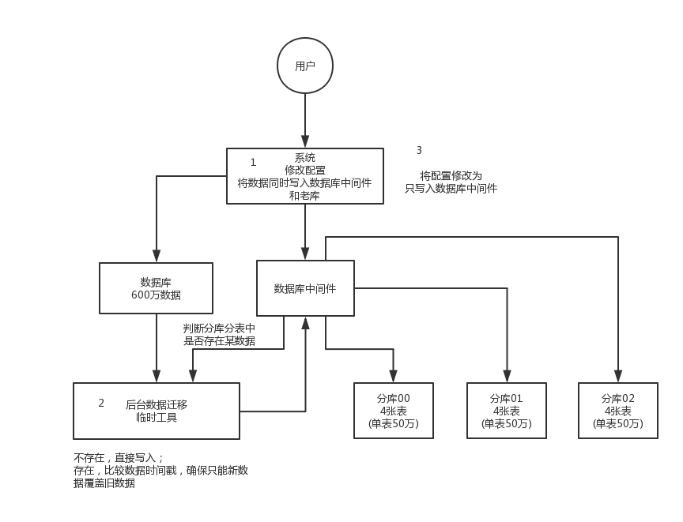

## 面试题

现在有一个未分库分表的系统，未来要分库分表，如何设计才可以让系统从未分库分表**动态切换**到分库分表上？

## 面试官心理分析

你看看，你现在已经明白为啥要分库分表了，你也知道常用的分库分表中间件了，你也设计好你们如何分库分表的方案了（水平拆分、垂直拆分、分表），那问题来了，你接下来该怎么把你那个单库单表的系统给迁移到分库分表上去？

所以这都是一环扣一环的，就是看你有没有全流程经历过这个过程。

## 面试题剖析

这个其实从 low 到高大上有好几种方案，我们都玩儿过，我都给你说一下。

### 停机迁移方案

我先给你说一个最 low 的方案，就是很简单，大家伙儿凌晨 12 点开始运维，网站或者 app 挂个公告，说 0 点到早上 6 点进行运维，无法访问。

接着到 0 点停机，系统停掉，没有流量写入了，此时老的单库单表数据库静止了。然后你之前得写好一个**导数的一次性工具**，此时直接跑起来，然后将单库单表的数据哗哗哗读出来，写到分库分表里面去。

导数完了之后，就 ok 了，修改系统的数据库连接配置啥的，包括可能代码和 SQL 也许有修改，那你就用最新的代码，然后直接启动连到新的分库分表上去。

验证一下，ok 了，完美，大家伸个懒腰，看看看凌晨 4 点钟的北京夜景，打个滴滴回家吧。

但是这个方案比较 low，谁都能干，我们来看看高大上一点的方案。

### 双写迁移方案

这个是我们常用的一种迁移方案，比较靠谱一些，不用停机，不用看北京凌晨 4 点的风景。

简单来说，就是在线上系统里面，之前所有写库的地方，增删改操作，**除了对老库增删改，都加上对新库的增删改**，这就是所谓的**双写**，同时写俩库，老库和新库。

然后**系统部署**之后，新库数据差太远，用之前说的导数工具，跑起来读老库数据写新库，写的时候要根据 gmt_modified 这类字段判断这条数据最后修改的时间，除非是读出来的数据在新库里没有，或者是比新库的数据新才会写。简单来说，就是不允许用老数据覆盖新数据。

导完一轮之后，有可能数据还是存在不一致，那么就程序自动做一轮校验，比对新老库每个表的每条数据，接着如果有不一样的，就针对那些不一样的，从老库读数据再次写。反复循环，直到两个库每个表的数据都完全一致为止。

接着当数据完全一致了，就 ok 了，基于仅仅使用分库分表的最新代码，重新部署一次，不就仅仅基于分库分表在操作了么，还没有几个小时的停机时间，很稳。所以现在基本玩儿数据迁移之类的，都是这么干的。

