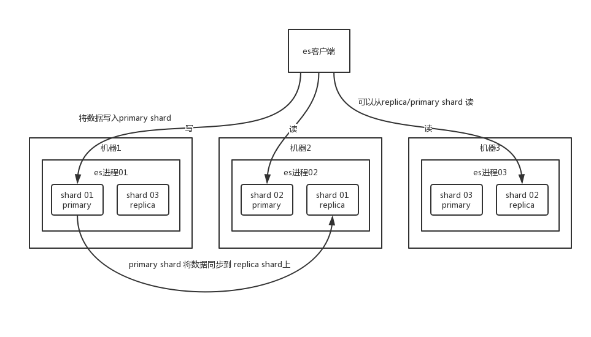

## 面试题
ES 的分布式架构原理能说一下么（ES 是如何实现分布式的啊）？

## 面试官心理分析

在搜索这块，lucene 是最流行的搜索库。几年前业内一般都问，你了解 lucene 吗？你知道倒排索引的原理吗？现在早已经 out 了，因为现在很多项目都是直接用基于 lucene 的分布式搜索引擎—— ElasticSearch，简称为 ES。

而现在分布式搜索基本已经成为大部分互联网行业的 Java 系统的标配，其中尤为流行的就是 ES，前几年 ES 没火的时候，大家一般用 solr。但是这两年基本大部分企业和项目都开始转向 ES 了。

所以互联网面试，肯定会跟你聊聊分布式搜索引擎，也就一定会聊聊 ES，如果你确实不知道，那你真的就 out 了。

如果面试官问你第一个问题，确实一般都会问你 ES 的分布式架构设计能介绍一下么？就看看你对分布式搜索引擎架构的一个基本理解。

## 面试题剖析

ElasticSearch 设计的理念就是分布式搜索引擎，底层其实还是基于 lucene 的。核心思想就是在多台机器上启动多个 ES 进程实例，组成了一个 ES 集群。

ES 中存储数据的**基本单位是索引**，比如说你现在要在 ES 中存储一些订单数据，你就应该在 ES 中创建一个索引 `order_idx` ，所有的订单数据就都写到这个索引里面去，一个索引差不多就是相当于是 mysql 里的一张表。

``` 
index -> type -> mapping -> document -> field。
```

这样吧，为了做个更直白的介绍，我在这里做个类比。但是切记，不要划等号，类比只是为了便于理解。

index 相当于 mysql 里的一张表。而 type 没法跟 mysql 里去对比，一个 index 里可以有多个 type，每个 type 的字段都是差不多的，但是有一些略微的差别。假设有一个 index，是订单 index，里面专门是放订单数据的。就好比说你在 mysql 中建表，有些订单是实物商品的订单，比如一件衣服、一双鞋子；有些订单是虚拟商品的订单，比如游戏点卡，话费充值。就两种订单大部分字段是一样的，但是少部分字段可能有略微的一些差别。

所以就会在订单 index 里，建两个 type，一个是实物商品订单 type，一个是虚拟商品订单 type，这两个 type 大部分字段是一样的，少部分字段是不一样的。

很多情况下，一个 index 里可能就一个 type，但是确实如果说是一个 index 里有多个 type 的情况（**注意**， `mapping types` 这个概念在 ElasticSearch 7. X 已被完全移除，详细说明可以参考[官方文档](https://github.com/elastic/elasticsearch/blob/6.5/docs/reference/mapping/removal_of_types.asciidoc)），你可以认为 index 是一个类别的表，具体的每个 type 代表了 mysql 中的一个表。每个 type 有一个 mapping，如果你认为一个 type 是具体的一个表，index 就代表多个 type 同属于的一个类型，而 mapping 就是这个 type 的**表结构定义**，你在 mysql 中创建一个表，肯定是要定义表结构的，里面有哪些字段，每个字段是什么类型。实际上你往 index 里的一个 type 里面写的一条数据，叫做一条 document，一条 document 就代表了 mysql 中某个表里的一行，每个 document 有多个 field，每个 field 就代表了这个 document 中的一个字段的值。


你搞一个索引，这个索引可以拆分成多个 `shard` ，每个 shard 存储部分数据。拆分多个 shard 是有好处的，一是**支持横向扩展**，比如你数据量是 3T，3 个 shard，每个 shard 就 1T 的数据，若现在数据量增加到 4T，怎么扩展，很简单，重新建一个有 4 个 shard 的索引，将数据导进去；二是**提高性能**，数据分布在多个 shard，即多台服务器上，所有的操作，都会在多台机器上并行分布式执行，提高了吞吐量和性能。

接着就是这个 shard 的数据实际是有多个备份，就是说每个 shard 都有一个 `primary shard` ，负责写入数据，但是还有几个 `replica shard` 。 `primary shard` 写入数据之后，会将数据同步到其他几个 `replica shard` 上去。



通过这个 replica 的方案，每个 shard 的数据都有多个备份，如果某个机器宕机了，没关系啊，还有别的数据副本在别的机器上呢。高可用了吧。

ES 集群多个节点，会自动选举一个节点为 master 节点，这个 master 节点其实就是干一些管理的工作的，比如维护索引元数据、负责切换 primary shard 和 replica shard 身份等。要是 master 节点宕机了，那么会重新选举一个节点为 master 节点。

如果是非 master节点宕机了，那么会由 master 节点，让那个宕机节点上的 primary shard 的身份转移到其他机器上的 replica shard。接着你要是修复了那个宕机机器，重启了之后，master 节点会控制将缺失的 replica shard 分配过去，同步后续修改的数据之类的，让集群恢复正常。

说得更简单一点，就是说如果某个非 master 节点宕机了。那么此节点上的 primary shard 不就没了。那好，master 会让 primary shard 对应的 replica shard（在其他机器上）切换为 primary shard。如果宕机的机器修复了，修复后的节点也不再是 primary shard，而是 replica shard。

其实上述就是 ElasticSearch 作为分布式搜索引擎最基本的一个架构设计。
