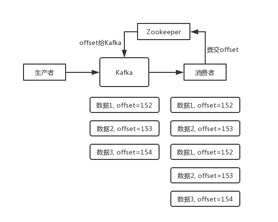

## 面试题
如何保证消息不被重复消费？或者说，如何保证消息消费的幂等性？

## 面试官心理分析

其实这是很常见的一个问题，这俩问题基本可以连起来问。既然是消费消息，那肯定要考虑会不会重复消费？能不能避免重复消费？或者重复消费了也别造成系统异常可以吗？这个是 MQ 领域的基本问题，其实本质上还是问你**使用消息队列如何保证幂等性**，这个是你架构里要考虑的一个问题。

## 面试题剖析

回答这个问题，首先你别听到重复消息这个事儿，就一无所知吧，你**先大概说一说可能会有哪些重复消费的问题**。

首先，比如 RabbitMQ、RocketMQ、Kafka，都有可能会出现消息重复消费的问题，正常。因为这问题通常不是 MQ 自己保证的，是由我们开发来保证的。挑一个 Kafka 来举个例子，说说怎么重复消费吧。

Kafka 实际上有个 offset 的概念，就是每个消息写进去，都有一个 offset，代表消息的序号，然后 consumer 消费了数据之后，**每隔一段时间**（定时定期），会把自己消费过的消息的 offset 提交一下，表示“我已经消费过了，下次我要是重启啥的，你就让我继续从上次消费到的 offset 来继续消费吧”。

但是凡事总有意外，比如我们之前生产经常遇到的，就是你有时候重启系统，看你怎么重启了，如果碰到点着急的，直接 kill 进程了，再重启。这会导致 consumer 有些消息处理了，但是没来得及提交 offset，尴尬了。重启之后，少数消息会再次消费一次。

举个栗子。

有这么个场景。数据 1/2/3 依次进入 kafka，kafka 会给这三条数据每条分配一个 offset，代表这条数据的序号，我们就假设分配的 offset 依次是 152/153/154。消费者从 kafka 去消费的时候，也是按照这个顺序去消费。假如当消费者消费了 `offset=153` 的这条数据，刚准备去提交 offset 到 zookeeper，此时消费者进程被重启了。那么此时消费过的数据 1/2 的 offset 并没有提交，kafka 也就不知道你已经消费了 `offset=153` 这条数据。那么重启之后，消费者会找 kafka 说，嘿，哥儿们，你给我接着把上次我消费到的那个地方后面的数据继续给我传递过来。由于之前的 offset 没有提交成功，那么数据 1/2 会再次传过来，如果此时消费者没有去重的话，那么就会导致重复消费。

如果消费者干的事儿是拿一条数据就往数据库里写一条，会导致说，你可能就把数据 1/2 在数据库里插入了 2 次，那么数据就错啦。

其实重复消费不可怕，可怕的是你没考虑到重复消费之后，**怎么保证幂等性**。

举个例子吧。假设你有个系统，消费一条消息就往数据库里插入一条数据，要是你一个消息重复两次，你不就插入了两条，这数据不就错了？但是你要是消费到第二次的时候，自己判断一下是否已经消费过了，若是就直接扔了，这样不就保留了一条数据，从而保证了数据的正确性。

一条数据重复出现两次，数据库里就只有一条数据，这就保证了系统的幂等性。

幂等性，通俗点说，就一个数据，或者一个请求，给你重复来多次，你得确保对应的数据是不会改变的，**不能出错**。

所以第二个问题来了，怎么保证消息队列消费的幂等性？

其实还是得结合业务来思考，我这里给几个思路：

* 比如你拿个数据要写库，你先根据主键查一下，如果这数据都有了，你就别插入了，update 一下好吧。
* 比如你是写 Redis，那没问题了，反正每次都是 set，天然幂等性。
* 比如你不是上面两个场景，那做的稍微复杂一点，你需要让生产者发送每条数据的时候，里面加一个全局唯一的 id，类似订单 id 之类的东西，然后你这里消费到了之后，先根据这个 id 去比如 Redis 里查一下，之前消费过吗？如果没有消费过，你就处理，然后这个 id 写 Redis。如果消费过了，那你就别处理了，保证别重复处理相同的消息即可。
* 比如基于数据库的唯一键来保证重复数据不会重复插入多条。因为有唯一键约束了，重复数据插入只会报错，不会导致数据库中出现脏数据。

当然，如何保证 MQ 的消费是幂等性的，需要结合具体的业务来看。
