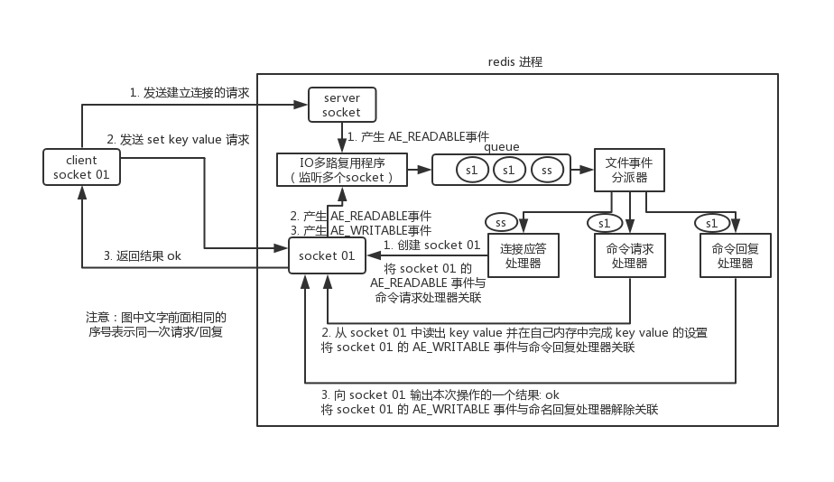

## 面试题
Redis 和 Memcached 有什么区别？Redis 的线程模型是什么？为什么 Redis 单线程却能支撑高并发？

## 面试官心理分析

这个是问 Redis 的时候，最基本的问题吧，Redis 最基本的一个内部原理和特点，就是 Redis 实际上是个**单线程工作模型**，你要是这个都不知道，那后面玩儿 Redis 的时候，出了问题岂不是什么都不知道？

还有可能面试官会问问你 Redis 和 Memcached 的区别，但是 Memcached 是早些年各大互联网公司常用的缓存方案，但是现在近几年基本都是 Redis，没什么公司用 Memcached 了。

## 面试题剖析

### Redis 和 Memcached 有啥区别？

#### Redis 支持复杂的数据结构

Redis 相比 Memcached 来说，拥有[更多的数据结构](/docs/high-concurrency/redis-data-types.md)，能支持更丰富的数据操作。如果需要缓存能够支持更复杂的结构和操作， Redis 会是不错的选择。

#### Redis 原生支持集群模式

在 Redis3.x 版本中，便能支持 cluster 模式，而 Memcached 没有原生的集群模式，需要依靠客户端来实现往集群中分片写入数据。

#### 性能对比

由于 Redis 只使用**单核**，而 Memcached 可以使用**多核**，所以平均每一个核上 Redis 在存储小数据时比 Memcached 性能更高。而在 100k 以上的数据中，Memcached 性能要高于 Redis。虽然 Redis 最近也在存储大数据的性能上进行优化，但是比起 Memcached，还是稍有逊色。

### Redis 的线程模型

Redis 内部使用文件事件处理器 `file event handler` ，这个文件事件处理器是单线程的，所以 Redis 才叫做单线程的模型。它采用 IO 多路复用机制同时监听多个 socket，将产生事件的 socket 压入内存队列中，事件分派器根据 socket 上的事件类型来选择对应的事件处理器进行处理。

文件事件处理器的结构包含 4 个部分：

* 多个 socket
* IO 多路复用程序
* 文件事件分派器
* 事件处理器（连接应答处理器、命令请求处理器、命令回复处理器）

多个 socket 可能会并发产生不同的操作，每个操作对应不同的文件事件，但是 IO 多路复用程序会监听多个 socket，会将产生事件的 socket 放入队列中排队，事件分派器每次从队列中取出一个 socket，根据 socket 的事件类型交给对应的事件处理器进行处理。

来看客户端与 Redis 的一次通信过程：

要明白，通信是通过 socket 来完成的，不懂的同学可以先去看一看 socket 网络编程。

首先，Redis 服务端进程初始化的时候，会将 server socket 的 `AE_READABLE` 事件与连接应答处理器关联。

客户端 socket01 向 Redis 进程的 server socket 请求建立连接，此时 server socket 会产生一个 `AE_READABLE` 事件，IO 多路复用程序监听到 server socket 产生的事件后，将该 socket 压入队列中。文件事件分派器从队列中获取 socket，交给**连接应答处理器**。连接应答处理器会创建一个能与客户端通信的 socket01，并将该 socket01 的 `AE_READABLE` 事件与命令请求处理器关联。

假设此时客户端发送了一个 `set key value` 请求，此时 Redis 中的 socket01 会产生 `AE_READABLE` 事件，IO 多路复用程序将 socket01 压入队列，此时事件分派器从队列中获取到 socket01 产生的 `AE_READABLE` 事件，由于前面 socket01 的 `AE_READABLE` 事件已经与命令请求处理器关联，因此事件分派器将事件交给命令请求处理器来处理。命令请求处理器读取 socket01 的 `key value` 并在自己内存中完成 `key value` 的设置。操作完成后，它会将 socket01 的 `AE_WRITABLE` 事件与命令回复处理器关联。

如果此时客户端准备好接收返回结果了，那么 Redis 中的 socket01 会产生一个 `AE_WRITABLE` 事件，同样压入队列中，事件分派器找到相关联的命令回复处理器，由命令回复处理器对 socket01 输入本次操作的一个结果，比如 `ok` ，之后解除 socket01 的 `AE_WRITABLE` 事件与命令回复处理器的关联。

这样便完成了一次通信。关于 Redis 的一次通信过程，推荐读者阅读《[Redis 设计与实现——黄健宏](https://github.com/doocs/technical-books#database)》进行系统学习。

### 为啥 Redis 单线程模型也能效率这么高？

* 纯内存操作。
* 核心是基于非阻塞的 IO 多路复用机制。
* C 语言实现，一般来说，C 语言实现的程序“距离”操作系统更近，执行速度相对会更快。
* 单线程反而避免了多线程的频繁上下文切换问题，预防了多线程可能产生的竞争问题。

### Redis 6.0 开始引入多线程

**注意！** Redis 6.0 之后的版本抛弃了单线程模型这一设计，**原本使用单线程运行的 Redis 也开始选择性地使用多线程模型**。

前面还在强调 Redis 单线程模型的高效性，现在为什么又要引入多线程？这其实说明 Redis 在有些方面，单线程已经不具有优势了。因为读写网络的 Read/Write 系统调用在 Redis 执行期间占用了大部分 CPU 时间，如果把网络读写做成多线程的方式对性能会有很大提升。

**Redis 的多线程部分只是用来处理网络数据的读写和协议解析，执行命令仍然是单线程。** 之所以这么设计是不想 Redis 因为多线程而变得复杂，需要去控制 key、lua、事务、LPUSH/LPOP 等等的并发问题。

### 总结

Redis 选择使用单线程模型处理客户端的请求主要还是因为 CPU 不是 Redis 服务器的瓶颈，所以使用多线程模型带来的性能提升并不能抵消它带来的开发成本和维护成本，系统的性能瓶颈也主要在网络 I/O 操作上；而 Redis 引入多线程操作也是出于性能上的考虑，对于一些大键值对的删除操作，通过多线程非阻塞地释放内存空间也能减少对 Redis 主线程阻塞的时间，提高执行的效率。
