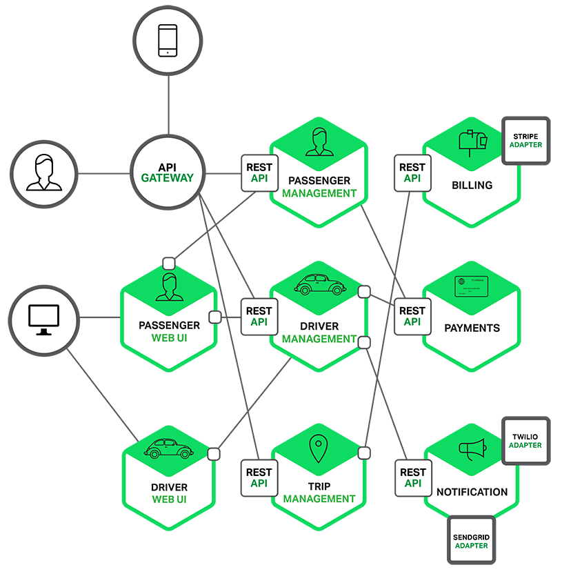
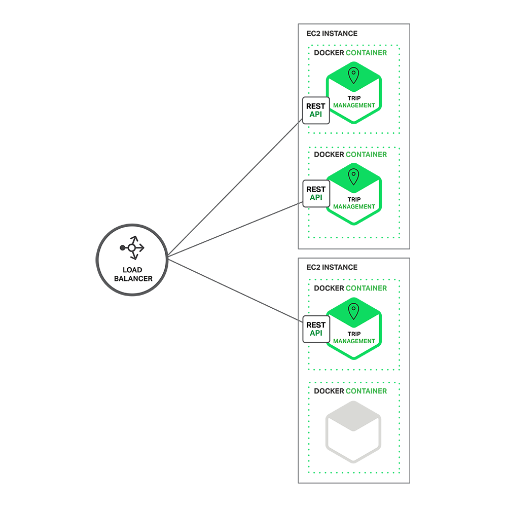
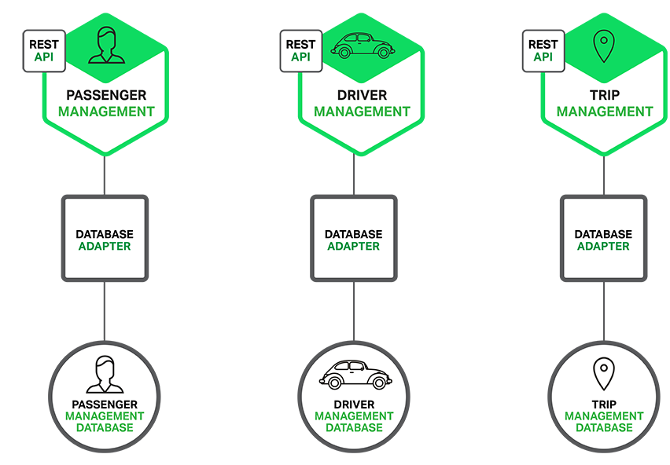

# 开发单体式应用

假设你正准备开发一款与 Uber 和 Hailo 竞争的出租车调度软件，经过初步会议和需求分析，你可能会手动或者使用基于 Rails、Spring Boot、Play 或者 Maven 的生成器开始这个新项目，它的六边形架构是模块化的 ，架构图如下：

应用核心是业务逻辑，由定义服务、域对象和事件的模块完成。围绕着核心的是与外界打交道的适配器。适配器包括数据库访问组件、生产和处理消息的消息组件，以及提供 API 或者 UI 访问支持的 web 模块等。

尽管也是模块化逻辑，但是最终它还是会打包并部署为单体式应用。具体的格式依赖于应用语言和框架。例如，许多 Java 应用会被打包为 WAR 格式， 部署在 Tomcat 或者 Jetty 上，而另外一些 Java 应用会被打包成自包含的 JAR 格式，同样，Rails 和 Node.js 会被打包成层级目录。

这种应用开发风格很常见，因为 IDE 和其它工具都擅长开发一个简单应用，这类应用也很易于调试，只需要简单运行此应用，用 Selenium 链接 UI 就可以完成端到端测试。单体式应用也易于部署，只需要把打包应用拷贝到服务器端，通过在负载均衡器后端运行多个拷贝就可以轻松实现应用扩展。在早期这 类应用运行的很好。

# 单体式应用的不足

不幸的是，这种简单方法却有很大的局限性。一个简单的应用会随着时间推移逐渐变大。在每次的 sprint 中， 开发团队都会面对新“故事”，然后开发许多新代码。几年后，这个小而简单的应用会变成了一个巨大的怪物。这儿有一个例子，我最近和一个开发者讨论，他正在 写一个工具，用来分析他们一个拥有数百万行代码的应用中 JAR 文件之间的依赖关系。我很确信这个代码正是很多开发者经过多年努力开发出来的一个怪物。

一旦你的应用变成一个又大又复杂的怪物，那开发团队肯定很痛苦。敏捷开发和部署举步维艰，其中最主要问题就是这个应用太复杂，以至于任何单个开发 者都不可能搞懂它。因此，修正 bug 和正确的添加新功能变的非常困难，并且很耗时。另外，团队士气也会走下坡路。如果代码难于理解，就不可能被正确的修 改。最终会走向巨大的、不可理解的泥潭。

单体式应用也会降低开发速度。应用越大，启动时间会越长。比如，最近的一个调查表明，有时候应用的启动时间居然超过了 12 分钟。我还听说某些应用需要 40 分钟启动时间。如果开发者需要经常重启应用，那么大部分时间就要在等待中渡过，生产效率受到极大影响。

另外，复杂而巨大的单体式应用也不利于持续性开发。今天，SaaS 应用常态就是每天会改变很多次，而这对于单体式应用模式非常困难。另外，这种变化带来的影响并没有很好的被理解，所以不得不做很多手工测试。那么接下来，持续部署也会很艰难。

单体式应用在不同模块发生资源冲突时，扩展将会非常困难。比如，一个模块完成一个 CPU 敏感逻辑，应该部署在 AWS EC2 Compute Optimized instances，而另外一个内存数据库模块更合适于 EC2 Memory-optimized instances。然而，由于这些模块部署在一起，因此不得不在硬件选择上做一个妥协。

单体式应用另外一个问题是可靠性。因为所有模块都运行在一个进程中，任何一个模块中的一个 bug，比如内存泄露，将会有可能弄垮整个进程。除此之外，因为所有应用实例都是唯一的，这个 bug 将会影响到整个应用的可靠性。

最后，单体式应用使得采用新架构和语言非常困难。比如，设想你有两百万行采用 XYZ 框架写的代码。如果想改成 ABC 框架，无论是时间还是成本都是非常昂贵的，即使 ABC 框架更好。因此，这是一个无法逾越的鸿沟。你不得不在最初选择面前低头。

总结一下：一开始你有一个很成功的关键业务应用，后来就变成了一个巨大的，无法理解的怪物。因为采用过时的，效率低的技术，使得雇佣有潜力的开发者很困难。应用无法扩展，可靠性很低，最终，敏捷性开发和部署变的无法完成。

那么如何应对呢？

# 微处理架构——处理复杂事物

许多公司，比如 Amazon、eBay 和 NetFlix，通过采用微处理结构模式解决了上述问题。其思路不是开发一个巨大的单体式的应用，而是将应用分解为小的、互相连接的微服务。

一个微服务一般完成某个特定的功能，比如下单管理、客户管理等等。每一个微服务都是微型六角形应用，都有自己的业务逻辑和适配器。一些微服务还会 发布 API 给其它微服务和应用客户端使用。其它微服务完成一个 Web UI，运行时，每一个实例可能是一个云 VM 或者是 Docker 容器。

比如，一个前面描述系统可能的分解如下：

每一个应用功能区都使用微服务完成，另外，Web 应用会被拆分成一系列简单的 Web 应用（比如一个对乘客，一个对出租车驾驶员）。这样的拆分对于不同用户、设备和特殊应用场景部署都更容易。

每一个后台服务开放一个 REST API，许多服务本身也采用了其它服务提供的 API。比如，驾驶员管理使用了告知驾驶员一个潜在需求的通知服务。UI 服务激活其它服务来更新 Web 页面。所有服务都是采用异步的，基于消息的通讯。微服务内部机制将会在后续系列中讨论。

一些 REST API 也对乘客和驾驶员采用的移动应用开放。这些应用并不直接访问后台服务，而是通过 API Gateway 来传递中间消息。API Gateway 负责负载均衡、缓存、访问控制、API 计费监控等等任务，可以通过 NGINX 方便实现，后续文章将会介绍到 API Gateway。

微服务架构模式在上图中对应于代表可扩展 Scale Cube 的 Y 轴，这是一个在《The Art of Scalability》书中描述过的三维扩展模型。另外两个可扩展轴，X 轴由负载均衡器后端运行的多个应用副本组成，Z 轴是将需求路由到相关服务。

应用基本可以用以上三个维度来表示，Y 轴代表将应用分解为微服务。运行时，X 轴代表运行多个隐藏在负载均衡器之后的实例，提供吞吐能力。一些应用可能还是用 Z 轴将服务分区。下面的图演示行程管理服务如何部署在运行于 AWS EC2 上的 Docker 上。

运行时，行程管理服务由多个服务实例构成。每一个服务实例都是一个 Docker 容器。为了保证高可用，这些容器一般都运行在多个云 VM 上。服务实例前是一层诸如 NGINX 的负载均衡器，他们负责在各个实例间分发请求。负载均衡器也同时处理其它请求，例如缓存、权限控制、API 统计和监控。

这种微服务架构模式深刻影响了应用和数据库之间的关系， **不像传统多个服务共享一个数据库，微服务架构每个服务都有自己的数据库** 。另外，这种思路也影响到了企业级数据模式。同时，这种模式意味着多份数据，但是，如果你想获得微服务带来的好处，每个服务独有一个数据库是必须的，因为这种架构需要这种松耦合。下面的图演示示例应用数据库架构。

每种服务都有自己的数据库，另外，每种服务可以用更适合自己的数据库类型，也被称作多语言一致性架构。比如，驾驶员管理（发现哪个驾驶员更靠近乘客），必须使用支持地理信息查询的数据库。

表面上看来，微服务架构模式有点像 SOA，他们都由多个服务构成。但是，可以从另外一个角度看此问题，微服务架构模式是一个不包含 Web 服务 （WS-）和 ESB 服务的 SOA。微服务应用乐于采用简单轻量级协议，比如 REST，而不是 WS-，在微服务内部避免使用 ESB 以及 ESB 类似功能。微服 务架构模式也拒绝使用 canonical schema 等 SOA 概念。

# 微服务架构的好处

微服务架构模式有很多好处。首先，通过分解巨大单体式应用为多个服务方法解决了复杂性问题。在功能不变的情况下，应用 被分解为多个可管理的分支或服务。每个服务都有一个用 RPC-或者消息驱动 API 定义清楚的边界。微服务架构模式给采用单体式编码方式很难实现的功能提供 了模块化的解决方案，由此，单个服务很容易开发、理解和维护。

第二，这种架构使得每个服务都可以有专门开发团队来开发。开发者可以自由选择开发技术，提供 API 服务。当然，许多公司试图避免混乱，只提供某些 技术选择。然后，这种自由意味着开发者不需要被迫使用某项目开始时采用的过时技术，他们可以选择现在的技术。甚至于，因为服务都是相对简单，即使用现在技 术重写以前代码也不是很困难的事情。

第三，微服务架构模式是每个微服务独立的部署。开发者不再需要协调其它服务部署对本服务的影响。这种改变可以加快部署速度。UI 团队可以采用 AB 测试，快速的部署变化。微服务架构模式使得持续化部署成为可能。

最后，微服务架构模式使得每个服务独立扩展。你可以根据每个服务的规模来部署满足需求的规模。甚至于，你可以使用更适合于服务资源需求的硬件。比 如，你可以在 EC2 Compute Optimized instances 上部署 CPU 敏感的服务，而在 EC2 memory-optimized instances 上部署内存数据库。

# 微服务架构的不足

Fred Brooks 在 30 年前写道，“there are no silver bullets”，像任何其它科技一样，微服务架构也有不足。其中一个跟他的名字类似，『微服务』强调了服务大小，实际上，有一些开发者鼓吹建立稍微大一 些的，10-100 LOC 服务组。尽管小服务更乐于被采用，但是不要忘了这只是终端的选择而不是最终的目的。微服务的目的是有效的拆分应用，实现敏捷开发和部署。

另外一个主要的不足是，微服务应用是分布式系统，由此会带来固有的复杂性。开发者需要在 RPC 或者消息传递之间选择并完成进程间通讯机制。更甚 于，他们必须写代码来处理消息传递中速度过慢或者不可用等局部失效问题。当然这并不是什么难事，但相对于单体式应用中通过语言层级的方法或者进程调用，微 服务下这种技术显得更复杂一些。

另外一个关于微服务的挑战来自于分区的数据库架构。商业交易中同时给多个业务分主体更新消息很普遍。这种交易对于单体式应用来说很容易，因为只有 一个数据库。在微服务架构应用中，需要更新不同服务所使用的不同的数据库。使用分布式交易并不一定是好的选择，不仅仅是因为 CAP 理论，还因为今天高扩展 性的 NoSQL 数据库和消息传递中间件并不支持这一需求。最终你不得不使用一个最终一致性的方法，从而对开发者提出了更高的要求和挑战。

测试一个基于微服务架构的应用也是很复杂的任务。比如，采用流行的 Spring Boot 架构，对一个单体式 web 应用，测试它的 REST API，是很容易的事情。反过来，同样的服务测试需要启动和它有关的所有服务（至少需要这些服务的 stubs）。再重申一次，不能低估了采用微服务架构带 来的复杂性。

另外一个挑战在于，微服务架构模式应用的改变将会波及多个服务。比如，假设你在完成一个案例，需要修改服务 A、B、C，而 A 依赖 B，B 依赖 C。在 单体式应用中，你只需要改变相关模块，整合变化，部署就好了。对比之下，微服务架构模式就需要考虑相关改变对不同服务的影响。比如，你需要更新服务 C，然 后是 B，最后才是 A，幸运的是，许多改变一般只影响一个服务，而需要协调多服务的改变很少。

部署一个微服务应用也很复杂，一个分布式应用只需要简单在复杂均衡器后面部署各自的服务器就好了。每个应用实例是需要配置诸如数据库和消息中间件等基础服务。相对比，一个微服务应用一般由大批服务构成。例如，根据 Adrian Cockcroft， Hailo 有 160 个不同服务构成，NetFlix 有大约 600 个服务。每个服务都有多个实例。这就造成许多需要配置、部署、扩展和监控的部分，除此之外，你还需要完成一个服务发现机制（后续文章中发 表），以用来发现与它通讯服务的地址（包括服务器地址和端口）。传统的解决问题办法不能用于解决这么复杂的问题。接续而来，成功部署一个微服务应用需要开 发者有足够的控制部署方法，并高度自动化。

一种自动化方法是使用 PaaS 服务，例如 Cloud Foundry。 PaaS 给开发者提供一个部署和管理微服务的简单方法，它把所有这些问题都打包内置解决了。同时，配置 PaaS 的系统和网络专家可以采用最佳实践和策略来 简化这些问题。另外一个自动部署微服务应用的方法是开发对于你来说最基础的 PaaS 系统。一个典型的开始点是使用一个集群化方案，比如配合 Docker 使 用 Mesos 或者 Kubernetes。后面的系列我们会看看如何基于软件部署方法例如 NGINX，可以方便的在微服务层面提供缓存、权限控制、API 统 计和监控。

# 总结

构建复杂的应用真的是非常困难。单体式的架构更适合轻量级的简单应用。如果你用它来开发复杂应用，那真的会很糟糕。微服务架构模式可以用来构建复杂应用，当然，这种架构模型也有自己的缺点和挑战。
