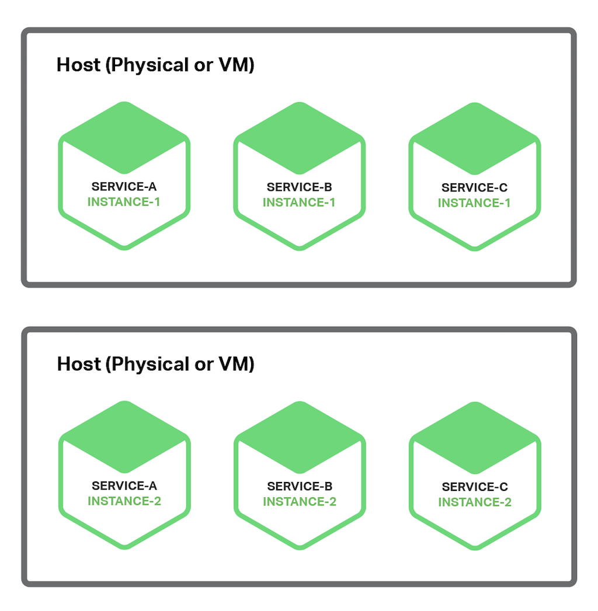
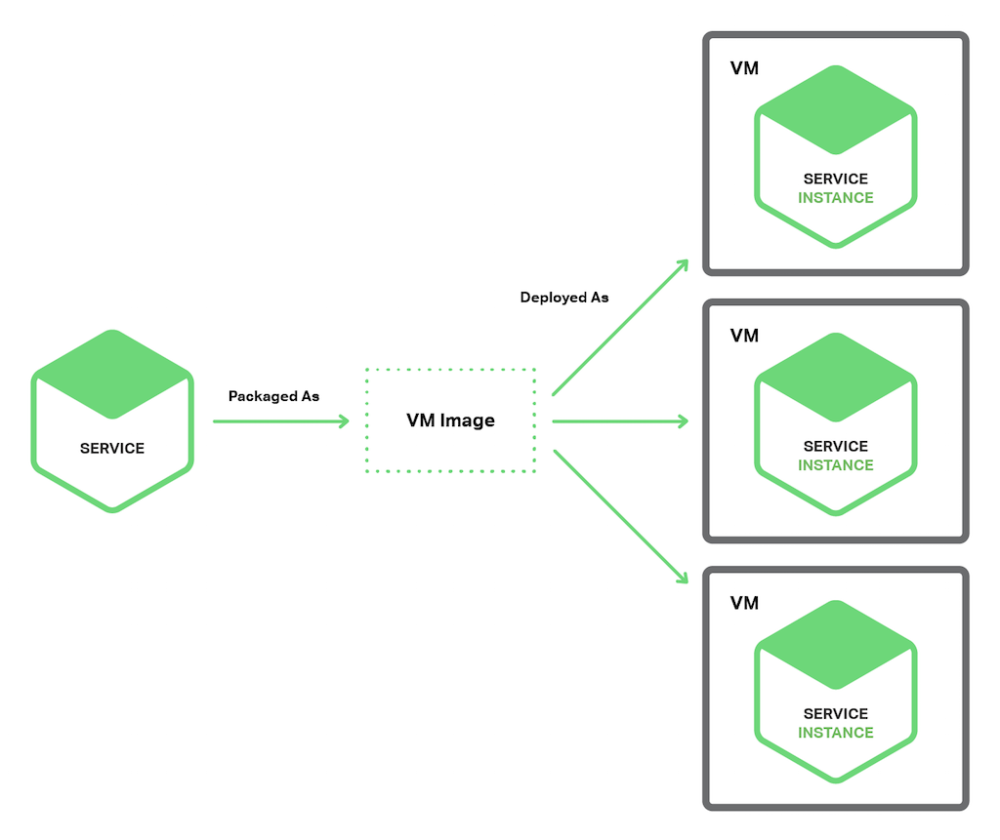
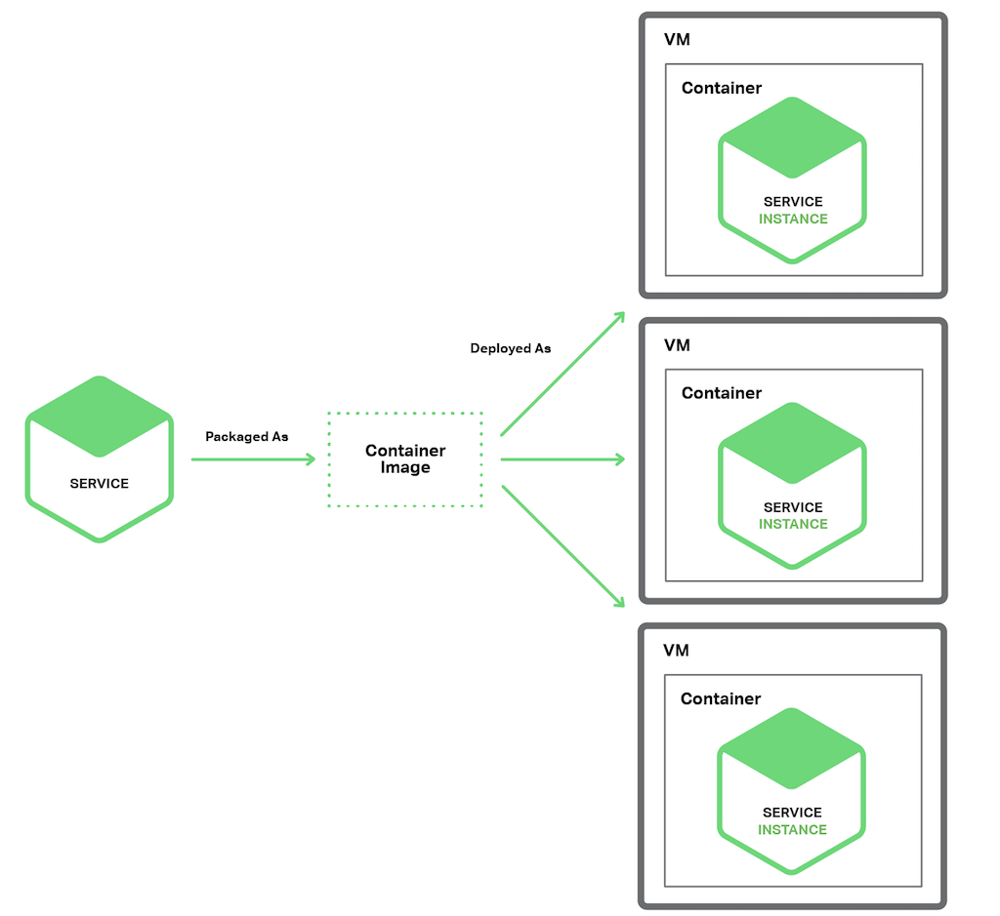

# 前言

部署一个单体式应用意味运行大型应用的多个副本，典型的提供若干个（N）服务器（物理或者虚拟），运行若干个（M）个应用实例。部署单体式应用不会很直接，但是肯定比部署微服务应用简单些。

一个微服务应用由上百个服务构成，服务可以采用不同语言和框架分别写就。每个服务都是一个单一应用，可以有自己的部署、资源、扩展和监控需求。例如，可以根据服务需求运行若干个服务实例，除此之外，每个实例必须有自己的 CPU，内存和 I/O 资源。尽管很复杂，但是更挑战的是服务部署必须快速、可靠和性价比高。

有一些微服务部署的模式，先讨论一下每个主机多服务实例的模式。

# 单主机多服务实例模式

部署微服务的一种方法就是单主机多服务实例模式，使用这种模式，需要提供若干台物理或者虚拟机，每台机器上运行多个服务实例。很多情况下，这是传统的应用部署方法。每个服务实例运行一个或者多个主机的 well-known 端口，主机可以看做宠物。

下图展示的是这种架构：

这种模式有一些参数，一个参数代表每个服务实例由多少进程构成。例如，需要在 Apache Tomcat Server 上部署一个 Java 服务实例作为 web 应用。一个 Node.js 服务实例可能有一个父进程和若干个子进程构成。

另外一个参数定义同一进程组内有多少服务实例运行。例如，可以在同一个 Apache Tomcat Server 上运行多个 Java web 应用，或者在同一个 OSGI 容器内运行多个 OSGI 捆绑实例。

单主机多服务实例模式也是优缺点并存。主要优点在于资源利用有效性。多服务实例共享服务器和操作系统，如果进程组运行多个服务实例效率会更高，例如，多个 web 应用共享同一个 Apache Tomcat Server 和 JVM。

另一个优点在于部署服务实例很快。只需将服务拷贝到主机并启动它。如果服务用 Java 写的，只需要拷贝 JAR 或者 WAR 文件即可。对于其它语言，例如 Node.js 或者 Ruby，需要拷贝源码。也就是说网络负载很低。

因为没有太多负载，启动服务很快。如果服务是自包含的进程，只需要启动就可以；否则，如果是运行在容器进程组中的某个服务实例，则需要动态部署进容器中，或者重启容器。

除了上述优点外，单主机多服务实例也有缺陷。其中一个主要缺点是服务实例间很少或者没有隔离，除非每个服务实例是独立进程。如果想精确监控每个服务实例资源使用，就不能限制每个实例资源使用。因此有可能造成某个糟糕的服务实例占用了主机的所有内存或者 CPU。

同一进程内多服务实例没有隔离。所有实例有可能，例如，共享同一个 JVM heap。某个糟糕服务实例很容易攻击同一进程中其它服务；更甚至于，有可能无法监控每个服务实例使用的资源情况。

另一个严重问题在于运维团队必须知道如何部署的详细步骤。服务可以用不同语言和框架写成，因此开发团队肯定有很多需要跟运维团队沟通事项。其中复杂性增加了部署过程中出错的可能性。

可以看到，尽管熟悉，但是单主机多服务实例有很多严重缺陷。下面看看是否有其他部署微服务方式能够避免这些问题。

# 单主机单服务实例模式

另外一种部署微服务方式是单主机单实例模式。当使用这种模式，每个主机上服务实例都是各自独立的。有两种不同实现模式：单虚拟机单实例和单容器单实例。

## 单虚拟机单实例模式

但是用单虚拟机单实例模式，一般将服务打包成虚拟机映像（image），例如一个 Amazon EC2 AMI。每个服务实例是一个使用此映像启动的 VM（例如，EC2 实例）。下图展示了此架构：

Netfix 采用这种架构部署 video streaming service。Netfix 使用 Aminator 将每个服务打包成一个 EC2 AMI。每个运行服务实例就是一个 EC2 实例。

有很多工具可以用来搭建自己的 VMs。可以配置持续集成（CI）服务（例如，Jenkins）避免 Aminator 将服务打包成 EC2 AMI。packer.io 是自动虚机映像创建的另外一种选择。跟 Aminator 不同，它支持一系列虚拟化技术，例如 EC2，DigitalOcean，VirtualBox 和 VMware。​

Boxfuse 公司有一个创新方法创建虚机映像，克服了如下缺陷。Boxfuse 将 java 应用打包成最小虚机映像，它们创建迅速，启动很快，因为对外暴露服务接口少而更加安全。

CloudNative 公司有一个用于创建 EC2 AMI 的 SaaS 应用，Bakery。用户微服务架构通过测试后，可以配置自己的 CI 服务器激活 Bakery。Bakery 将服务打包成 AMI。使用如 Bakery 的 SaaS 应用意味着用户不需要浪费时间在设置自己的 AMI 创建架构。

每虚拟机服务实例模式有许多优势，主要的 VM 优势在于每个服务实例都是完全独立运行的，都有各自独立的 CPU 和内存而不会被其它服务占用。

另外一个好处在于用户可以使用成熟云架构，例如 AWS 提供的，云服务都提供如负载均衡和扩展性等有用功能。

还有一个好处在于服务实施技术被自包含了。一旦服务被打包成 VM 就成为一个黑盒子。VM 的管理 API 成为部署服务的 API，部署成为一个非常简单和可靠的事情。

单虚拟机单实例模式也有缺点。一个缺点就是资源利用效率不高。每个服务实例占用整个虚机的资源，包括操作系统。而且，在一个典型的公有 IaaS 环境，虚机资源都是标准化的，有可能未被充分利用。

而且，公有 IaaS 根据 VM 来收费，而不管虚机是否繁忙；例如 AWS 提供了自动扩展功能，但是对随需应用缺乏快速响应，使得用户不得不多部署虚机，从而增加了部署费用。

另外一个缺点在于部署服务新版本比较慢。虚机镜像因为大小原因创建起来比较慢，同样原因，虚机初始化也比较慢，操作系统启动也需要时间。但是这并不一直是这样，一些轻量级虚机，例如使用 Boxfuse 创建的虚机，就比较快。

第三个缺点是对于运维团队，它们负责许多客制化工作。除非使用如 Boxfuse 之类的工具，可以帮助减轻大量创建和管理虚机的工作；否则会占用大量时间从事与核心业务不太无关的工作。

那么我们来看看另外一种仍然具有虚机特性，但是比较轻量的微服务部署方法。

# 单容器单服务实例模式

当使用这种模式时，每个服务实例都运行在各自容器中。容器是运行在操作系统层面的虚拟化机制。一个容器包含若干运行在沙箱中的进程。从进程角度来看，他们有各自的命名空间和根文件系统；可以限制容器的内存和 CPU 资源。某些容器还具有 I/O 限制，这类容器技术包括 Docker 和 Solaris Zones。

下图展示了这种模式：

使用这种模式需要将服务打包成容器映像。一个容器映像是一个运行包含服务所需库和应用的文件系统​。某些容器映像由完整的 linux 根文件系统组成，其它则是轻量级的。例如，为了部署 Java 服务，需要创建包含 Java 运行库的容器映像，也许还要包含 Apache Tomcat server，以及编译过的 Java 应用。

一旦将服务打包成容器映像，就需要启动若干容器。一般在一个物理机或者虚拟机上运行多个容器，可能需要集群管理系统，例如 k8s 或者 Marathon，来管理容器。集群管理系统将主机作为资源池，根据每个容器对资源的需求，决定将容器调度到那个主机上。

单容器单服务实例模式也是优缺点都有。容器的优点跟虚机很相似，服务实例之间完全独立，可以很容易监控每个容器消耗的资源。跟虚机相似，容器使用隔离技术部署服务。容器管理 API 也可以作为管理服务的 API。

然而，跟虚机不一样，容器是一个轻量级技术。容器映像创建起来很快，例如，在笔记本电脑上，将 Spring Boot 应用打包成容器映像只需要 5 秒钟。因为不需要操作系统启动机制，容器启动也很快。当容器启动时，后台服务就启动了。

使用容器也有一些缺点。尽管容器架构发展迅速，但是还是不如虚机架构成熟。而且由于容器之间共享 host OS 内核因此并不像虚机那么安全。

另外，容器技术将会对管理容器映像提出许多客制化需求，除非使用如 Google Container Engine 或者 Amazon EC2 Container Service (ECS)，否则用户将同时需要管理容器架构以及虚机架构。

第三，容器经常被部署在按照虚机收费的架构上，很显然，客户也会增加部署费用来应对负载的增长。

有趣的是，容器和虚机之间的区别越来越模糊。如前所述，Boxfuse 虚机启动创建都很快，Clear Container 技术面向创建轻量级虚机。unikernel 公司的技术也引起大家关注，Docker 最近收购了 Unikernel 公司。

除了这些之外，server-less 部署技术，避免了前述容器和 VM 技术的缺陷，吸引了越来越多的注意。下面我们来看看。

# Serverless 部署

AWS Lambda 是 serverless 部署技术的例子，支持 Java，Node.js 和 Python 服务；需要将服务打包成 ZIP 文件上载到 AWS Lambda 就可以部署。可以提供元数据，提供处理服务请求函数的名字（一个事件）。AWS Lambda 自动运行处理请求足够多的微服务，然而只根据运行时间和消耗内存量来计费。当然细节决定成败，AWS Lambda 也有限制。但是大家都不需要担心服务器，虚拟机或者容器内的任何方面绝对吸引人。

Lambda 函数 是无状态服务。一般通过激活 AWS 服务处理请求。例如，当映像上载到 S3 bucket 激活 Lambda 函数后，就可以在 DynamoDB 映像表中插入一个条目，给 Kinesis 流发布一条消息，触发映像处理动作。Lambda 函数也可以通过第三方 web 服务激活。

有四种方法激活 Lambda 函数：

* 直接方式，使用 web 服务请求
* 自动方式，回应例如 AWS S3，DynamoDB，Kinesis 或者 Simple Email Service 等产生的事件
* 自动方式，通过 AWS API 网关来处理应用客户端发出的 HTTP 请求​
* 定时方式，通过 cron 响应​--很像定时器方式

可以看出，AWS Lambda 是一种很方便部署微服务的方式。基于请求计费方式意味着用户只需要承担处理自己业务那部分的负载；另外，因为不需要了解基础架构，用户只需要开发自己的应用。

然而还是有不少限制。不需要用来部署长期服务，例如用来消费从第三方代理转发来的消息，请求必须在 300 秒内完成，服务必须是无状态，因为理论上 AWS Lambda 会为每个请求生成一个独立的实例；必须用某种支持的语言完成，服务必须启动很快，否则，会因为超时被停止。
部署微服务应用也是一种挑战。用各种语言和框架写成的服务成百上千。每种服务都是一种迷你应用，有自己独特的部署、资源、扩充和监控需求。有若干种微服务部署模式，包括单虚机单实例以及单容器单实例。另外可选模式还有 AWS Lambda，一种 serverless 方法。
