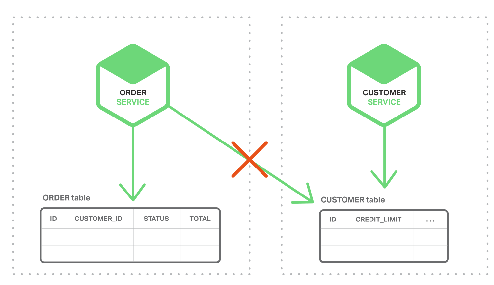
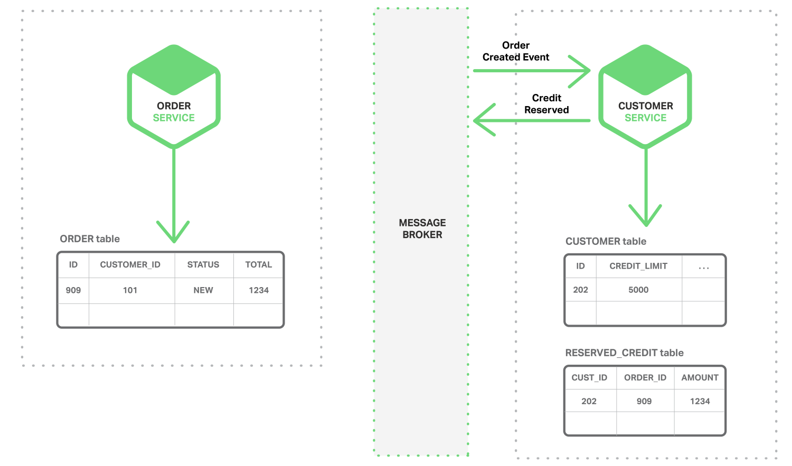

# 1.1 微服务和分布式数据管理问题

单体式应用一般都会有一个关系型数据库，由此带来的好处是应用可以使用 ACID transactions，可以带来一些重要的操作特性：

1. 原子性 – 任何改变都是原子性的
2. 一致性 – 数据库状态一直是一致性的
3. 隔离性 – 即使交易并发执行，看起来也是串行的
4. Durable – 一旦交易提交了就不可回滚

鉴于以上特性，应用可以简化为：开始一个交易，改变（插入，删除，更新）很多行，然后提交这些交易。

使用关系型数据库带来另外一个优势在于提供 SQL（功能强大，可声明的，表转化的查询语言）支持。用户可以非常容易通过查询将多个表的数据组合起来，RDBMS 查询调度器决定最佳实现方式，用户不需要担心例如如何访问数据库等底层问题。另外，因为所有应用的数据都在一个数据库中，很容易去查询。

然而，对于微服务架构来说，数据访问变得非常复杂，这是因为数据都是微服务私有的，唯一可访问的方式就是通过 API。这种打包数据访问方式使得微服务之间松耦合，并且彼此之间独立。如果多个服务访问同一个数据，schema 会更新访问时间，并在所有服务之间进行协调。

更甚于，不同的微服务经常使用不同的数据库。应用会产生各种不同数据，关系型数据库并不一定是最佳选择。某些场景，某个 NoSQL 数据库可能提供更方便的数据模型，提供更加的性能和可扩展性。例如，某个产生和查询字符串的应用采用例如 Elasticsearch 的字符搜索引擎。同样的，某个产生社交图片数据的应用可以采用图片数据库，例如，Neo4j ；因此，基于微服务的应用一般都使用 SQL 和 NoSQL 结合的数据库，也就是被称为 polyglot persistence 的方法。

分区的，polyglot-persistent 架构用于存储数据有许多优势，包括松耦合服务和更佳性能和可扩展性。然而，随之而来的则是分布式数据管理带来的挑战。

第一个挑战在于如何完成一笔交易的同时保持多个服务之间数据一致性。之所以会有这个问题，我们以一个在线 B2B 商店为例，客户服务维护包括客户的各种信息，例如 credit lines 。订单服务管理订单，需要验证某个新订单与客户的信用限制没有冲突。在单一式应用中，订单服务只需要使用 ACID 交易就可以检查可用信用和创建订单。

相反的，微服务架构下，订单和客户表分别是相对应服务的私有表，如下图所示：

订单服务不能直接访问客户表，只能通过客户服务发布的 API 来访问。订单服务也可以使用 distributed transactions, 也就是周知的两阶段提交 (2PC)。然而，2PC 在现在应用中不是可选性。根据 CAP 理论，必须在可用性（availability）和 ACID 一致性（consistency）之间做出选择，availability 一般是更好的选择。但是，许多现代科技，例如许多 NoSQL 数据库，并不支持 2PC。在服务和数据库之间维护数据一致性是非常根本的需求，因此我们需要找其他的方案。

第二个挑战是如何完成从多个服务中搜索数据。例如，设想应用需要显示客户和他的订单。如果订单服务提供 API 来接受用户订单信息，那么用户可以使用类应用型的 join 操作接收数据。应用从用户服务接受用户信息，从订单服务接受此用户订单。假设，订单服务只支持通过私有键（key）来查询订单（也许是在使用只支持基于主键接受的 NoSQL 数据库），此时，没有合适的方法来接收所需数据。

# 1.2 事件驱动架构

对许多应用来说，这个解决方案就是使用事件驱动架构（event-driven architecture）。在这种架构中，当某件重要事情发生时，微服务会发布一个事件，例如更新一个业务实体。当订阅这些事件的微服务接收此事件时，就可以更新自己的业务实体，也可能会引发更多的时间发布。

可以使用事件来实现跨多服务的业务交易。交易一般由一系列步骤构成，每一步骤都由一个更新业务实体的微服务和发布激活下一步骤的事件构成。下图展现如何使用事件驱动方法，在创建订单时检查信用可用度，微服务通过消息代理（Messsage Broker）来交换事件。

1. 订单服务创建一个带有 NEW 状态的 Order （订单），发布了一个 “Order Created Event（创建订单）” 的事件。

2. 客户服务消费 Order Created Event 事件，为此订单预留信用，发布 “Credit Reserved Event（信用预留）” 事件。

3. 订单服务消费 Credit Reserved Event ，改变订单的状态为 OPEN。

更复杂的场景可以引入更多步骤，例如在检查用户信用的同时预留库存等。

考虑到（a）每个服务原子性更新数据库和发布事件，然后，（b）消息代理确保事件传递至少一次，然后可以跨多个服务完成业务交易（此交易不是 ACID 交易）。这种模式提供弱确定性，例如最终一致性 eventual consistency。这种交易类型被称作 BASE model。

亦可以使用事件来维护不同微服务拥有数据预连接（pre-join）的实现视图。维护此视图的服务订阅相关事件并且更新视图。例如，客户订单视图更新服务（维护客户订单视图）会订阅由客户服务和订单服务发布的事件。

当客户订单视图更新服务收到客户或者订单事件，就会更新 客户订单视图数据集。可以使用文档数据库（例如 MongoDB）来实现客户订单视图，为每个用户存储一个文档。客户订单视图查询服务负责响应对客户以及最近订单（通过查询客户订单视图数据集）的查询。

事件驱动架构也是既有优点也有缺点，此架构可以使得交易跨多个服务且提供最终一致性，并且可以使应用维护最终视图；而缺点在于编程模式比 ACID 交易模式更加复杂：为了从应用层级失效中恢复，还需要完成补偿性交易，例如，如果信用检查不成功则必须取消订单；另外，应用必须应对不一致的数据，这是因为临时（in-flight）交易造成的改变是可见的，另外当应用读取未更新的最终视图时也会遇见数据不一致问题。另外一个缺点在于订阅者必须检测和忽略冗余事件。

# 1.3 原子操作 Achieving Atomicity

事件驱动架构还会碰到数据库更新和发布事件原子性问题。例如，订单服务必须向 ORDER 表插入一行，然后发布 Order Created event，这两个操作需要原子性。如果更新数据库后，服务瘫了（crashes）造成事件未能发布，系统变成不一致状态。确保原子操作的标准方式是使用一个分布式交易，其中包括数据库和消息代理。然而，基于以上描述的 CAP 理论，这却并不是我们想要的。

## 1.3.1 使用本地交易发布事件

获得原子性的一个方法是对发布事件应用采用 multi-step process involving only local transactions，技巧在于一个 EVENT 表，此表在存储业务实体数据库中起到消息列表功能。应用发起一个（本地）数据库交易，更新业务实体状态，向 EVENT 表中插入一个事件，然后提交此次交易。另外一个独立应用进程或者线程查询此 EVENT 表，向消息代理发布事件，然后使用本地交易标志此事件为已发布，如下图所示：

订单服务向 ORDER 表插入一行，然后向 EVENT 表中插入 Order Created event，事件发布线程或者进程查询 EVENT 表，请求未发布事件，发布他们，然后更新 EVENT 表标志此事件为已发布。

此方法也是优缺点都有。优点是可以确保事件发布不依赖于 2PC，应用发布业务层级事件而不需要推断他们发生了什么；而缺点在于此方法由于开发人员必须牢记发布事件，因此有可能出现错误。另外此方法对于某些使用 NoSQL 数据库的应用是个挑战，因为 NoSQL 本身交易和查询能力有限。

此方法因为应用采用了本地交易更新状态和发布事件而不需要 2PC，现在再看看另外一种应用简单更新状态获得原子性的方法。

## 1.3.2 挖掘数据库交易日志

另外一种不需要 2PC 而获得线程或者进程发布事件原子性的方式就是挖掘数据库交易或者提交日志。应用更新数据库，在数据库交易日志中产生变化，交易日志挖掘进程或者线程读这些交易日志，将日志发布给消息代理。如下图所见：

此方法的例子如 LinkedIn Databus 项目，Databus 挖掘 Oracle 交易日志，根据变化发布事件，LinkedIn 使用 Databus 来保证系统内各记录之间的一致性。

另外的例子如：AWS 的 streams mechanism in AWS DynamoDB，是一个可管理的 NoSQL 数据库，一个 DynamoDB 流是由过去 24 小时对数据库表基于时序的变化（创建，更新和删除操作），应用可以从流中读取这些变化，然后以事件方式发布这些变化。

交易日志挖掘也是优缺点并存。优点是确保每次更新发布事件不依赖于 2PC。交易日志挖掘可以通过将发布事件和应用业务逻辑分离开得到简化；而主要缺点在于交易日志对不同数据库有不同格式，甚至不同数据库版本也有不同格式；而且很难从底层交易日志更新记录转换为高层业务事件。

交易日志挖掘方法通过应用直接更新数据库而不需要 2PC 介入。下面我们再看一种完全不同的方法：不需要更新只依赖事件的方法。

## 1.3.3 使用事件源

Event sourcing （事件源）通过使用根本不同的事件中心方式来获得不需 2PC 的原子性，保证业务实体的一致性。 这种应用保存业务实体一系列状态改变事件，而不是存储实体现在的状态。应用可以通过重放事件来重建实体现在状态。只要业务实体发生变化，新事件就会添加到时间表中。因为保存事件是单一操作，因此肯定是原子性的。

为了理解事件源工作方式，考虑事件实体作为一个例子。传统方式中，每个订单映射为 ORDER 表中一行，例如在 ORDER_LINE_ITEM 表中。但是对于事件源方式，订单服务以事件状态改变方式存储一个订单：创建的，已批准的，已发货的，取消的；每个事件包括足够数据来重建订单状态。

事件是长期保存在事件数据库中，提供 API 添加和获取实体事件。事件存储跟之前描述的消息代理类似，提供 API 来订阅事件。事件存储将事件递送到所有感兴趣的订阅者，事件存储是事件驱动微服务架构的基干。

事件源方法有很多优点：解决了事件驱动架构关键问题，使得只要有状态变化就可以可靠地发布事件，也就解决了微服务架构中数据一致性问题。另外，因为是持久化事件而不是对象，也就避免了 object relational impedance mismatch problem。

数据源方法提供了 100%可靠的业务实体变化监控日志，使得获取任何时点实体状态成为可能。另外，事件源方法可以使得业务逻辑可以由事件交换的松耦合业务实体构成。这些优势使得单体应用移植到微服务架构变的相对容易。

事件源方法也有不少缺点，因为采用不同或者不太熟悉的变成模式，使得重新学习不太容易；事件存储只支持主键查询业务实体，必须使用 Command Query Responsibility Segregation (CQRS) 来完成查询业务，因此，应用必须处理最终一致数据。

# 1.4 总结

在微服务架构中，每个微服务都有自己私有的数据集。不同微服务可能使用不同的 SQL 或者 NoSQL 数据库。尽管数据库架构有很强的优势，但是也面对数据分布式管理的挑战。第一个挑战就是如何在多服务之间维护业务交易一致性；第二个挑战是如何从多服务环境中获取一致性数据。

最佳解决办法是采用事件驱动架构。其中碰到的一个挑战是如何原子性的更新状态和发布事件。有几种方法可以解决此问题，包括将数据库视为消息队列、交易日志挖掘和事件源。
