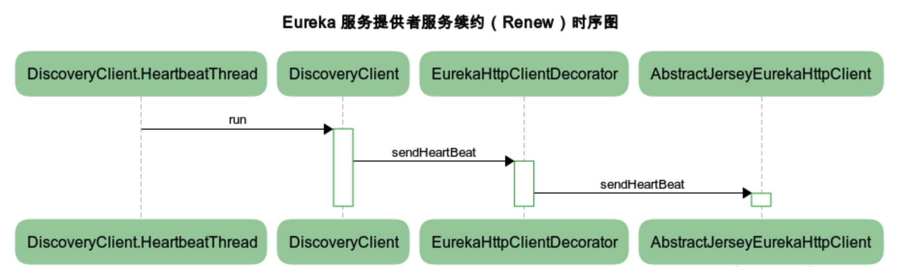

# 服务发现组件 Eureka 的几个主要调用过程

* Author: [mghio](https://www.mghio.cn)
* Description: 该文主要讲述服务发现组件 Eureka 的几个主要调用过程

## 前言

现在流行的微服务体系结构正在改变我们构建应用程序的方式，从单一的单体服务转变为越来越小的可单独部署的服务（称为 `微服务` ），共同构成了我们的应用程序。当进行一个业务时不可避免就会存在多个服务之间调用，假如一个服务 A 要访问在另一台服务器部署的服务 B，那么前提是服务 A 要知道服务 B 所在机器的 IP 地址和服务对应的端口，最简单的方式就是让服务 A 自己去维护一份服务 B 的配置（包含 IP 地址和端口等信息），但是这种方式有几个明显的缺点：随着我们调用服务数量的增加，配置文件该如何维护；缺乏灵活性，如果服务 B 改变 IP 地址或者端口，服务 A 也要修改相应的文件配置；还有一个就是进行服务的动态扩容或缩小不方便。
一个比较好的解决方案就是 `服务发现（Service Discovery）` 。它抽象出来了一个注册中心，当一个新的服务上线时，它会将自己的 IP 和端口注册到注册中心去，会对注册的服务进行定期的心跳检测，当发现服务状态异常时将其从注册中心剔除下线。服务 A 只要从注册中心中获取服务 B 的信息即可，即使当服务 B 的 IP 或者端口变更了，服务 A 也无需修改，从一定程度上解耦了服务。服务发现目前业界有很多开源的实现，比如 `apache` 的 [zookeeper](https://github.com/apache/zookeeper)、 `Netflix` 的 [eureka](https://github.com/Netflix/eureka)、 `hashicorp` 的 [consul](https://github.com/hashicorp/consul)、 `CoreOS` 的 [etcd](https://github.com/etcd-io/etcd)。

## Eureka 是什么

`Eureka` 在 [GitHub](https://github.com/Netflix/eureka) 上对其的定义为

> Eureka is a REST (Representational State Transfer) based service that is primarily used in the AWS cloud for locating services for the purpose of load balancing and failover of middle-tier servers.

At Netflix, Eureka is used for the following purposes apart from playing a critical part in mid-tier load balancing.

`Eureka` 是由 [Netflix](https://www.netflix.com) 公司开源，采用的是 Client / Server 模式进行设计，基于 http 协议和使用 Restful Api 开发的服务注册与发现组件，提供了完整的服务注册和服务发现，可以和 `Spring Cloud` 无缝集成。其中 Server 端扮演着服务注册中心的角色，主要是为 Client 端提供服务注册和发现等功能，维护着 Client 端的服务注册信息，同时定期心跳检测已注册的服务当不可用时将服务剔除下线，Client 端可以通过 Server 端获取自身所依赖服务的注册信息，从而完成服务间的调用。遗憾的是从其官方的 [github wiki](https://github.com/Netflix/eureka/wik) 可以发现，2.0 版本已经不再开源。但是不影响我们对其进行深入了解，毕竟服务注册、服务发现相对来说还是比较基础和通用的，其它开源实现框架的思想也是想通的。

## 服务注册中心（Eureka Server） 

我们在项目中引入 `Eureka Server` 的相关依赖，然后在启动类加上注解 `@EnableEurekaServer` ，就可以将其作为注册中心，启动服务后访问页面如下：

我们继续添加两个模块 `service-provider` ， `service-consumer` ，然后在启动类加上注解 `@EnableEurekaClient` 并指定注册中心地址为我们刚刚启动的 `Eureka Server` ，再次访问可以看到两个服务都已经注册进来了。

`Demo` 仓库地址：https://github.com/mghio/depth-in-springcloud

可以看到 `Eureka` 的使用非常简单，只需要添加几个注解和配置就实现了服务注册和服务发现，接下来我们看看它是如何实现这些功能的。

### 服务注册（Register）

注册中心提供了服务注册接口，用于当有新的服务启动后进行调用来实现服务注册，或者心跳检测到服务状态异常时，变更对应服务的状态。服务注册就是发送一个 `POST` 请求带上当前实例信息到类 `ApplicationResource` 的 `addInstance` 方法进行服务注册。

可以看到方法调用了类 `PeerAwareInstanceRegistryImpl` 的 `register` 方法，该方法主要分为两步：

1. 调用父类 `AbstractInstanceRegistry` 的 `register` 方法把当前服务注册到注册中心
2. 调用 `replicateToPeers` 方法使用异步的方式向其它的 `Eureka Server` 节点同步服务注册信息

服务注册信息保存在一个嵌套的 `map` 中，它的结构如下：

第一层 `map` 的 `key` 是应用名称（对应 `Demo` 里的 `SERVICE-PROVIDER` ），第二层 `map` 的 `key` 是应用对应的实例名称（对应 `Demo` 里的 `mghio-mbp:service-provider:9999` ），一个应用可以有多个实例，主要调用流程如下图所示：

### 服务续约（Renew）

服务续约会由服务提供者（比如 `Demo` 中的 `service-provider` ）定期调用，类似于心跳，用来告知注册中心 `Eureka Server` 自己的状态，避免被 `Eureka Server` 认为服务时效将其剔除下线。服务续约就是发送一个 `PUT` 请求带上当前实例信息到类 `InstanceResource` 的 `renewLease` 方法进行服务续约操作。

进入到 `PeerAwareInstanceRegistryImpl` 的 `renew` 方法可以看到，服务续约步骤大体上和服务注册一致，先更新当前 `Eureka Server` 节点的状态，服务续约成功后再用异步的方式同步状态到其它 `Eureka Server` 节上，主要调用流程如下图所示：

### 服务下线（Cancel）

当服务提供者（比如 `Demo` 中的 `service-provider` ）停止服务时，会发送请求告知注册中心 `Eureka Server` 进行服务剔除下线操作，防止服务消费者从注册中心调用到不存在的服务。服务下线就是发送一个 `DELETE` 请求带上当前实例信息到类 `InstanceResource` 的 `cancelLease` 方法进行服务剔除下线操作。

进入到 `PeerAwareInstanceRegistryImpl` 的 `cancel` 方法可以看到，服务续约步骤大体上和服务注册一致，先在当前 `Eureka Server` 节点剔除下线该服务，服务下线成功后再用异步的方式同步状态到其它 `Eureka Server` 节上，主要调用流程如下图所示：

### 服务剔除（Eviction）

服务剔除是注册中心 `Eureka Server` 在启动时就启动一个守护线程 `evictionTimer` 来定期（默认为 `60` 秒）执行检测服务的，判断标准就是超过一定时间没有进行 `Renew` 的服务，默认的失效时间是 `90` 秒，也就是说当一个已注册的服务在 `90` 秒内没有向注册中心 `Eureka Server` 进行服务续约（Renew），就会被从注册中心剔除下线。失效时间可以通过配置 `eureka.instance.leaseExpirationDurationInSeconds` 进行修改，定期执行检测服务可以通过配置 `eureka.server.evictionIntervalTimerInMs` 进行修改，主要调用流程如下图所示：

## 服务提供者（Service Provider）

对于服务提供方（比如 `Demo` 中的 `service-provider` 服务）来说，主要有三大类操作，分别为 `服务注册（Register）` 、 `服务续约（Renew）` 、 `服务下线（Cancel）` ，接下来看看这三个操作是如何实现的。

### 服务注册（Register）

一个服务要对外提供服务，首先要在注册中心 `Eureka Server` 进行服务相关信息注册，能进行这一步的前提是你要配置 `eureka.client.register-with-eureka=true` ，这个默认值为 `true` ，注册中心不需要把自己注册到注册中心去，把这个配置设为 `false` ，这个调用比较简单，主要调用流程如下图所示：

### 服务续约（Renew）

服务续约是由服务提供者方定期（默认为 `30` 秒）发起心跳的，主要是用来告知注册中心 `Eureka Server` 自己状态是正常的还活着，可以通过配置 `eureka.instance.lease-renewal-interval-in-seconds` 来修改，当然服务续约的前提是要配置 `eureka.client.register-with-eureka=true` ，将该服务注册到注册中心中去，主要调用流程如下图所示：

### 服务下线（Cancel）

当服务提供者方服务停止时，要发送 `DELETE` 请求告知注册中心 `Eureka Server` 自己已经下线，好让注册中心将自己剔除下线，防止服务消费方从注册中心获取到不可用的服务。这个过程实现比较简单，在类 `DiscoveryClient` 的 `shutdown` 方法加上注解 `@PreDestroy` ，当服务停止时会自动触发服务剔除下线，执行服务下线逻辑，主要调用流程如下图所示：

## 服务消费者（Service Consumer）

这里的服务消费者如果不需要被其它服务调用的话，其实只会涉及到两个操作，分别是从注册中心 `获取服务列表（Fetch）` 和 `更新服务列表（Update）` 。如果同时也需要注册到注册中心对外提供服务的话，那么剩下的过程和上文提到的服务提供者是一致的，这里不再阐述，接下来看看这两个操作是如何实现的。

### 获取服务列表（Fetch）

服务消费者方启动之后首先肯定是要先从注册中心 `Eureka Server` 获取到可用的服务列表同时本地也会缓存一份。这个获取服务列表的操作是在服务启动后 `DiscoverClient` 类实例化的时候执行的。

可以看出，能发生这个获取服务列表的操作前提是要保证配置了 `eureka.client.fetch-registry=true` ，该配置的默认值为 `true` ，主要调用流程如下图所示：

### 更新服务列表（Update）

由上面的 `获取服务列表（Fetch）` 操作过程可知，本地也会缓存一份，所以这里需要定期的去到注册中心 `Eureka Server` 获取服务的最新配置，然后比较更新本地缓存，这个更新的间隔时间可以通过配置 `eureka.client.registry-fetch-interval-seconds` 修改，默认为 `30` 秒，能进行这一步更新服务列表的前提是你要配置 `eureka.client.register-with-eureka=true` ，这个默认值为 `true` 。主要调用流程如下图所示：

## 总结

工作中项目使用的是 `Spring Cloud` 技术栈，它有一套非常完善的开源代码来整合 `Eureka` ，使用起来非常方便。之前都是直接加注解和修改几个配置属性一气呵成的，没有深入了解过源码实现，本文主要是阐述了服务注册、服务发现等相关过程和实现方式，对 `Eureka` 服务发现组件有了更近一步的了解。

--- 
参考文章

[Netflix Eureka](https://github.com/Netflix/eureka)

[Service Discovery in a Microservices Architecture](https://www.nginx.com/blog/service-discovery-in-a-microservices-architecture)
