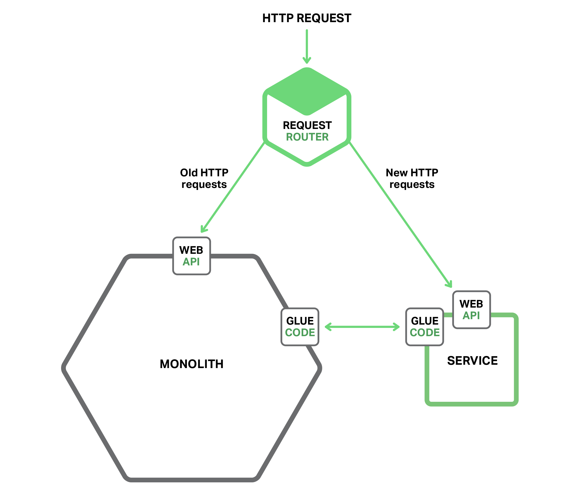
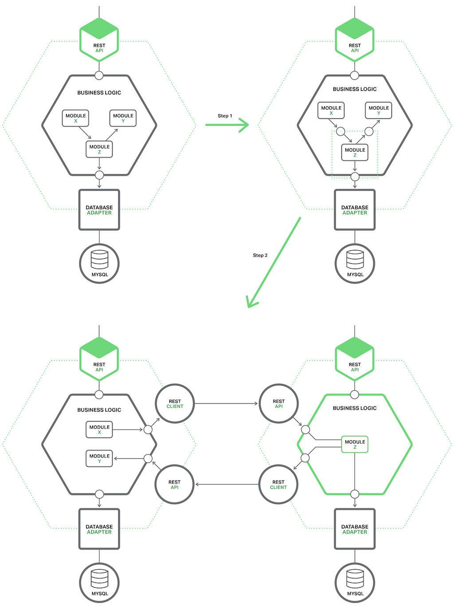

# 迁移到微服务综述

迁移单体式应用到微服务架构意味着一系列现代化过程，有点像这几代开发者一直在做的事情，实时上，当迁移时，我们可以重用一些想法。

一个策略是：不要大规模（big bang）重写代码（只有当你承担重建一套全新基于微服务的应用时候可以采用重写这种方法）。重写代码听起来很不错，但实际上充满了风险最终可能会失败，就如 Martin Fowler 所说：

> “the only thing a Big Bang rewrite guarantees is a Big Bang!”

相反，应该采取逐步迁移单体式应用的策略，通过逐步生成微服务新应用，与旧的单体式应用集成，随着时间推移，单体式应用在整个架构中比例逐渐下降直到消失或者成为微服务架构一部分。这个策略有点像在高速路上限速到 70 迈对车做维护，尽管有挑战，但是比起重写的风险小很多。

Martin Fowler 将这种现代化策略成为绞杀（Strangler）应用，名字来源于雨林中的绞杀藤（strangler vine），也叫绞杀榕 (strangler fig)。绞杀藤为了爬到森林顶端都要缠绕着大树生长，一段时间后，树死了，留下树形藤。这种应用也使用同一种模式，围绕着传统应用开发了新型微服务应用，传统应用会渐渐退出舞台。

我们来看看其他可行策略。

# 策略 1——停止挖掘

Law of Holes 是说当自己进洞就应该停止挖掘。对于单体式应用不可管理时这是最佳建议。换句话说，应该停止让单体式应用继续变大，也就是说当开发新功能时不应该为旧单体应用添加新代码，最佳方法应该是将新功能开发成独立微服务。如下图所示：

除了新服务和传统应用，还有两个模块，其一是请求路由器，负责处理入口（http）请求，有点像之前提到的 API 网关。路由器将新功能请求发送给新开发的服务，而将传统请求还发给单体式应用。

另外一个是胶水代码（glue code），将微服务和单体应用集成起来，微服务很少能独立存在，经常会访问单体应用的数据。胶水代码，可能在单体应用或者为服务或者二者兼而有之，负责数据整合。微服务通过胶水代码从单体应用中读写数据。​

微服务有三种方式访问单体应用数据：

* 换气单体应用提供的远程 API
* 直接访问单体应用数据库
* 自己维护一份从单体应用中同步的数据

胶水代码也被称为容灾层（anti-corruption layer），这是因为胶水代码保护微服务全新域模型免受传统单体应用域模型污染。胶水代码在这两种模型间提供翻译功能。术语 anti-corruption layer 第一次出现在 Eric Evans 撰写的必读书 *Domain Driven Design*，随后就被提炼为一篇白皮书。开发容灾层可能有点不是很重要，但却是避免单体式泥潭的必要部分。

将新功能以轻量级微服务方式实现由很多优点，例如可以阻止单体应用变的更加无法管理。微服务本身可以开发、部署和独立扩展。采用微服务架构会给开发者带来不同的切身感受。

然而，这方法并不解决任何单体式本身问题，为了解决单体式本身问题必须深入单体应用​做出改变。我们来看看这么做的策略。

# 策略 2——将前端和后端分离

减小单体式应用复杂度的策略是讲表现层和业务逻辑、数据访问层分开。典型的企业应用至少有三个不同元素构成：

1. 表现层——处理 HTTP 请求，要么响应一个 RESTAPI 请求，要么是提供一个基于 HTML 的图形接口。对于一个复杂用户接口应用，表现层经常是代码重要的部分。

2. 业务逻辑层——完成业务逻辑的应用核心。

3. 数据访问层——访问基础元素，例如数据库和消息代理。

在表现层与业务数据访问层之间有清晰的隔离。业务层有由若干方面组成的粗粒度（coarse-grained）的 API，内部包含了业务逻辑元素。API 是可以将单体业务分割成两个更小应用的天然边界，其中一个应用是表现层，另外一个是业务和数据访问逻辑。分割后，表现逻辑应用远程调用业务逻辑应用，下图表示迁移前后架构不同：​

单体应用这么分割有两个好处，其一使得应用两部分开发、部署和扩展各自独立，特别地，允许表现层开发者在用户界面上快速选择，进行 A/B 测试；其二，使得一些远程 API 可以被微服务调用。

然而，这种策略只是部分的解决方案。很可能应用的两部分之一或者全部都是不可管理的，因此需要使用第三种策略来消除剩余的单体架构。

# 策略 3——抽出服务

第三种迁移策略就是从单体应用中抽取出某些模块成为独立微服务。每当抽取一个模块变成微服务，单体应用就变简单一些；一旦转换足够多的模块，单体应用本身已经不成为问题了，要么消失了，要么简单到成为一个服务。

## 排序那个模块应该被转成微服务

一个巨大的复杂单体应用由成十上百个模块构成，每个都是被抽取对象。决定第一个被抽取模块一般都是挑战，一般最好是从最容易抽取的模块开始，这会让开发者积累足够经验，这些经验可以为后续模块化工作带来巨大好处。

转换模块成为微服务一般很耗费时间，一般可以根据获益程度来排序，一般从经常变化模块开始会获益最大。一旦转换一个模块为微服务，就可以将其开发部署成独立模块，从而加速开发进程。

将资源消耗大户先抽取出来也是排序标准之一。例如，将内存数据库抽取出来成为一个微服务会非常有用，可以将其部署在大内存主机上。同样的，将对计算资源很敏感的算法应用抽取出来也是非常有益的，这种服务可以被部署在有很多 CPU 的主机上。通过将资源消耗模块转换成微服务，可以使得应用易于扩展。

查找现有粗粒度边界来决定哪个模块应该被抽取，也是很有益的，这使得移植工作更容易和简单。例如，只与其他应用异步同步消息的模块就是一个明显边界，可以很简单容易地将其转换为微服务。

## 如何抽取模块

抽取模块第一步就是定义好模块和单体应用之间粗粒度接口，由于单体应用需要微服务的数据，反之亦然，因此更像是一个双向 API。因为必须在负责依赖关系和细粒度接口模式之间做好平衡，因此开发这种 API 很有挑战性，尤其对使用域模型模式的业务逻辑层来说更具有挑战，因此经常需要改变代码来解决依赖性问题，如图所示：

一旦完成粗粒度接口，也就将此模块转换成独立微服务。为了实现，必须写代码使得单体应用和微服务之间通过使用进程间通信（IPC）机制的 API 来交换信息。如图所示迁移前后对比：

此例中，正在使用 Y 模块的 Z 模块是备选抽取模块，其元素正在被 X 模块使用，迁移第一步就是定义一套粗粒度 APIs，第一个接口应该是被 X 模块使用的内部接口，用于激活 Z 模块；第二个接口是被 Z 模块使用的外部接口，用于激活 Y 模块。

迁移第二步就是将模块转换成独立服务。内部和外部接口都使用基于 IPC 机制的代码，一般都会将 Z 模块整合成一个微服务基础框架，来出来割接过程中的问题，例如服务发现。

抽取完模块，也就可以开发、部署和扩展另外一个服务，此服务独立于单体应用和其它服务。可以从头写代码实现服务；这种情况下，将服务和单体应用整合的 API 代码成为容灾层，在两种域模型之间进行翻译工作。每抽取一个服务，就朝着微服务方向前进一步。随着时间推移，单体应用将会越来越简单，用户就可以增加更多独立的微服务。
将现有应用迁移成微服务架构的现代化应用，不应该通过从头重写代码方式实现，相反，应该通过逐步迁移的方式。有三种策略可以考虑：将新功能以微服务方式实现；将表现层与业务数据访问层分离；将现存模块抽取变成微服务。随着时间推移，微服务数量会增加，开发团队的弹性和效率将会大大增加。
