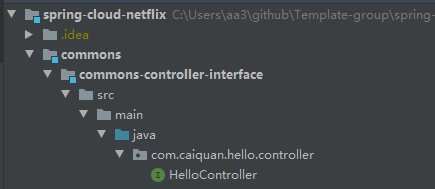
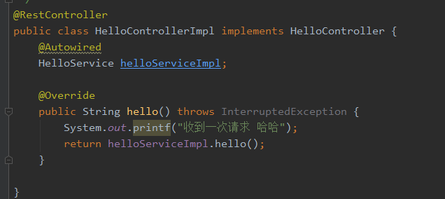
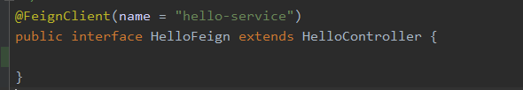
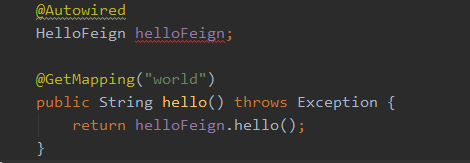
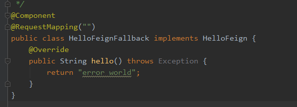

解决feign内容重复问题
===================

[源码链接](https://github.com/caiquan-github/SpringCloudFeign-SpecialUse)

##		问题描述

​	当我服务A与服务B需要调用服务C。那么服务A与服务B各自项目都需要创建一个描述C服务FeignClient接口

如：

​	 这则会带来这样的feign接口在同一项目不同服务中重复出现

##		解决思路

###		服务提供者设计

​	声明一个接口作为提供方controller接口，这里我直接命名HelloController

​	接口需要描述访问路径，这样调用方就可以直接拿到路径

​	这个接口由服务C来提供，但是服务A与服务B也需要用到，则可以创建一个公共接口模块作为jar包引入

​	服务C依赖公共接口模块，创建HelloControllerImpl接口实现类描述任务逻辑、

​	注意这里实现了HelloController公共接口模块，因为公共接口模块描述了@RequestMapping，根据Spring的机制从而实现类不需要描述路径信息

​	服务提供者完成

###	服务调用者

​	引入服务提供者提供的controller接口

​	创建一个HelloFeign接口继承 C服务提供的接口

​	@Autowired注入使用

###		异常

​	当服务调用者引入hystrix熔断器时抛出异常。BeanCreationException

​	在Fallback类上加入@RequestMapping（“”）注解

##		总结

​	这样设计的话 我作为服务A的开发者需要调用服务C 只需要做如下几件事情

####		普通流程

​	1.创建一个接口，接口上声明注解@FeignClient

​	2.了解提供者接口的参数信息

​	3.编写FeignClient调用（重复性工作）

​	4.通过@Autowired 来使用

#### 优化后流程

​	1.引入服务c提供的公共接口依赖

​	2.创建一个接口，接口上声明注解@FeignClient 继承公共接口

​	3.通过@Autowired 来使用