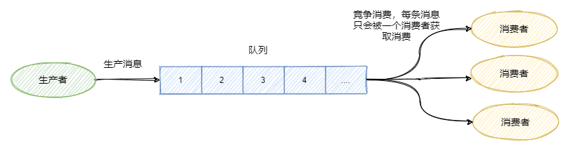
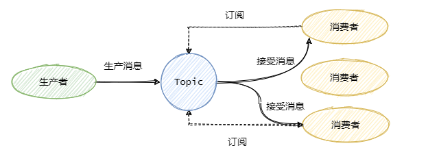
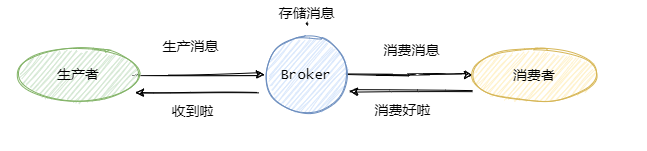
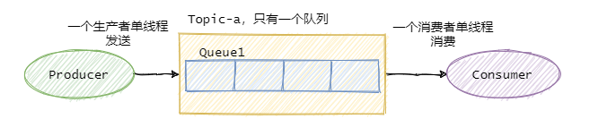
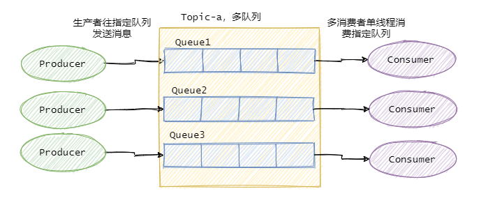

> 参考：https://mp.weixin.qq.com/s/2DQY5dXqxt1JuigZ2NfwYQ

## **I. 什么是消息队列**

来看看维基百科怎么说的，顺带学学英语这波不亏：

> In computer science, message queues and mailboxes are software-engineering components typically used for inter-process communication (IPC), or for inter-thread communication within the same process. They use a queue for messaging – the passing of control or of content. Group communication systems provide similar kinds of functionality.

翻译一下：在计算机科学领域，消息队列和邮箱都是软件工程组件，通常用于进程间或同一进程内的线程通信。它们通过队列来传递消息-传递控制信息或内容，群组通信系统提供类似的功能。

简单的概括下上面的定义：消息队列就是一个使用队列来通信的组件。

上面的定义没有错，但就现在而言我们日常所说的消息队列常常指代的是消息中间件，它的存在不仅仅只是为了通信这个问题。

----------

## **II. 为什么需要消息队列**

从本质上来说是因为互联网的快速发展，业务不断扩张，促使技术架构需要不断的演进。

- 从以前的单体架构到现在的微服务架构，成百上千的服务之间相互调用和依赖。从互联网初期一个服务器上有 100 个在线用户已经很了不得，到现在坐拥10亿日活的微信。**我们需要有一个「东西」来解耦服务之间的关系、控制资源合理合时的使用以及缓冲流量洪峰等等**。

消息队列就应运而生了。它常用来实现：**异步处理、服务解耦、流量控制**。

### **1. 异步处理**
随着公司的发展你可能会发现你**项目的请求链路越来越长**，例如刚开始的电商项目，可以就是粗暴的扣库存、下单。慢慢地又加上**积分服务、短信服务**等。这一路同步调用下来客户可能等急了，这时候就是消息队列登场的好时机。

**调用链路长、响应就慢了**，并且相对于扣库存和下单，积分和短信没必要这么的 "及时"。因此只需要在下单结束那个流程，**扔个消息到消息队列中**就可以直接返回响应了。而且积分服务和短信服务可以**并行的消费这条消息**。

- 可以看出消息队列可以**减少请求的等待**，还能让服务**异步并发处理**，提升系统总体性能。

### **2. 服务解耦**
上面我们说到加了积分服务和短信服务，这时候可能又要来个营销服务，之后领导又说想做个大数据，又来个数据分析服务等等。  
可以发现订单的下游系统在不断的扩充，为了迎合这些下游系统订单服务需要经常地修改，任何一个下游系统接口的变更可能都会影响到订单服务。

- 所以一般会选用消息队列来**解决系统之间耦合的问题**，订单服务把订单相关消息塞到消息队列中，下游系统谁要谁就订阅这个主题。

### **3. 流量控制**
想必大家都听过「**削峰填谷**」，后端服务相对而言都是比较「弱」的，**因为业务较重，处理时间较长**。像一些例如秒杀活动爆发式流量打过来可能就顶不住了。因此需要**引入一个中间件来做缓冲**，消息队列再适合不过了。

- 网关的请求先放入消息队列中，后端服务尽自己最大能力去消息队列中消费请求。超时的请求可以直接返回错误。

- 当然还有一些服务特别是某些后台任务，**不需要及时地响应，并且业务处理复杂且流程长**，那么过来的请求先放入消息队列中，后端服务按照自己的节奏处理。

上面两种情况分别对应着**生产者生产过快**和**消费者消费过慢**两种情况，消息队列都能在其中发挥很好的缓冲效果。

### **4. 注意**
引入消息队列固然有以上的好处，但是多引入一个中间件系统的稳定性就下降一层，运维的难度抬高一层。因此要权衡利弊，系统是演进的。

----------

## **III. 消息队列基本概念**

消息队列有两种模型：**队列模型**和**发布/订阅模型**。

### **1. 队列模型**
- 生产者往某个队列里面发送消息，**一个队列可以存储多个生产者的消息，一个队列也可以有多个消费者**，但是消费者之间是**竞争关系**，即每条消息只能被一个消费者消费。



### **2. 发布/订阅模型**
- 为了解决**一条消息能被多个消费者消费的问题**，发布/订阅模型就来了。该模型是将消息发往一个 **Topic** 即主题中，**所有订阅了这个 Topic 的订阅者都能消费这条消息**。

其实可以这么理解，发布/订阅模型等于我们都加入了一个群聊中，我发一条消息，加入了这个群聊的人都能收到这条消息。那么队列模型就是一对一聊天，我发给你的消息，只能在你的聊天窗口弹出，是不可能弹出到别人的聊天窗口中的。

讲到这有人说，那我一对一聊天对每个人都发同样的消息不就也实现了一条消息被多个人消费了嘛。

是的，通过**多队列全量存储相同的消息**，即**数据的冗余可以实现一条消息被多个消费者消费**。RabbitMQ 就是采用**队列模型**，**通过 Exchange 模块来将消息发送至多个队列**，解决一条消息需要被多个消费者消费问题。

这里还能看到假设群聊里除我之外只有一个人，那么此时的发布/订阅模型和队列模型其实就一样了。



### **3. 小结一下**
- **队列模型每条消息只能被一个消费者消费**，而发布/订阅模型就是为**让一条消息可以被多个消费者消费**而生的。  
    当然队列模型也可以通过消息全量存储至多个队列来解决一条消息被多个消费者消费问题，但是会有数据的冗余。

- 发布/订阅模型兼容队列模型，即只有一个消费者的情况下和队列模型基本一致。

- RabbitMQ 采用**队列模型**，RocketMQ和Kafka 采用**发布/订阅模型**。

接下来的内容都基于**发布/订阅模型**。

----------

## **IV. 如何保证消息不丢失**

- 就我们市面上常见的消息队列而言，**只要配置得当，我们的消息就不会丢**。

先来看看这个图，



可以看到一共有三个阶段，分别是**生产消息、存储消息和消费消息**。我们从这三个阶段分别入手来看看如何确保消息不会丢失。

### **1. 生产消息**
- 生产者发送消息至 Broker，**需要处理 Broker 的响应**，不论是同步还是异步发送消息，同步和异步回调都需要做好 try-catch，妥善的处理响应。

- 如果 Broker 返回写入失败等错误消息，需要**重试发送**。

- 当多次发送失败需要作报警，日志记录等。

这样就能保证**在生产消息阶段消息不会丢失**。

### **2. 存储消息**
- 存储消息阶段需要**在消息刷盘之后再给生产者响应**，假设消息写入缓存中就返回响应，那么机器突然断电这消息就没了，而生产者以为已经发送成功了。

- 如果 Broker 是集群部署，有多副本机制，**即消息不仅仅要写入当前 Broker,还需要写入副本机中**。那配置成至少写入两台机子后再给生产者响应。这样基本上就能保证存储的可靠了。

### **3. 消费消息**
这里经常会有同学犯错，有些同学当消费者拿到消息之后直接存入内存队列中就直接返回给 Broker 消费成功，这是不对的。

- 你需要考虑**拿到消息放在内存之后消费者就宕机了**怎么办。所以我们应该在**消费者真正执行完业务逻辑之后**，再发送给 Broker 消费成功，这才是真正的消费了。

所以只要我们在**消息业务逻辑处理完成之后再给 Broker 响应**，那么消费阶段消息就不会丢失。

### **4. 小结一下**
可以看出，保证消息的可靠性需要三方配合。

- **生产者需要处理好 Broker 的响应**，出错情况下利用**重试、报警**等手段。

- Broker 需要控制响应的时机，**单机情况下是消息刷盘后返回响应**，集群多副本情况下，即**发送至两个副本及以上的情况下再返回响应**。

- 消费者需要在**执行完真正的业务逻辑之后**再返回响应给 Broker。

- 但是要注意**消息可靠性增强了，性能就下降了**，等待消息刷盘、多副本同步后返回都会影响性能。因此还是看业务，例如日志的传输可能丢那么一两条关系不大，因此没必要等消息刷盘再响应。

----------

## **V. 如果处理重复消息**

我们先来看看能不能避免消息的重复。

假设我们发送消息，就管发，不管 Broker 的响应，那么我们发往 Broker 是不会重复的。

- 但是一般情况我们是不允许这样的，这样消息就完全不可靠了，**我们的基本需求是消息至少得发到 Broker上**，那就得等 Broker 的响应，那么就可能存在 Broker 已经写入了，<u>当时响应由于网络原因生产者没有收到，**然后生产者又重发了一次**，此时消息就重复了。</u>

- 再看消费者消费的时候，假设我们消费者拿到消息消费了，**业务逻辑已经走完了**，事务提交了，**此时需要更新 Consumer offset 了**，然后这个消费者挂了，另一个消费者顶上，**此时 Consumer offset 还没更新**，于是又拿到刚才那条消息，业务又被执行了一遍。于是消息又重复了。

可以看到正常业务而言消息重复是不可避免的，因此我们只能从另一个角度来解决重复消息的问题。

- **关键点就是幂等**。既然我们不能防止重复消息的产生，那么我们只能在业务上处理重复消息所带来的影响。

----------

## **VI. 幂等处理重复消息**

> 幂等是数学上的概念，我们就理解为**同样的参数多次调用同一个接口和调用一次产生的结果是一致的**。

例如这条 SQL ```update t1 set money = 150 where id = 1 and money = 100;``` 执行多少遍 money 都是 150，这就叫幂等。

因此需要改造业务处理逻辑，使得在重复消息的情况下也不会影响最终的结果。

- 可以通过上面我那条 SQL 一样，做了个**前置条件判断**，即 money = 100情况，并且直接修改，更通用的是**做个 version 即版本号控制**，对比**消息中的版本号和数据库中的版本号**。

- 或者**通过数据库的约束例如唯一键**，例如 ```insert into update on duplicate key...```。

- 或者**记录关键的 key**，比如处理订单这种，记录订单 ID，假如有重复的消息过来，**先判断下这个 ID 是否已经被处理过了**，如果没处理再进行下一步。当然也可以用全局唯一 ID 等等。

基本上就这么几个套路，真正应用到实际中还是得看具体业务细节。

----------

## **VII. 如何保证消息的有序性**

有序性分：**全局有序和部分有序**。

### **1. 全局有序**
- 如果要保证消息的全局有序，首先只能由一个生产者往 Topic 发送消息，并且一个 Topic 内部只能有一个队列（分区）。消费者也必须是单线程消费这个队列。这样的消息就是全局有序的。

不过一般情况下我们都不需要全局有序，即使是同步 MySQL Binlog 也只需要保证单表消息有序即可。



- 因此绝大部分的有序需求是部分有序，部分有序我们就可以将 Topic 内部划分成我们需要的队列数，把消息通过特定的策略发往固定的队列中，然后每个队列对应一个单线程处理的消费者。这样即完成了部分有序的需求，又可以通过队列数量的并发来提高消息处理效率。



----------

## **VIII. 如果处理消息堆积**

- 消息的堆积往往是因为**生产者的生产速度与消费者的消费速度不匹配**。有可能是因为消息消费失败反复重试造成的，也有可能就是消费者消费能力弱，渐渐地消息就积压了。

- 因此我们需要先**定位消费慢的原因**，如果是 bug 则处理 bug ，如果是因为**本身消费能力较弱**，我们可以**优化下消费逻辑**，比如之前是一条一条消息消费处理的，这次我们**批量处理**，比如数据库的插入，一条一条插和批量插效率是不一样的。

- 假如逻辑我们已经都优化了，但还是慢，那就得考虑**水平扩容**了，**增加 Topic 的队列数和消费者数量**，注意队列数一定要增加，不然新增加的消费者是没东西消费的。**一个 Topic 中，一个队列只会分配给一个消费者**。

当然你消费者内部是单线程还是多线程消费那看具体场景。不过要注意上面提高的消息丢失的问题，如果你是将接受到的消息写入内存队列之后，然后就返回响应给 Broker，然后多线程向内存队列消费消息，假设此时消费者宕机了，内存队列里面还未消费的消息也就丢了。