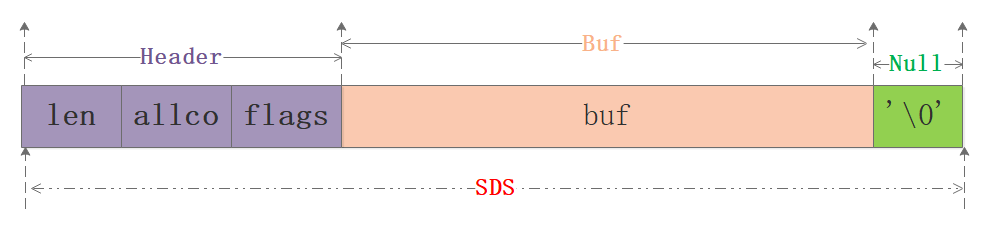
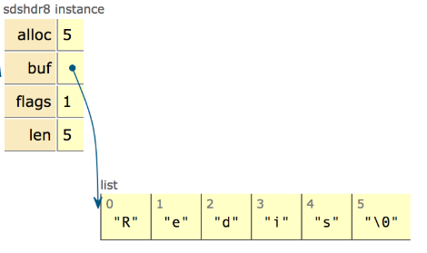
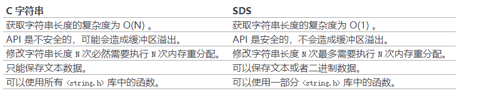

# **Redis Interview**

## **I.什么是Redis及其重要性？**

- Redis 是一个使用 ANSI C 编写的**开源、支持网络、基于内存、可选持久化**的高性能**键值对数据库**。

## **II. 简述Redis常用的数据结构及其如何实现的？**

- Redis 支持的常用5种数据类型指的是 value 类型，分别为：**字符串 String、列表 List、哈希 Hash、集合 Set、有序集合 Zset**，但是 Redis 后续又丰富了几种数据类型分别是 Bitmaps、HyperLogLogs、GEO。

- 由于 Redis 是基于标准C写的，只有最基础的数据类型，因此 Redis 为了满足对外使用的5种数据类型，开发了属于自己独有的一套基础数据结构，使用这些数据结构来实现5种数据类型。Redis **底层的数据结构**包括：**简单动态数组SDS、链表、字典、跳跃链表、整数集合、压缩列表、对象**。

## **III. Redis的SDS和C中字符串相比有什么优势？**

在C语言中使用 **N+1 长度**的字符数组来表示字符串，**尾部使用 '\0' 作为结尾标志**，对于此种实现无法满足 Redis 对于安全性、效率、丰富的功能的要求，因此 Redis 单独封装了 SDS 简单动态字符串结构。



从图中可以知道sds本质分为三部分：header、buf、null结尾符，其中header可以认为是整个sds的指引部分，给定了使用的空间大小、最大分配大小等信息，再用一张网上的图来清晰看下sdshdr8的实例：



sds的优势：

O(1)获取长度: C字符串需要遍历而sds中有len可以直接获得；

防止缓冲区溢出bufferoverflow: 当sds需要对字符串进行修改时，首先借助于len和alloc检查空间是否满足修改所需的要求，如果空间不够的话，SDS会自动扩展空间，避免了像C字符串操作中的覆盖情况；

有效降低内存分配次数：C字符串在涉及增加或者清除操作时会改变底层数组的大小造成重新分配、sds使用了空间预分配和惰性空间释放机制，说白了就是每次在扩展时是成倍的多分配的，在缩容是也是先留着并不正式归还给OS，这两个机制也是比较好理解的；

二进制安全：C语言字符串只能保存ascii码，对于图片、音频等信息无法保存，sds是二进制安全的，写入什么读取就是什么，不做任何过滤和限制；



## **IV. 谈谈Redis的Zset和跳跃链表问题**

Redis 的 zset 是一个复合结构，一方面它需要一个 hash 结构来存储 value 和 score 的 对应关系，另一方面需要提供按照 score 来排序的功能，还需要能够指定 score 的范围来获 取 value 列表的功能，这就需要另外一个结构「跳跃列表」。

ZSet 结构同时包含一个字典和一个跳跃表，跳跃表按 score 从小到大保存所有集合元素。字典保存着从 member 到 score 的映射。两种结构通过指针共享相同元素的 member 和 score，不浪费额外内存。

```C
typedef struct zset {
    dict *dict;
    zskiplist *zsl;
} zset;
```

### **ZSet中跳跃链表的实现细节**

**随机层数的实现原理**

跳表是一个概率型的数据结构，元素的插入层数是随机指定的。Willam Pugh在论文中描述了它的计算过程如下：
1. 指定节点最大层数 MaxLevel，指定概率 p， 默认层数 lvl 为1 
2. 生成一个 0~1 的随机数 r，若 r < p，且lvl < MaxLevel ，则 lvl ++
3. 重复第 2 步，直至生成的r > p 为止，此时的 lvl 就是要插入的层数。