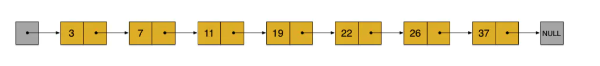
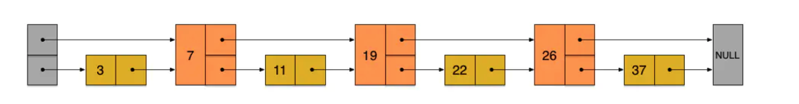
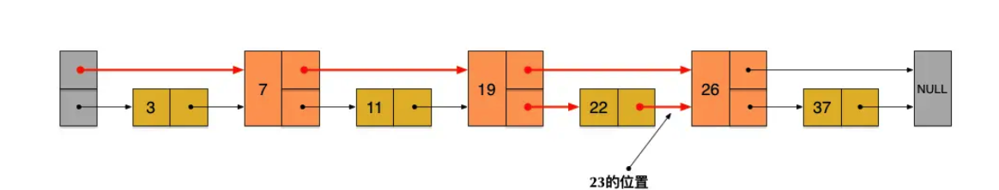
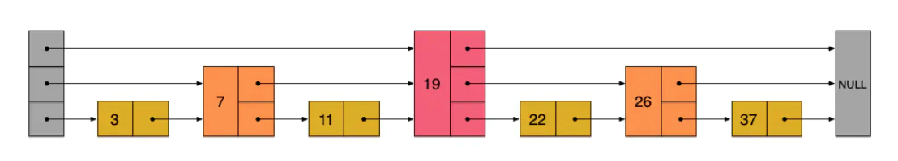
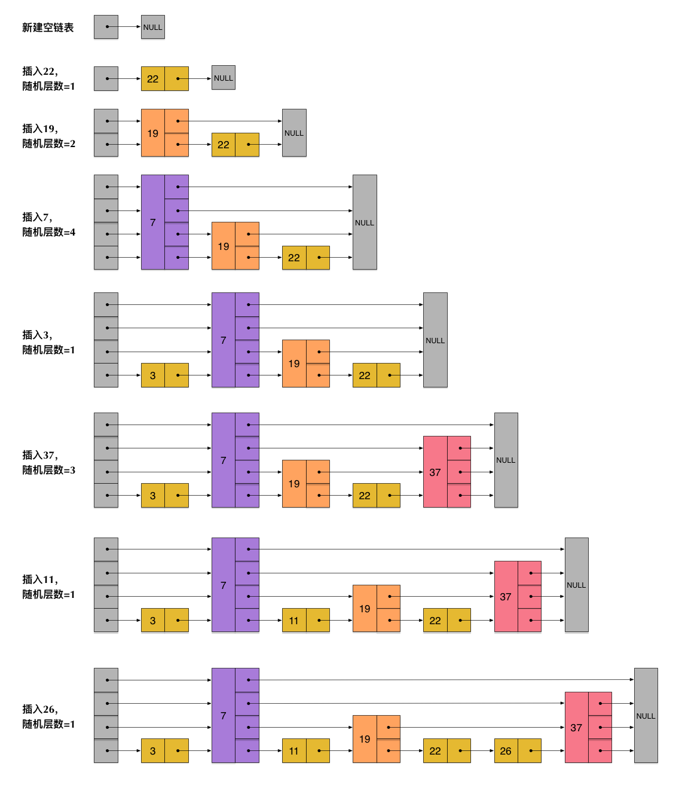
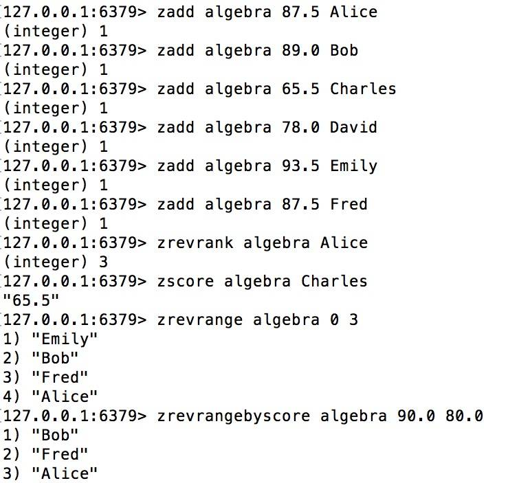
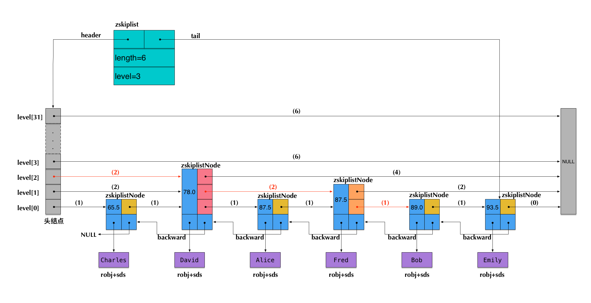

# **Redis 为什么用跳表而不用平衡树**
> [参考: Redis 为什么用跳表而不用平衡树？](https://juejin.im/post/6844903446475177998)  

## **I. skiplist数据结构简介**
skiplist 本质上也是一种**查找结构**，用于解决算法中的查找问题（Searching），即根据给定的 **key**，快速查到它所在的位置（或者对应的value）。

一般查找问题的解法分为两个大类：一个是基于各种**平衡树**，一个是基于**哈希表**。但 skiplist 却比较特殊，它没法归属到这两大类里面。

这种数据结构是由 William Pugh 发明的，最早出现于他在1990年发表的论文《Skip Lists: A Probabilistic Alternative to Balanced Trees》。

skiplist，首先它是一个 list。实际上，它是在**有序链表**的基础上发展起来的。

我们先来看一个有序链表，如下图（最左侧的灰色节点表示一个空的头结点）：



在这样一个链表中，如果要查找某个数据，那么需要从头开始逐个进行比较，直到找到**包含数据**的那个节点，或者找到第一个**比给定数据大**的节点为止（没找到）。也就是说，时间复杂度为 **O(n)**。同样，当我们要**插入**新数据的时候，也要经历同样的查找过程，从而确定插入位置。

假如我们每相邻两个节点**增加一个指针**，让指针指向下下个节点，如下图：



这样所有新增加的指针连成了一个**新的链表**，但它包含的节点个数只有**原来的一半**（上图中是7, 19, 26）。现在当我们想查找数据的时候，可以先沿着这个新链表进行查找。当**碰到比待查数据大的节点时，再回到原来的链表中进行查找**。比如，我们想查找23，查找的路径是沿着下图中标红的指针所指向的方向进行的：



- 23首先和7比较，再和19比较，比它们都大，继续向后比较。
- 但23和26比较的时候，比26要小，因此回到下面的链表（原链表），与22比较。
- 23比22要大，沿下面的指针继续向后和26比较。23比26小，说明待查数据23在原链表中不存在，而且它的插入位置应该在22和26之间。

在这个查找过程中，由于新增加的指针，我们**不再需要与链表中每个节点逐个进行比较**了。需要比较的节点数大概只有原来的一半。

利用同样的方式，我们可以在上层新产生的链表上，**继续为每相邻的两个节点增加一个指针**，从而产生第三层链表。如下图：



在这个新的三层链表结构上，如果我们还是查找23，那么沿着最上层链表首先要比较的是19，发现23比19大，接下来我们就知道只需要到19的后面去继续查找，从而**一下子跳过了19前面的所有节点**。可以想象，当链表足够长的时候，这种多层链表的查找方式能让我们**跳过很多下层节点**，大大加快查找的速度。

skiplist 正是受这种多层链表的想法的启发而设计出来的。实际上，按照上面生成链表的方式，**上面每一层链表的节点个数，是下面一层的节点个数的一半**，这样查找过程就非常类似于一个**二分查找**，使得查找的时间复杂度可以降低到 **O(log n)**。但是，这种方法在插入数据的时候有很大的问题。新插入一个节点之后，就会**打乱上下相邻两层链表上节点个数严格的 2:1 的对应关系**。如果要维持这种对应关系，就必须把新插入的节点后面的所有节点（也包括新插入的节点）**重新进行调整**，这会让时间复杂度重新蜕化成 **O(n)**。删除数据也有同样的问题。

skiplist 为了避免这一问题，它不要求上下相邻两层链表之间的节点个数有严格的对应关系，而是为**每个节点随机出一个层数 (level)**。比如，一个节点随机出的层数是3，那么就把它链入到第1层到第3层这三层链表中。为了表达清楚，下图展示了如何通过一步步的插入操作从而形成一个 skiplist 的过程：



从上面skiplist的创建和插入过程可以看出，**每一个节点的层数（level）是随机出来的**，而且新插入一个节点**不会影响其它节点的层数**。因此，插入操作只需要**修改插入节点前后的指针**，而不需要对很多节点都进行调整。这就**降低了插入操作的复杂度**。实际上，这是 skiplist 的一个很重要的特性，这让它**在插入性能上明显优于平衡树**的方案。

根据上图中的 skiplist 结构，我们很容易理解这种数据结构的名字的由来。skiplist，可以翻译成“跳表”或“跳跃表”，指的就是除了最下面第1层链表之外，它会产生**若干层稀疏的链表**，这些链表里面的指针**故意跳过了一些节点**（而且**越高层的链表跳过的节点越多**）。这就使得我们在查找数据的时候能够先在高层的链表中进行查找，然后**逐层降低**，最终降到第1层链表来精确地确定数据位置。在这个过程中，我们跳过了一些节点，从而也就加快了查找速度。

刚刚创建的这个 skiplist 总共包含4层链表，现在假设我们在它里面依然查找23，下图给出了查找路径：


需要注意的是，前面演示的各个节点的插入过程，实际上在插入之前也要先经历一个**类似的查找过程**，在确定插入位置后，再完成插入操作。

当然，实际应用中的 skiplist 每个节点应该包含 key 和 value 两部分。前面的描述中我们没有具体区分 key 和 value，但实际上列表中是**按照 key 进行排序的**，查找过程也是**根据 key 在比较**。

## **II. skiplist与平衡树、哈希表的比较**
- skiplist和各种平衡树（如AVL、红黑树等）的元素是有序排列的，而哈希表不是有序的。因此，在哈希表上只能做单个key的查找，不适宜做范围查找。所谓范围查找，指的是查找那些大小在指定的两个值之间的所有节点。

- 在做范围查找的时候，**平衡树**比skiplist操作要复杂。在平衡树上，我们找到指定范围的小值之后，还需要以中序遍历的顺序继续寻找其它不超过大值的节点。如果不对平衡树进行一定的改造，这里的中序遍历并不容易实现。而在skiplist上进行范围查找就非常简单，只需要在找到小值之后，对第1层链表进行若干步的遍历就可以实现。

- 平衡树的插入和删除操作可能引发子树的调整，逻辑复杂，而skiplist的插入和删除只需要修改相邻节点的指针，操作简单又快速。

- 从内存占用上来说，skiplist比平衡树更灵活一些。一般来说，平衡树每个节点包含2个指针（分别指向左右子树），而skiplist每个节点包含的指针数目平均为1/(1-p)，具体取决于参数p的大小。如果像Redis里的实现一样，取p=1/4，那么平均每个节点包含1.33个指针，比平衡树更有优势。

- 查找单个key，skiplist和平衡树的时间复杂度都为O(log n)，大体相当；而哈希表在保持较低的哈希值冲突概率的前提下，查找时间复杂度接近O(1)，性能更高一些。所以我们平常使用的各种Map或dictionary结构，大都是基于哈希表实现的。

- 从算法实现难度上来比较，skiplist比平衡树要简单得多。

## **III. Redis中的skiplist实现**
在Redis中，skiplist被用于实现暴露给外部的一个数据结构：sorted set。准确地说，sorted set底层不仅仅使用了skiplist，还使用了ziplist和dict。

### **1. sorted set的命令举例**
sorted set是一个有序的数据集合，对于像类似排行榜这样的应用场景特别适合。

现在我们来看一个例子，用sorted set来存储代数课（algebra）的成绩表。原始数据如下：

- Alice 87.5
- Bob 89.0
- Charles 65.5
- David 78.0
- Emily 93.5
- Fred 87.5

这份数据给出了每位同学的名字和分数。下面我们将这份数据存储到sorted set里面去：



- 前面的6个zadd命令，将6位同学的名字和分数(score)都输入到一个key值为algebra的sorted set里面了。注意Alice和Fred的分数相同，都是87.5分。
- zrevrank命令查询Alice的排名（命令中的rev表示按照倒序排列，也就是从大到小），返回3。排在Alice前面的分别是Emily、Bob、Fred，而排名(rank)从0开始计数，所以Alice的排名是3。注意，其实Alice和Fred的分数相同，这种情况下sorted set会把分数相同的元素，按照字典顺序来排列。按照倒序，Fred排在了Alice的前面。
- zscore命令查询了Charles对应的分数。
- zrevrange命令查询了从大到小排名为0~3的4位同学。
- zrevrangebyscore命令查询了分数在80.0和90.0之间的所有同学，并按分数从大到小排列。

总结一下，sorted set中的每个元素主要表现出3个属性：
- 数据本身（在前面的例子中我们把名字存成了数据）。
- 每个数据对应一个分数(score)。
- 根据分数大小和数据本身的字典排序，每个数据会产生一个排名(rank)。可以按正序或倒序。

### **2. Redis中skiplist实现的特殊性**
我们简单分析一下前面出现的几个查询命令：
- zrevrank由数据查询它对应的排名，这在前面介绍的skiplist中并不支持。
- zscore由数据查询它对应的分数，这也不是skiplist所支持的。
- zrevrange根据一个排名范围，查询排名在这个范围内的数据。这在前面介绍的skiplist中也不支持。
- zrevrangebyscore根据分数区间查询数据集合，是一个skiplist所支持的典型的范围查找（score相当于key）。

实际上，Redis中sorted set的实现是这样的：
- 当**数据较少**时，sorted set是由一个 **ziplist** 来实现的。
- 当**数据多**的时候，sorted set是由**一个 dict + 一个 skiplist** 来实现的。简单来讲，dict 用来查询数据到**分数的对应关系**，而 skiplist 用来**根据分数查询数据**（可能是范围查找）。

这里sorted set的构成我们在下一章还会再详细地讨论。现在我们集中精力来看一下sorted set与skiplist的关系，：
- zscore的查询，不是由skiplist来提供的，而是由那个 **dict** 来提供的。
- 为了支持排名(rank)，Redis里对 skiplist 做了扩展，使得根据排名能够快速查到数据，或者根据分数查到数据之后，也同时很容易获得排名。而且，根据排名的查找，时间复杂度也为O(log n)。
- zrevrange的查询，是根据排名查数据，由扩展后的skiplist来提供。
- zrevrank是先在dict中由数据查到分数，再拿分数到skiplist中去查找，查到后也同时获得了排名。

前述的查询过程，也暗示了各个操作的时间复杂度：
- zscore只用查询一个dict，所以时间复杂度为O(1)
- zrevrank, zrevrange, zrevrangebyscore由于要查询skiplist，所以zrevrank的时间复杂度为O(log n)，而zrevrange, zrevrangebyscore的时间复杂度为O(log(n)+M)，其中M是当前查询返回的元素个数。

总结起来，Redis中的skiplist跟前面介绍的经典的skiplist相比，有如下不同：
- 分数(score)允许重复，即skiplist的key允许重复。这在最开始介绍的经典skiplist中是不允许的。
- 在比较时，不仅比较分数（相当于skiplist的key），还比较数据本身。在Redis的skiplist实现中，数据本身的内容唯一标识这份数据，而不是由key来唯一标识。另外，当多个元素分数相同的时候，还需要根据数据内容来进字典排序。
- 第1层链表不是一个单向链表，而是一个双向链表。这是为了方便以倒序方式获取一个范围内的元素。
- 在skiplist中可以很方便地计算出每个元素的排名(rank)。

### **3. skiplist的数据结构定义**

```C
#define ZSKIPLIST_MAXLEVEL 32
#define ZSKIPLIST_P 0.25

typedef struct zskiplistNode {
    robj *obj;
    double score;
    struct zskiplistNode *backward;
    struct zskiplistLevel {
        struct zskiplistNode *forward;
        unsigned int span;
    } level[];
} zskiplistNode;

typedef struct zskiplist {
    struct zskiplistNode *header, *tail;
    unsigned long length;
    int level;
} zskiplist;
```
- 开头定义了两个常量，ZSKIPLIST_MAXLEVEL和ZSKIPLIST_P，分别对应我们前面讲到的skiplist的两个参数：一个是MaxLevel，一个是p。

- zskiplistNode 定义了 skiplist 的节点结构。
    - obj 字段存放的是节点数据，它的类型是一个 string robj。
    - score 字段是数据对应的分数。
    - backward 字段是指向链表前一个节点的指针（前向指针）。节点只有1个前向指针，所以只有第1层链表是一个双向链表。
    - level[] 存放指向各层链表后一个节点的指针（后向指针）。每层对应1个后向指针，用forward字段表示。另外，每个后向指针还对应了一个span值，它表示当前的指针跨越了多少个节点。span用于计算元素排名(rank)，这正是前面我们提到的Redis对于skiplist所做的一个扩展。

- zskiplist 定义了真正的 skiplist 结构，它包含：
    - 头指针 header 和尾指针 tail。
    - 链表长度 length，即链表包含的节点总数。注意，新创建的 skiplist 包含一个空的头指针，这个头指针不包含在 length 计数中。
    - level 表示 skiplist 的总层数，即所有节点层数的最大值。

下图以前面插入的代数课成绩表为例，展示了Redis中一个skiplist的可能结构:



注意：图中前向指针上面括号中的数字，表示对应的span的值。即当前指针跨越了多少个节点，这个计数不包括指针的起点节点，但包括指针的终点节点。

假设我们在这个skiplist中查找score=89.0的元素（即Bob的成绩数据），在查找路径中，我们会跨域图中标红的指针，这些指针上面的span值累加起来，就得到了Bob的排名(2+2+1)-1=4（减1是因为rank值以0起始）。需要注意这里算的是从小到大的排名，而如果要算从大到小的排名，只需要用skiplist长度减去查找路径上的span累加值，即6-(2+2+1)=1。

可见，在查找skiplist的过程中，通过累加span值的方式，我们就能很容易算出排名。相反，如果指定排名来查找数据（类似zrange和zrevrange那样），也可以不断累加span并时刻保持累加值不超过指定的排名，通过这种方式就能得到一条O(log n)的查找路径。

### **4. Redis中的sorted set**

我们前面提到过，Redis中的 sorted set，是在 skiplist, dict 和 ziplist 基础上构建起来的:
- 当数据较少时，sorted set是由一个ziplist来实现的。
- 当数据多的时候，sorted set是由一个叫zset的数据结构来实现的，这个zset包含一个dict + 一个skiplist。dict用来**查询数据到分数(score)的对应关系**，而skiplist用来根据分数查询数据（可能是范围查找）。

在这里我们先来讨论一下前一种情况——基于ziplist实现的sorted set。ziplist就是由很多数据项组成的一大块连续内存。由于sorted set的每一项元素都由数据和score组成，因此，当使用zadd命令插入一个(数据, score)对的时候，底层在相应的ziplist上就插入两个数据项：数据在前，score在后。

ziplist的主要优点是节省内存，但它上面的查找操作只能按顺序查找（可以正序也可以倒序）。因此，sorted set的各个查询操作，就是在ziplist上从前向后（或从后向前）一步步查找，每一步前进两个数据项，跨域一个(数据, score)对。

随着数据的插入，sorted set底层的这个ziplist就可能会转成zset的实现（转换过程详见t_zset.c的zsetConvert）。那么到底插入多少才会转呢？

```C
zset-max-ziplist-entries 128
zset-max-ziplist-value 64
```
这个配置的意思是说，在如下两个条件之一满足的时候，ziplist会转成zset（具体的触发条件参见t_zset.c中的zaddGenericCommand相关代码）：
- 当sorted set中的元素个数，即(数据, score)对的数目超过128的时候，也就是ziplist数据项超过256的时候。
- 当sorted set中插入的任意一个数据的长度超过了64的时候。

最后，zset结构的代码定义如下：
```C
typedef struct zset {
    dict *dict;
    zskiplist *zsl;
} zset;
```

## **Redis为什么用skiplist而不用平衡树？**
在前面我们对于skiplist和平衡树、哈希表的比较中，其实已经不难看出Redis里使用skiplist而不用平衡树的原因了。现在我们看看，对于这个问题，Redis的作者 @antirez 是怎么说的：

> There are a few reasons:
> 1) They are not very memory intensive. It's up to you basically. Changing parameters about the probability of a node to have a given number of levels will make then less memory intensive than btrees.
> 2) A sorted set is often target of many ZRANGE or ZREVRANGE operations, that is, traversing the skip list as a linked list. With this operation the cache locality of skip lists is at least as good as with other kind of balanced trees.
> 3) They are simpler to implement, debug, and so forth. For instance thanks to the skip list simplicity I received a patch (already in Redis master) with augmented skip lists implementing ZRANK in O(log(N)). It required little changes to the code.

这里从内存占用、对范围查找的支持和实现难易程度这三方面总结的原因，我们在前面其实也都涉及到了。